# Foremost commands and usage examples (from the report)

# Create an MD5 hash of the device
md5sum /dev/sdb

# Create a forensic image of the device (example)
dd if=/dev/sdb of=/home/ubuntu/Desktop/Test/test.img bs=2048

# Basic Foremost scan on an image
sudo foremost -i test.img -o ./foremost_output

# Recover only PDFs
sudo foremost -i /dev/sdb -o ./output -t pdf

# Skip files larger than 20MB
sudo foremost -i /dev/sdb -o ./output -s 20m

# Custom header signature example for ZIP files
sudo foremost -i /dev/sdb -o ./output -c custom.zip:/FF/FF/FF/FF/

## Extracted screenshots

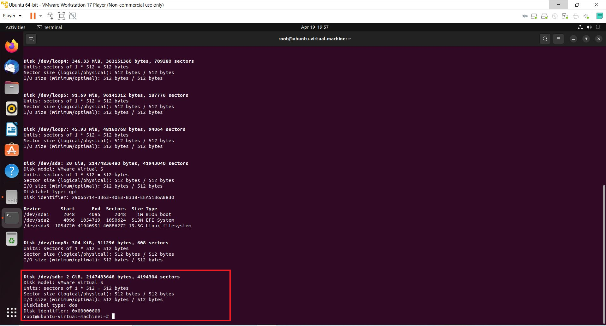

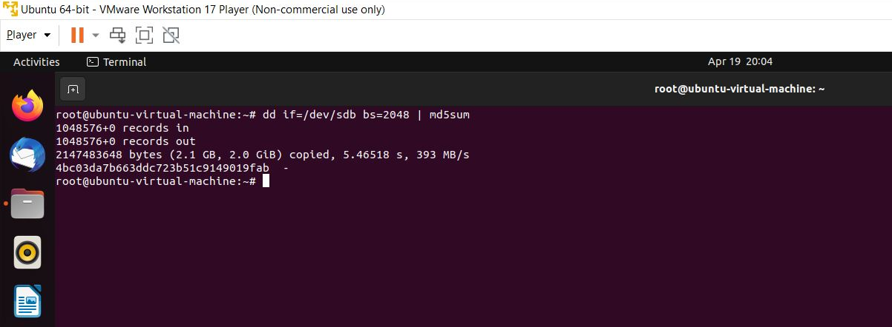

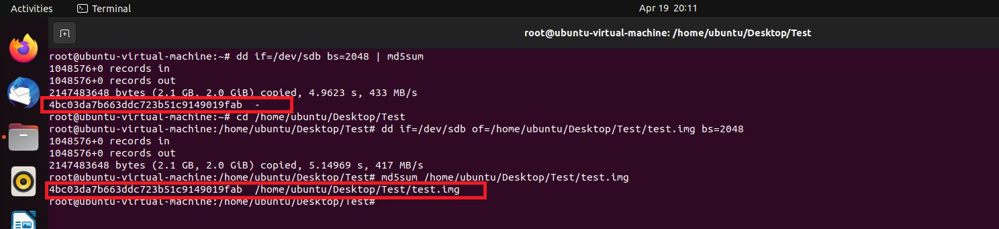

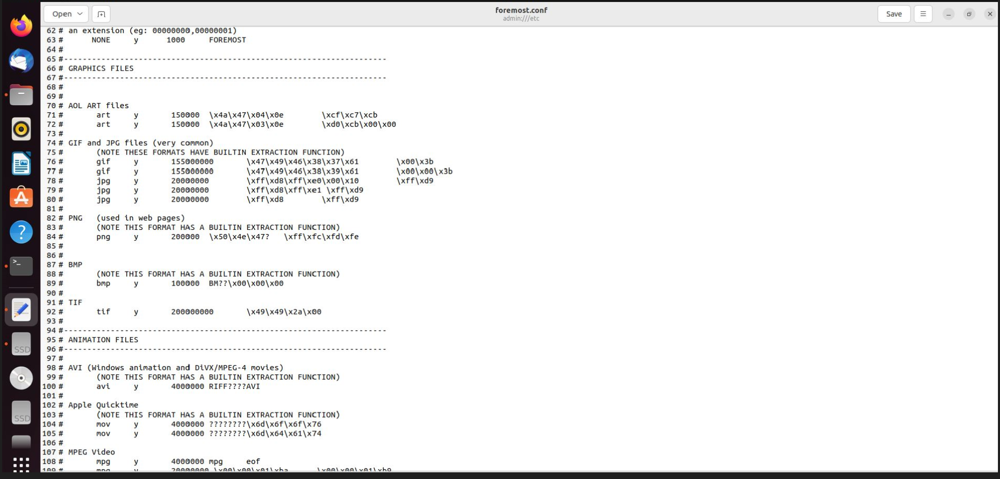

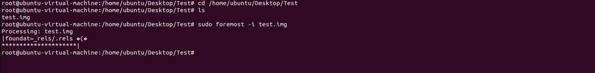

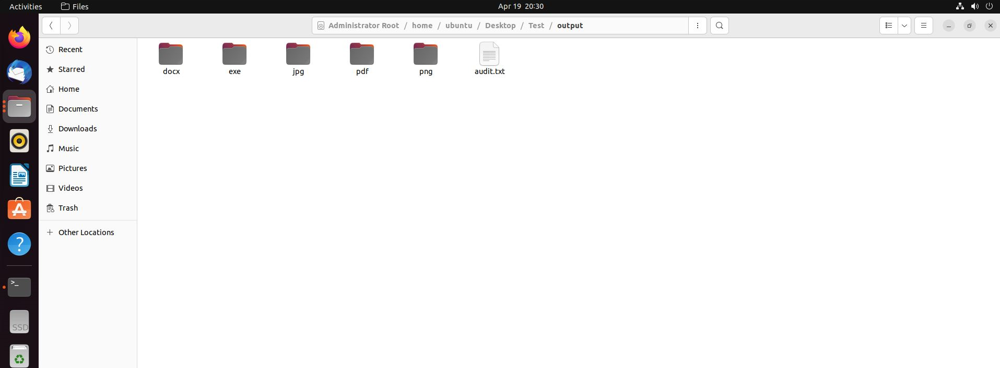

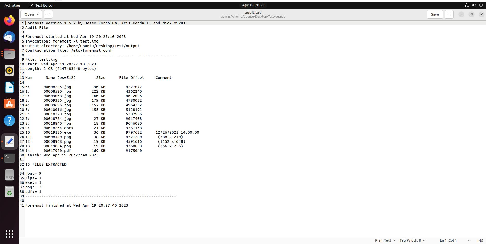

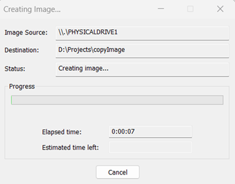

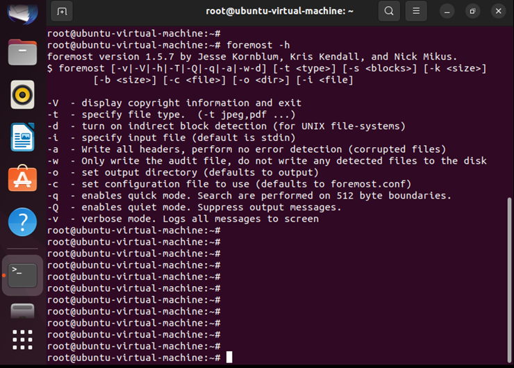

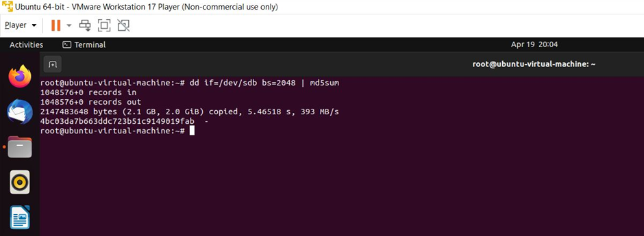

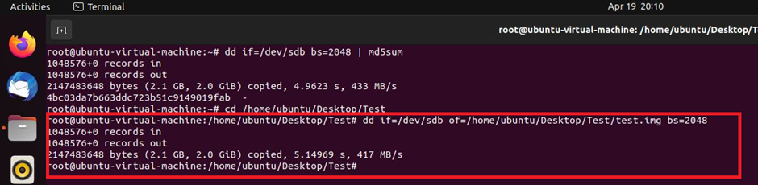

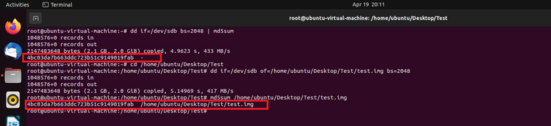

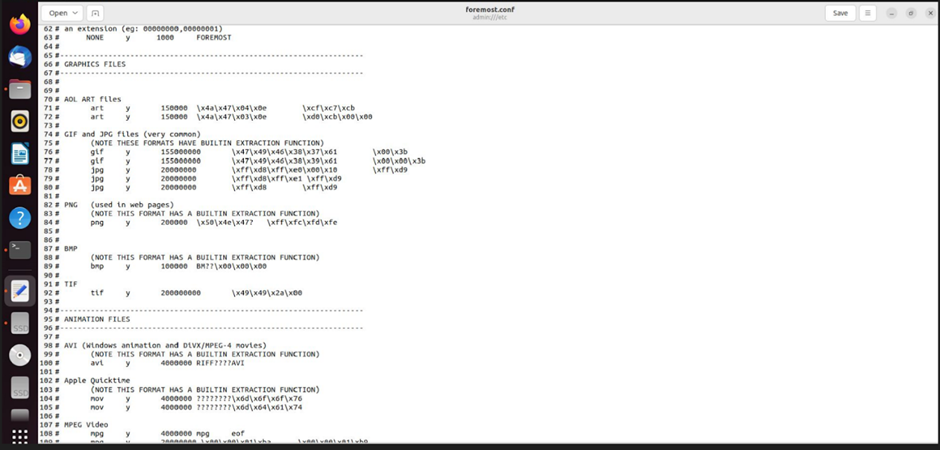

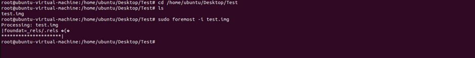

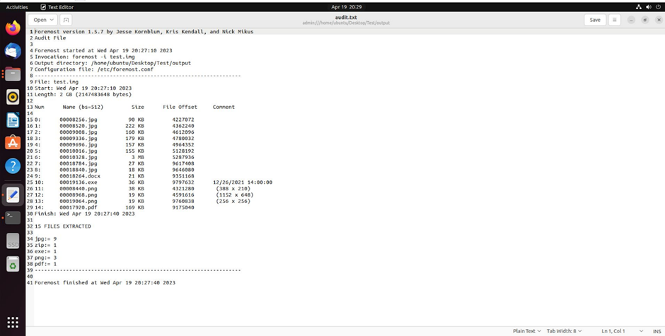

