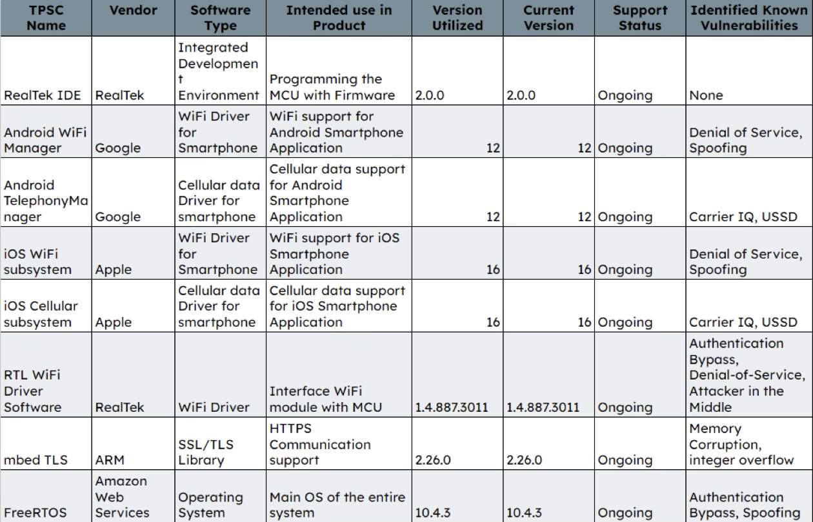

# Software Bill of Materials (SBOM)  
### Case Study: Wi-Fi Smart Plug Security Evaluation  

---

## 1. Introduction  
This document outlines the **Software Bill of Materials (SBOM)** for the Wi-Fi Smart Plug evaluated in this project.  

An SBOM provides a structured inventory of all software components, libraries, and dependencies used within a system.  
Maintaining an accurate SBOM is a critical step in ensuring **software supply chain transparency** and **vulnerability traceability**.  

This SBOM was generated from firmware analysis, documentation review, and static inspection of binaries extracted from the device.

---

## 2. Purpose of the SBOM  
- **Transparency:** Identify all third-party and open-source components.  
- **Compliance:** Align with emerging SBOM standards (SPDX, CycloneDX).  
- **Security:** Correlate known vulnerabilities (CVE data) with system components.  
- **Maintenance:** Support post-market surveillance and patch management.  

---

## 3. SBOM Summary  

| Component ID | Component Name | Version | Vendor / Source | License | Purpose | Known Vulnerability | Risk | Mitigation |
|---------------|----------------|----------|------------------|----------|----------|----------------------|-------|-------------|
| SW-01 | FreeRTOS Kernel | v10.4.6 | Amazon | MIT | Real-time task scheduling for MCU | CVE-2022-3645 | Medium | Update to patched version; validate memory handling |
| SW-02 | LWIP TCP/IP Stack | v2.1.2 | lwIP Project | BSD | Network communication stack | CVE-2023-2260 | Medium | Apply security patch; enable input sanitization |
| SW-03 | mbedTLS | v2.28 | ARM | Apache-2.0 | Cryptographic functions (not fully implemented) | Misconfiguration risk | High | Enforce use of TLS for all endpoints |
| SW-04 | SOAP Framework (Custom) | 1.0 | In-house | Proprietary | Device–cloud communication protocol | No encryption | High | Replace with HTTPS REST API |
| SW-05 | JSON Parser | v1.1.0 | Open Source | MIT | Data serialization | CVE-2021-23840 | Low | Use safe parsing libraries; sanitize input |
| SW-06 | OTA Update Module | v1.0 | In-house | Proprietary | Over-the-air firmware updates | No signature verification | High | Enforce firmware signing |
| SW-07 | Cloud SDK | v3.5 | Third-party vendor | Proprietary | Cloud integration and telemetry | Unknown disclosure | Medium | Request SBOM from vendor; verify CVE status |
| SW-08 | MQTT Client | v1.3 | Eclipse Paho | EPL-2.0 | Device telemetry (future feature) | No known CVE | Low | Maintain library updates |
| SW-09 | Bootloader | v1.0 | In-house | Proprietary | System initialization | Lacks secure boot | High | Implement cryptographic boot verification |
| SW-10 | Wi-Fi Driver | v2.2 | Vendor SDK | Proprietary | Hardware communication layer | Closed source | Medium | Verify integrity of binaries during build |

---

## 4. SBOM Visualization  

  
*Figure 1. Extracted Software Bill of Materials representing firmware components and their interdependencies.*

---

## 5. Observations  
1. **Incomplete Vendor Disclosure:** Several proprietary modules lack official SBOM documentation.  
2. **Open-Source Components:** Libraries such as FreeRTOS and lwIP introduce dependency risks if not regularly patched.  
3. **Cryptographic Misuse:** mbedTLS is present but not fully integrated, leaving SOAP endpoints exposed.  
4. **Firmware Update Risk:** The OTA module lacks integrity validation, enabling potential firmware tampering.  

---

## 6. Recommendations  

| Category | Recommendation |
|-----------|----------------|
| **SBOM Management** | Automate SBOM generation using tools like *Syft*, *SPDX*, or *CycloneDX*. |
| **Vendor Coordination** | Require third-party suppliers to provide SBOMs with each firmware release. |
| **Patch Management** | Implement a centralized update policy with vulnerability monitoring. |
| **Compliance** | Align with NIST SP 800-218 (*Secure Software Development Framework*). |

---

## 7. Conclusion  
An SBOM serves as the foundation of **IoT software supply chain security**.  
The Smart Plug’s incomplete and manually maintained SBOM highlights the risks of dependency blind spots and untracked vulnerabilities.  

Integrating automated SBOM generation and continuous vulnerability monitoring will enhance transparency and enable timely security updates throughout the product lifecycle.

---

## 8. References  
1. NIST SP 800-218: *Secure Software Development Framework (SSDF).*  
2. OWASP Software Component Verification Standard (SCVS).  
3. SPDX and CycloneDX SBOM Specifications.  
4. MITRE CVE Database.  

---

📘 *This SBOM was compiled as part of the Smart Plug IoT Security Case Study to enhance software transparency and support vulnerability management.*
