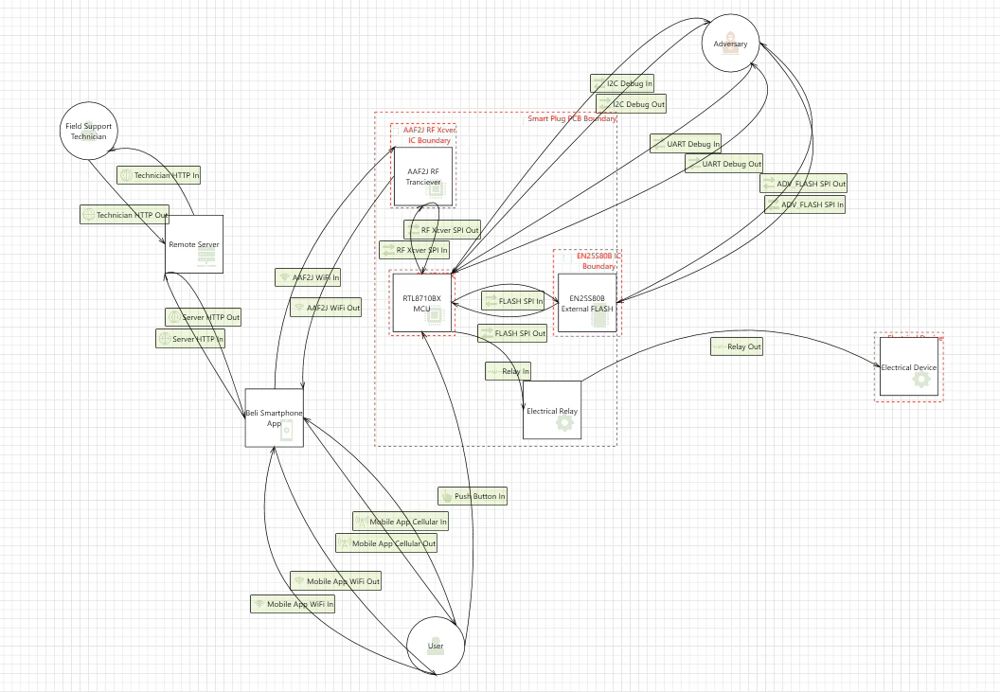

# Security Assessment Report  
### Case Study: Wi-Fi Smart Plug Security Evaluation  

---

## 1. Executive Summary  
This report documents the findings of a comprehensive cybersecurity assessment performed on a **Wi-Fi Smart Plug**, an Internet of Things (IoT) device designed to remotely control and monitor household appliances.  

The objective was to identify vulnerabilities within the device’s firmware, communication protocols, and overall system architecture. The analysis leveraged **threat modeling**, **network packet inspection**, **hardware debugging**, and **software bill of materials (SBOM)** review.

**Overall Security Posture:** *Moderate Risk*  
Although functional and feature-complete, the device demonstrates several high-severity security issues, including **unencrypted communications**, **authentication bypass**, and **insufficient firmware protection**.  

---

## 2. Scope and Objectives  

### 2.1 Scope of Assessment  
The security evaluation included:  
- Analysis of the Smart Plug’s **firmware**, **network traffic**, and **hardware interfaces**.  
- Review of **communication protocols** between the device, smartphone application, and cloud backend.  
- Construction and analysis of the **Data Flow Diagram (DFD)** and **Threat Model**.  
- Compilation and evaluation of the **Software Bill of Materials (SBOM)**.  

### 2.2 Objectives  
1. Identify exploitable vulnerabilities in hardware, firmware, and communication layers.  
2. Evaluate compliance with best practices defined in the **OWASP IoT Top 10** and **NIST SP 800-183**.  
3. Recommend mitigation strategies for both developers and end-users.  

---

## 3. Threat Modeling  

### 3.1 Data Flow Diagram  

  
*Figure 1. Smart Plug Data Flow Diagram used as the foundation for threat modeling.*

The DFD highlights all major entities (Smart Plug, Smartphone App, Cloud Server) and the trust boundaries between them. Data flows were analyzed using the **STRIDE** framework to classify potential threats.  

### 3.2 Threat Model Findings  
| Threat Category | Description | Impact | Mitigation |
|------------------|-------------|---------|-------------|
| **Spoofing** | Attackers can impersonate legitimate devices or servers. | High | Mutual authentication and signed certificates. |
| **Tampering** | Unencrypted firmware allows malicious modification. | High | Firmware signing and validation. |
| **Repudiation** | Device lacks transaction logging. | Medium | Implement secure audit logs. |
| **Information Disclosure** | SOAP messages transmitted over HTTP. | High | Enforce HTTPS/TLS. |
| **Denial of Service (DoS)** | Device fails under packet flood conditions. | Medium | Rate limiting and watchdog timers. |
| **Elevation of Privilege** | Bypass via exposed UART debug interface. | High | Disable debug in production. |

---

## 4. Testing Methodology  

The security evaluation combined **static** and **dynamic** testing approaches, leveraging both manual inspection and automated tools.  

### 4.1 Static Analysis  
- Extracted and disassembled firmware binary.  
- Verified presence of hardcoded credentials and encryption routines.  
- Inspected for insecure libraries and dependencies.  

### 4.2 Dynamic Testing  
- **UART Debugging:** Connected via USB-to-Serial adapter and observed system logs.  
- **Network Traffic Analysis:** Captured packets using **Wireshark** to analyze data exchange with the mobile app and cloud.  
- **Fuzz Testing:** Injected malformed data packets to test input validation.  
- **Penetration Simulation:** Emulated man-in-the-middle (MITM) scenarios using proxy interception.  

### 4.3 Tools Utilized  
| Tool | Function |
|------|-----------|
| Wireshark | Network packet capture & analysis |
| Microsoft Threat Modeling Tool | Threat identification & DFD generation |
| Logic Analyzer | Signal timing validation |
| UART/Serial Monitor | Low-level communication debugging |
| Firmware Extractor | Binary disassembly and review |
| Python Scripting | Custom fuzzing and replay testing |

---

## 5. Vulnerability Overview  

| ID | Vulnerability | Risk | Description | Evidence | Recommendation |
|----|----------------|------|-------------|-----------|----------------|
| V-01 | **Plaintext SOAP Communication** | High | SOAP requests transmitted over HTTP without encryption. | Wireshark captures confirmed plaintext data. | Enforce HTTPS with valid TLS certificates. |
| V-02 | **Unencrypted Firmware Image** | High | Firmware can be read or modified via debug interface. | Dumped binary accessible via UART. | Sign and encrypt firmware using secure boot. |
| V-03 | **Authentication Bypass** | High | Weak authentication allows unauthorized control. | Bypass flow identified in protocol. | Implement token-based session management. |
| V-04 | **Exposed UART Debug Port** | Medium | Debug interface accessible in production units. | Physical access exposes console. | Disable debug interface post-manufacture. |
| V-05 | **Incomplete SBOM** | Medium | Missing third-party library disclosures. | Inconsistent vendor documentation. | Maintain an accurate SBOM with each release. |

---

## 6. Risk Evaluation  

### 6.1 Risk Matrix  

| Likelihood ↓ / Impact → | Low | Medium | High |
|--------------------------|------|--------|------|
| **Low** | Minor inconvenience | — | — |
| **Medium** | Data leakage | Local compromise | — |
| **High** | — | Device takeover | Full system compromise |

The **overall risk rating** is determined as *High*, based on the presence of multiple exploitable attack vectors that allow remote control and data exposure.  

---

## 7. Post-Market Surveillance Recommendations  

### 7.1 Developer and Vendor Actions  
- Establish a **dedicated security maintenance team**.  
- Subscribe to **vulnerability databases** and vendor security advisories.  
- Conduct **periodic penetration testing** and firmware reviews.  
- Implement an automated **patch management process**.  

### 7.2 End-User Recommendations  
- Keep firmware and mobile apps updated.  
- Restrict network access via firewall segmentation.  
- Monitor unusual device activity using router logs.  

---

## 8. Conclusion  
The Smart Plug demonstrates functional capability but suffers from foundational security design flaws typical of consumer IoT products.  
The lack of encryption, authentication enforcement, and firmware protection exposes the device to significant exploitation risks.  

However, through the adoption of **secure coding**, **cryptographic controls**, and **supply chain transparency (SBOM)**, manufacturers can substantially enhance device resilience and protect end users from emerging IoT threats.  

---

## 9. References  
1. OWASP IoT Security Guidelines (2024).  
2. NIST SP 800-183: *Networks of Things.*  
3. Microsoft Threat Modeling Tool Documentation.  
4. MITRE CVE Database.  
5. Wireshark Network Analysis Documentation.  

---

📘 *This document accompanies the academic case study "Smart Plug Security Audit" and provides a detailed account of the testing methods, vulnerabilities, and security posture evaluation.*
