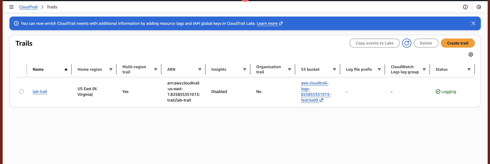
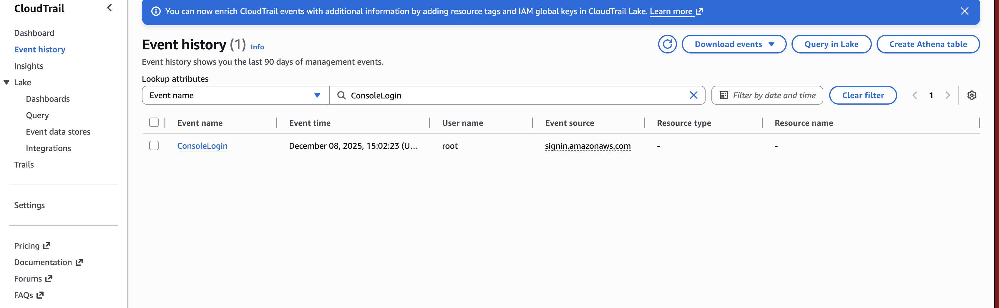
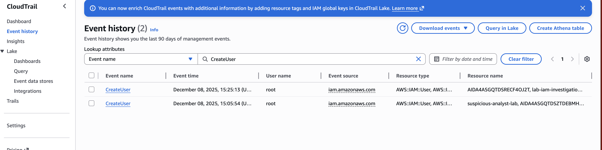
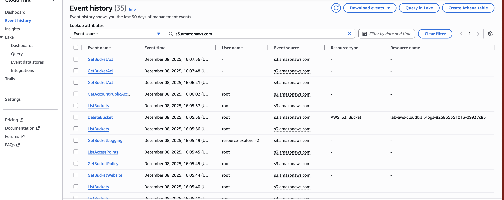

# 🧪 LAB 3 – AWS CloudTrail Log Hunting

This lab focuses on understanding how AWS CloudTrail captures API activity across your AWS environment, and how to hunt for specific events such as logins, IAM modifications, and S3 activity.

CloudTrail is a foundational AWS security tool because it records actions taken by users, roles, and AWS services. Being able to investigate CloudTrail logs is a core skill in cloud security, IR, and compliance.

## 📘 1. Overview

In this lab, you will:

- Verify that a CloudTrail trail is enabled
- Generate console and service activity
- Hunt CloudTrail logs for:
  - Console logins
  - IAM activity
  - S3 operations
- Understand how individual AWS actions generate audit logs

## 🧱 2. Prerequisites

- AWS account (Free Tier compatible)
- Administrator-level permissions
- CloudTrail Event history enabled (default)
- S3 permissions (if creating a Trail)

## 🧪 3. Lab Steps

---

## ✅ Step 1 – Verify or Create a CloudTrail Trail

CloudTrail can operate in *Event history* mode (free, last 90 days) or in *Trailed logging* stored in S3 (recommended for forensics & long-term retention).

### 🔹 Instructions:

1. Open CloudTrail from AWS Console.
2. In the left sidebar, click **Trails**.
3. If you already have a trail and **Logging = On**, you may use it.
4. Otherwise:
   - Click **Create trail**
   - Trail name: `lab-trail`
   - Choose **Create new S3 bucket**
   - Accept default settings
   - Click **Create trail**

### 📸 Screenshot C1 – CloudTrail trail enabled  

This verifies CloudTrail is continuously logging your account’s activity.

---

## ✅ Step 2 – Generate Console Activity

To generate useful logs:

- Navigate into **S3** (optionally create a test bucket)
- Visit **IAM**
- Open **EC2 Instances** dashboard
- Perform normal read-only exploration

Each of these actions generates CloudTrail events such as:

- `ListBuckets`
- `GetBucketAcl`
- `ListUsers`
- `DescribeInstances`

These logs will later appear in Event History.

---

## ✅ Step 3 – Hunt Console Logins

One of the first things in any investigation is checking who logged into the AWS Console.

### 🔹 Instructions:

1. Open **CloudTrail → Event history**
2. Set lookup attribute: **Event name**
3. Enter: `ConsoleLogin`
4. Click **Search**

### 📸 Screenshot C2 – ConsoleLogin event  

### 🔍 What to examine:

- User name (Who logged in?)
- Event time
- Source IP address
- MFA used?  
  *(Inside event JSON: `"mfaAuthenticated": "true/false"`)*

---

## ✅ Step 4 – Hunt IAM Changes

IAM actions are extremely important to monitor because they relate to:

- privilege escalation  
- lateral movement  
- new user/role creation  
- policy attachment  

### 🔹 Instructions:

In **Event history**, filter for IAM activity:

| Useful event name     | What it means                        |
|-----------------------|---------------------------------------|
| `CreateUser`          | A new IAM user was created            |
| `AttachUserPolicy`    | A policy was added to a user          |
| `PutUserPolicy`       | A custom inline policy was added      |
| `DeleteUser`          | An IAM user was deleted               |

### 📸 Screenshot C3 – IAM CreateUser events  

### 🔍 What to check:

- Which user performed the IAM action?
- Which IAM user or policy was affected?
- Event source: `iam.amazonaws.com`

---

## ✅ Step 5 – Hunt S3 Activity

S3 is commonly targeted by attackers. CloudTrail tracks all S3 API operations.

### 🔹 Instructions:

1. Clear previous filters
2. Set lookup attribute: **Event source**
3. Value: `s3.amazonaws.com`
4. Search

This reveals actions such as:

- `ListBuckets`
- `GetBucketAcl`
- `GetBucketPolicy`
- `PutObject`
- `DeleteBucket`

### 📸 Screenshot C4 – S3 Activity  

---

# 🧹 4. Cleanup

Optional, but recommended:

### **Disable Trail Logging**
- CloudTrail → Trails → `lab-trail` → **Stop logging**

### **Delete Resources**
- Delete the log S3 bucket used for the trail  
- Delete the test S3 bucket you created  

This prevents unintended costs.

---

# 🎉 Lab Completed

You have successfully:

- Created and validated a CloudTrail trail
- Generated AWS activity
- Investigated console logins
- Analyzed IAM changes
- Reviewed S3 access logs

This lab strengthens your AWS forensics and cloud security investigation skills.
