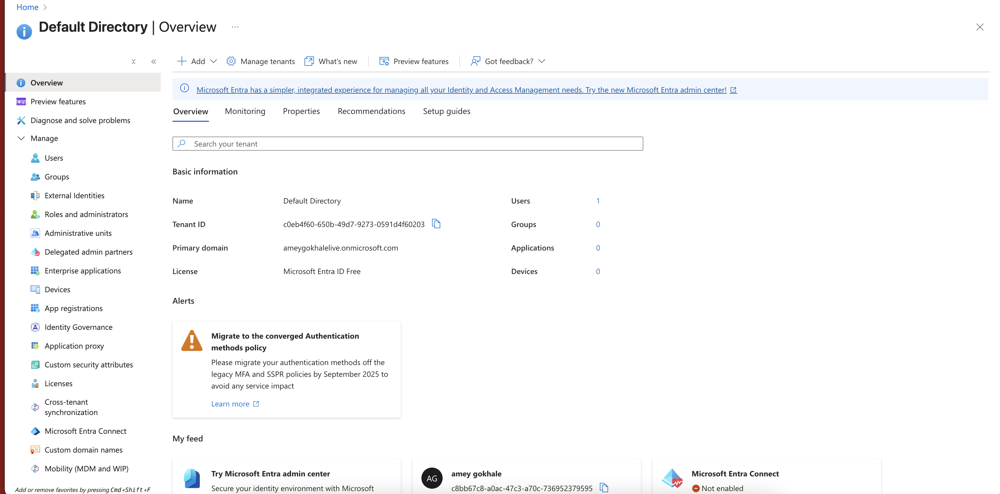
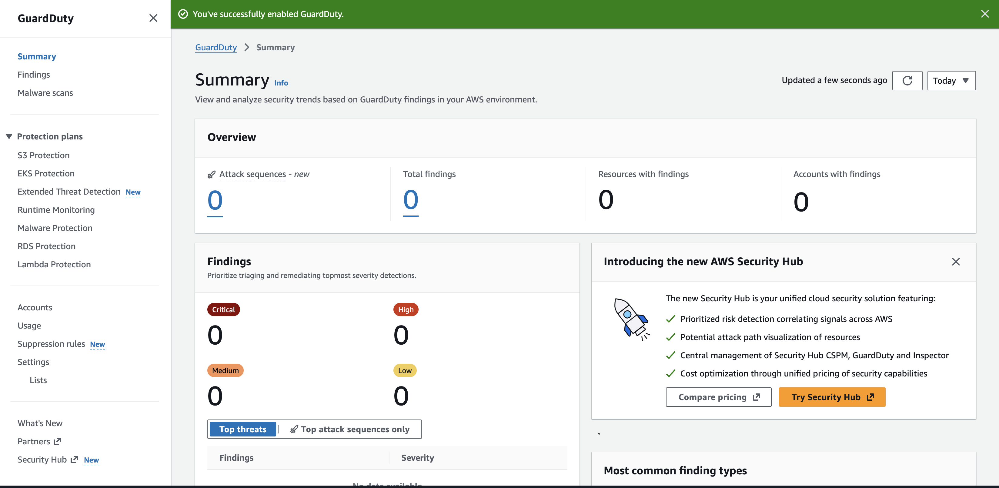
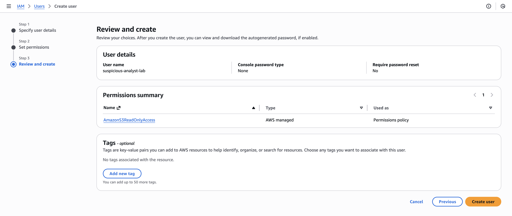
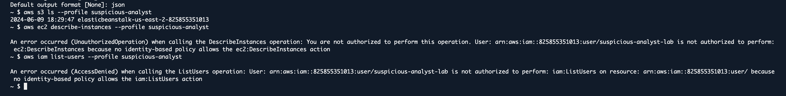
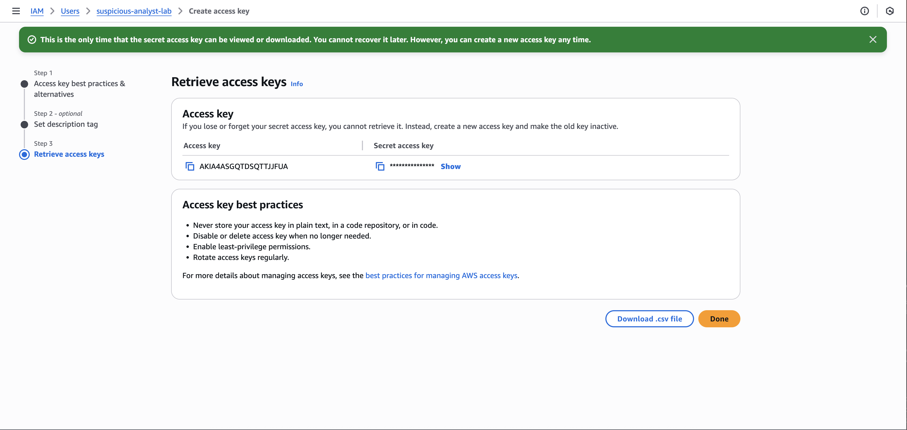
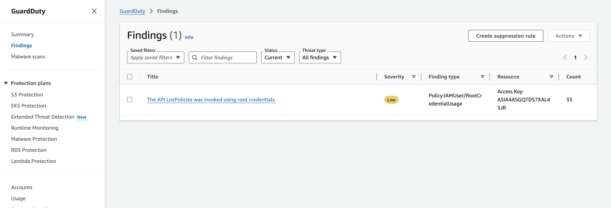

# 🧪 Lab 1 – AWS GuardDuty Alert Triage

This lab demonstrates how to enable **Amazon GuardDuty**, generate minimal activity using a low‑privilege IAM user, and practice reviewing & triaging GuardDuty findings.

---

## 📘 **1. Overview**
In this lab, you will:
- Enable **Amazon GuardDuty**
- Create an IAM user with limited permissions
- Generate optional AWS CLI activity
- Review GuardDuty findings and practice triage

⚠️ **Note:** GuardDuty includes a 30‑day free trial on first activation.

---

## ✅ **2. Prerequisites**
- AWS account (Free Tier preferred)
- IAM user with admin permissions
- Selected region (e.g., **N. Virginia – us-east-1**)

---

## 🛠️ **3. Steps**

---

## **Step 1 – Enable GuardDuty**
1. Open the AWS Console.
2. Select region: **us-east-1 (N. Virginia)**.
3. In search bar → type **GuardDuty** → open it.
4. If first time:
   - Click **Get started**
   - Click **Enable GuardDuty**
5. Confirm "GuardDuty is enabled" appears.

📸 **Screenshot G1 – GuardDuty Enabled**



---

## **Step 2 – Create a Test IAM User (Suspicious Analyst)**
1. Search **IAM**.
2. Go to **Users** → **Create user**.
3. Username: `suspicious-analyst-lab` → Next.
4. Permissions:
   - Choose **Attach policies directly**
   - Search & select: **AmazonS3ReadOnlyAccess**
5. Click **Next** → **Create user**.

📸 **Screenshot G2 – IAM User Summary**



---

## **Step 3 – Create Access Keys**
1. Open the user `suspicious-analyst-lab`.
2. Go to **Security credentials**.
3. Scroll to **Access keys**.
4. Click **Create access key**.
5. Use case → **Command Line Interface (CLI)** → Next.
6. Click **Create access key**.
7. Download/Save:
   - Access Key ID
   - Secret Access Key (⚠️ do not expose publicly)

📸 **Screenshot G3 – Access Key Created**



---

## **Step 4 – (Optional) Generate API Activity with AWS CLI**
This activity creates CloudTrail events that GuardDuty may use to generate findings.

### Configure AWS CLI
```bash
aws configure --profile suspicious-analyst
```
Enter the access key, secret key, region (**us-east-1**), output format **json**.

### Run limited-permission commands
```bash
aws s3 ls --profile suspicious-analyst
aws ec2 describe-instances --profile suspicious-analyst
aws iam list-users --profile suspicious-analyst
```

Some may fail with `UnauthorizedOperation` or `AccessDenied` — this is expected.

📸 **Screenshot – CLI Output**



---

## **Step 5 – Review & Triage GuardDuty Findings**
1. Return to **GuardDuty** service.
2. In the left menu, click **Findings**.
3. Adjust filters if needed:
   - Severity
   - Threat type
   - Resource type
4. If findings appear, click one to open details.

You should review the following fields:
- **Finding type**
- **Severity** (Low/Medium/High/Critical)
- **API call or activity** that triggered it
- **Resource (access key / user)** involved
- **Source IP & geolocation**
- **Timestamps (first seen / last seen)**
- **Recommended remediation**

📸 **Screenshot G4 – GuardDuty Finding Details**



📸 **Screenshot G5 – Findings List**



---

## 🧹 **4. Cleanup**
### Disable GuardDuty (to avoid charges later)
1. Go to **GuardDuty → Settings**.
2. Click **Disable GuardDuty** → confirm.

### Delete the IAM test user
1. Go to **IAM → Users**.
2. Select `suspicious-analyst-lab`.
3. Click **Delete user**.

---

## 🎉 **Lab Completed!**
You successfully:
- Enabled Amazon GuardDuty
- Created a test IAM user & generated API activity
- Reviewed GuardDuty findings and practiced alert triage

This gives you foundational skills in AWS threat detection, IAM abuse detection, and cloud security investigation.

