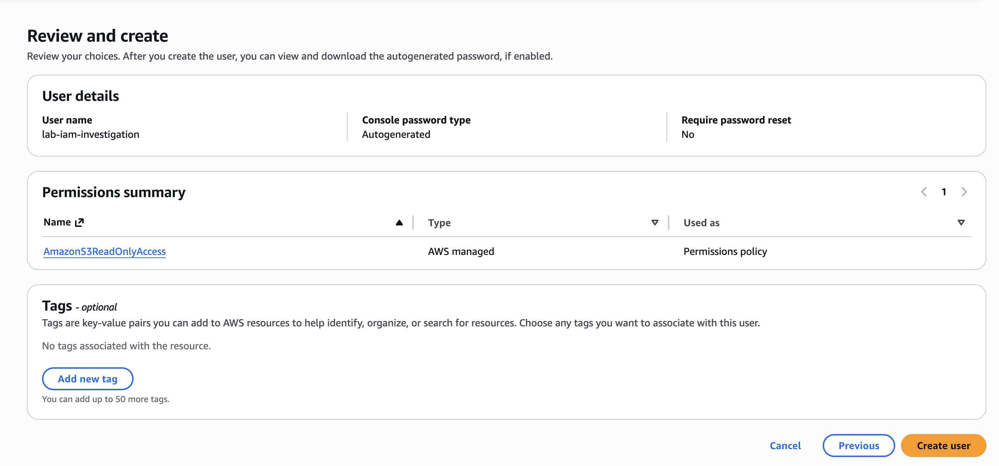
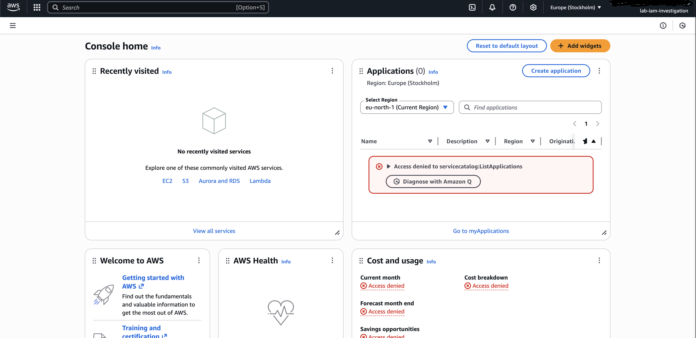
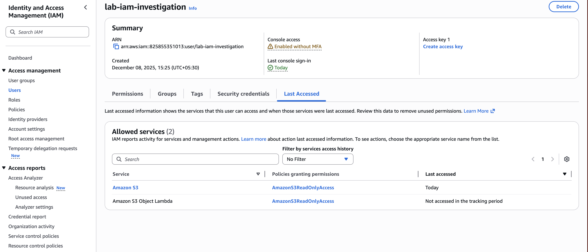
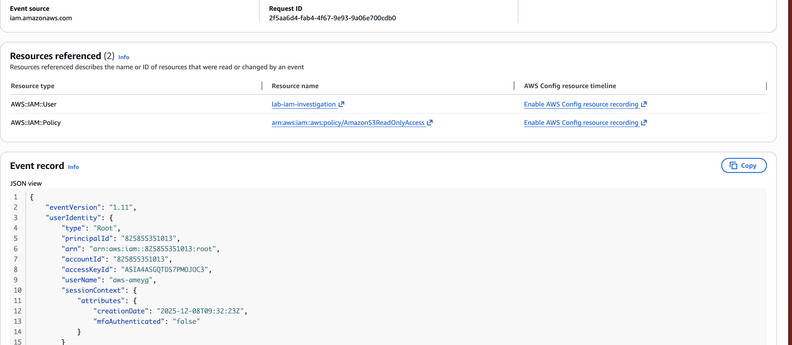

# 🧪 Lab 2 – AWS IAM Investigation

This lab walks through creating a limited-permission IAM user, generating login/S3 activity, inspecting permissions, and analyzing user actions with CloudTrail.

---

## 📘 **1. Overview**
In this lab, you will:
- Create an IAM user
- Investigate their permissions
- Review what services they accessed
- Correlate their actions with CloudTrail

---

## ✅ **2. Prerequisites**
- AWS Console access with admin rights
- CloudTrail **Event history** enabled (default for most accounts)

---

## 🛠️ **3. Steps**

---

## **Step 1 – Create Investigation User**
1. Open **IAM** in AWS Console.
2. In the left menu → **Users** → **Create user**.
3. Set user name: `lab-iam-investigation` → **Next**.
4. Permissions:
   - Choose **Attach policies directly**
   - Search and select: **AmazonS3ReadOnlyAccess**
5. Click **Next** → **Create user**.
6. Open the user page.

📸 **Screenshot I1 – IAM User Created**

---

## **Step 2 – (Optional) Generate Console Login Activity**
1. On the `lab-iam-investigation` user page → **Security credentials**.
2. Under Console password → **Manage console access**.
3. Enable **Console access** and set a custom password.
4. Open an **Incognito/Private Window**.
5. Log in using the IAM user credentials.
6. Navigate to **S3**, view bucket list, maybe open a bucket.
7. Log out.

📸 **Screenshot – Logged in as IAM user**

---

## **Step 3 – Inspect User in IAM (Permissions & Access Advisor)**
1. Return to your admin session.
2. Open **IAM → Users → lab-iam-investigation**.
3. Go through:
   - **Permissions** tab → confirm attached policies
   - **Groups** tab → confirm no groups (unless added)
   - **Access Advisor** tab → shows last accessed services

📸 **Screenshot I2 – Access Advisor**

---

## **Step 4 – Correlate Activity with CloudTrail**
1. Open **CloudTrail** in AWS Console.
2. Left menu → **Event history**.
3. Set:
   - **Lookup attribute:** Username
   - **Value:** `lab-iam-investigation`
4. View events such as:
   - ConsoleLogin
   - ListBuckets
   - GetObject
5. Click an event to view:
   - `eventTime`
   - `sourceIPAddress`
   - `userIdentity.arn`
   - `requestParameters`

📸 **Screenshot I3 – Event History (Filtered)**

📸 **Screenshot I4 – Event Details**

---

## 🧹 **4. Cleanup**
1. Go to **IAM → Users**.
2. Select `lab-iam-investigation`.
3. Click **Delete user** → confirm.

---

## 🎉 **Lab Completed!**
You successfully:
- Created and analyzed an IAM user
- Viewed permissions and Access Advisor data
- Investigated activity using CloudTrail

This gives you practical experience in AWS identity forensics and security investigations.