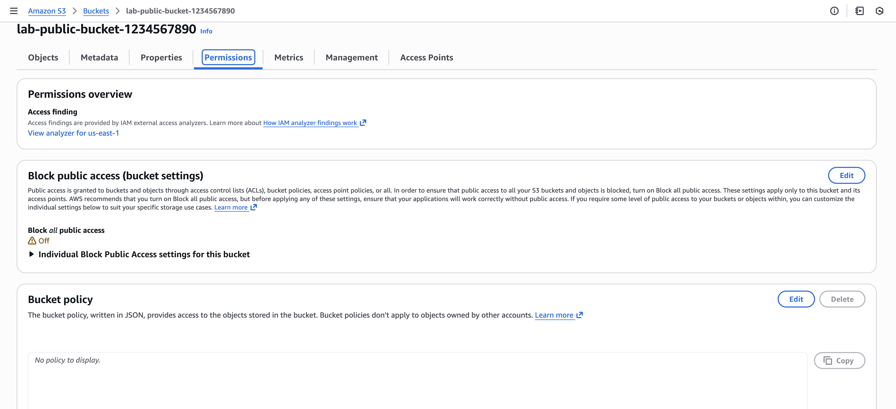
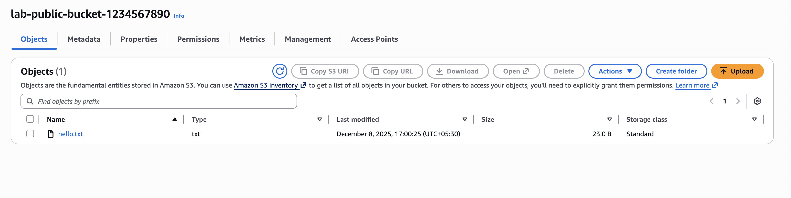
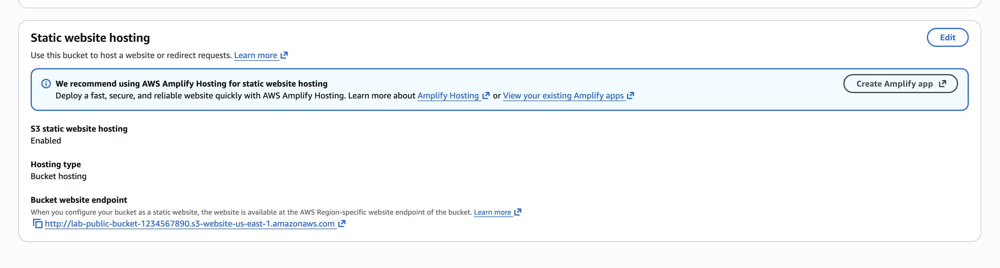
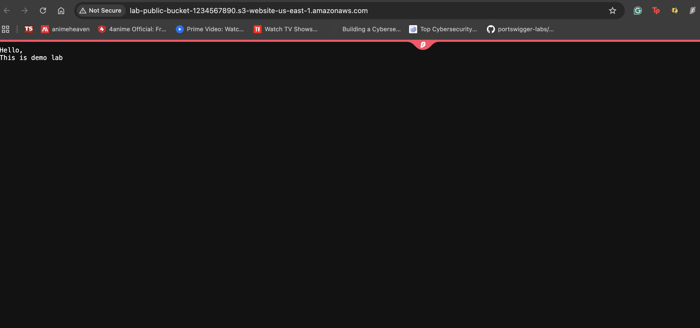

# AWS S3 Bucket Attack & Defense

This lab demonstrates how insecure S3 configurations can expose data publicly—and how to properly lock down a bucket using AWS security controls.  
You will intentionally make a bucket public (**attack simulation**) and then secure it again (**defense simulation**).

---

## 1. Overview

In this lab you will:

- Create a bucket with public access allowed  
- Upload a file and make it publicly readable  
- (Your method) Enable **Static Website Hosting** and expose the file  
- Access the file anonymously in a browser  
- Lock down the bucket by enabling **Block Public Access**  
- Confirm public access is denied  

---

## 2. Prerequisites

- AWS account  
- Permissions to create and manage S3 buckets  
- Basic familiarity with the AWS Console  

---

# 3. Lab Steps

---

## Step 1 – Create Test Bucket

1. Open **Amazon S3** in AWS Console  
2. Click **Create bucket**  
3. Bucket name:  
   ```
   lab-public-bucket-<random>
   ```
4. Choose your region (e.g., **us-east-1**)  
5. Under **Block Public Access settings**, uncheck:

   - **Block all public access**

6. Acknowledge the warning  
7. Click **Create bucket**  
8. Open the bucket → go to **Permissions**

### Screenshot S1 – Public access allowed


This confirms the bucket is currently vulnerable to public exposure.

---

## Step 2 – Upload a File

1. Inside the bucket → open the **Objects** tab  
2. Click **Upload**  
3. Upload a simple file: `hello.txt`  
4. Contents example:
   ```
   Hello,
   This is demo lab
   ```
5. Click **Upload**  
6. Confirm it appears in the list

### Screenshot S2 – hello.txt in bucket


---

## Step 3 – Make Object Public & Access It (Your version: via Static Website Hosting)

Instead of making the object public directly, you enabled **S3 Static Website Hosting** and pointed the webpage to `hello.txt`.

### Instructions followed:

1. Open bucket → **Properties**  
2. Scroll to **Static website hosting**  
3. Click **Edit**  
4. Enable hosting:  
   - **Hosting type:** Bucket hosting  
   - **Index document:** `hello.txt`  
5. Save changes  
6. Copy the **Bucket website endpoint**

Example:
```
http://lab-public-bucket-1234567890.s3-website-us-east-1.amazonaws.com
```

7. Open an **incognito/private** browser  
8. Paste the URL → press Enter  
9. You should see the content of `hello.txt`

### Screenshot S3.1 – Static website hosting enabled


### 📸 Screenshot S3.2 – Public object in incognito


This confirms your bucket is **fully public**, and anyone can access it without authentication.

---

## Step 4 – Lock Down (Defense)

Time to secure the bucket.

### Instructions:

1. Go to **Permissions** tab  
2. Under *Block public access (bucket settings)* → click **Edit**  
3. Turn **ON**:  
   - **Block all public access**  
4. Save & acknowledge the warning  
5. Ensure the following are removed or restricted:
   - No public (`"Principal": "*"`) bucket policy  
   - No public ACL grants  

6. Go back to incognito browser  
7. Refresh the same website URL  

You should now see an **AccessDenied** response.

### Screenshot S4 – AccessDenied in incognito


Your bucket is now secure.

---

# 4. Cleanup

Optional but recommended:

### Delete the test object:
- S3 → Bucket → Objects  
- Select **hello.txt** → Delete  

### Delete the entire bucket:
- S3 bucket list → Select bucket → Delete  
- Type bucket name → Confirm  

This prevents accidental charges and keeps your AWS environment clean.

---
