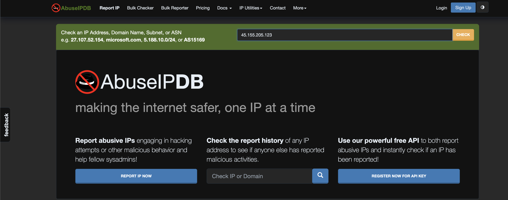
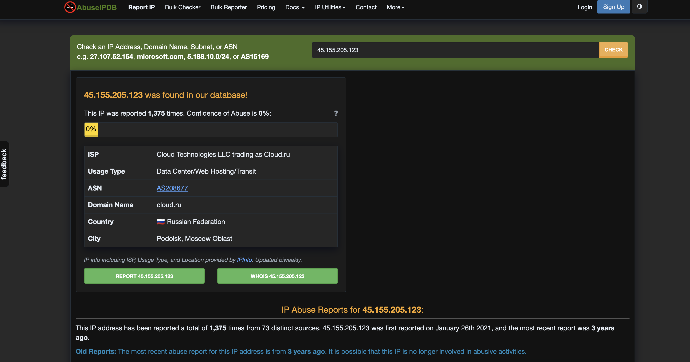
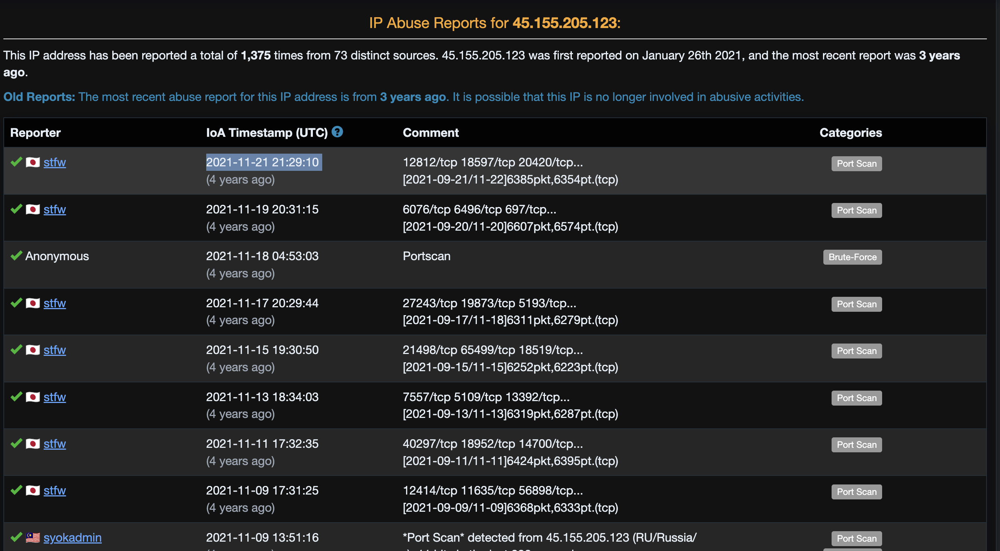
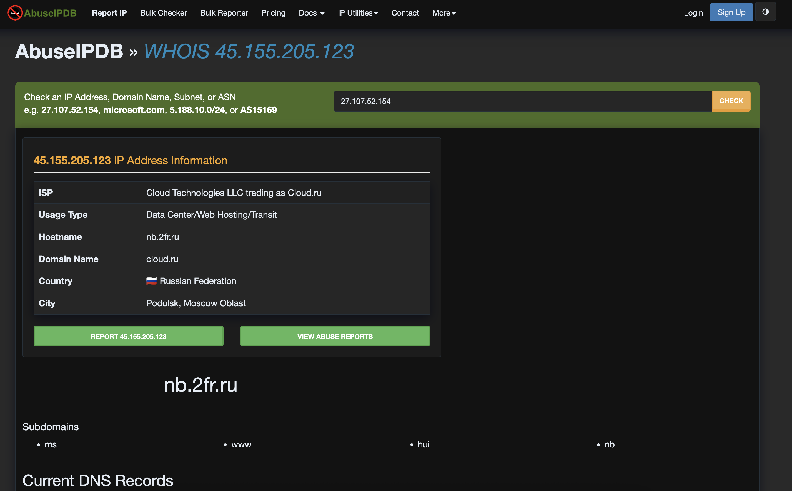

# AbuseIPDB Lab – IP Reputation & Threat Intelligence Analysis

This lab demonstrates how to analyze a suspicious IP address using **AbuseIPDB**, a platform that collects and displays reports of malicious internet activity.  
We will use a publicly-known malicious IP and walk through each stage of analysis with screenshots.

---

# What is AbuseIPDB? (Theory)

**AbuseIPDB** is a community-driven threat intelligence service used by:

- SOC teams  
- Incident responders  
- System administrators  
- Threat intelligence analysts  

It provides:

- **Abuse Confidence Score** (0–100)  
- Report history from multiple users  
- ISP, ASN, geolocation, and WHOIS info  
- Categories such as brute-force, DDoS, port scanning, malware, and spam  
- Detailed notes from reporters  

AbuseIPDB is mainly used to **verify if an IP address is involved in malicious behavior** and to understand the nature of those activities.

---

# Safe IP Used in This Lab

We used the following **publicly known** malicious IP address (safe for training):

```
45.155.205.123
```

This IP appears in public blocklists and threat feeds.

---

# Lab Steps

Screenshots are included directly after each step.

---

## Step 1 – Visit AbuseIPDB

Go to: https://www.abuseipdb.com  
You will see the main dashboard with the search bar.


---

## Step 2 – Enter the Suspicious IP Address  
Paste the IP into the search field and click **Check**.



---

## Step 3 – View the IP Information  

This section shows:

- ISP  
- Usage type  
- ASN  
- Country and city  
- Domain name  
- Abuse Confidence Score  
- Total number of reports  



---

## Step 4 – Analyze Report History  

Scroll down to see all user-submitted reports, including:

- Timestamps  
- Reporter names (or anonymous)  
- Comments  
- Ports involved  
- Abuse categories such as port scanning and brute-force  

This helps analysts understand the **type of activity** linked to the IP.



---

## Step 5 – WHOIS Information  

Click on the **WHOIS** tab to see additional domain and IP ownership info.

This section reveals:

- Registered organization  
- Hosted domain  
- Subdomains  
- DNS records  

WHOIS data helps correlate ownership and detect if the IP belongs to a known malicious hosting provider.



---
