# Autopsy Digital Forensics Practical- Mac

This practical demonstrates how to install, configure, and use **Autopsy** for forensic analysis on macOS. It covers setting up a case, adding evidence, analyzing a disk image, and generating reports.

---

## ⚙️ Commands to Remember

| Command | Description |
|----------|--------------|
| `autopsy` | Start Autopsy normally |
| `autopsy -p 8080` | Change the port number |
| `autopsy -d ~/Desktop/Forensics_Cases` | Use a custom evidence locker directory |
| `sudo autopsy -i /dev/disk2s1 ext4 /Volumes/USB` | Analyze a specific mounted device |
| `autopsy -C` | Disable cookies for secure sessions |
| `autopsy -c` | Force cookie use in browser |
| `autopsy -d ~/Forensic_Evidence -p 9090` | Run with custom port and evidence directory |

---

## Installation and Setup on macOS

### Step 1: Install Homebrew
```bash
/bin/bash -c "$(curl -fsSL https://raw.githubusercontent.com/Homebrew/install/HEAD/install.sh)"
```

### Step 2: Install Autopsy
```bash
brew install autopsy
```

### Step 3: Launch Autopsy
```bash
autopsy
```
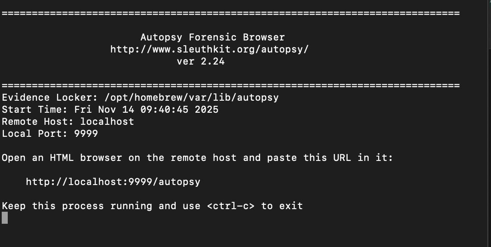

When launched, Autopsy runs on `http://localhost:9999/autopsy`.

---

## Starting a New Case

### Step 4: Open in Browser
Copy the localhost link from the terminal and open it in your browser.
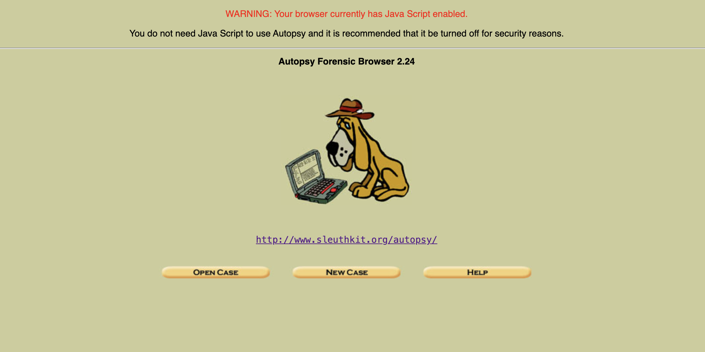

### Step 5: Create a New Case
Click **New Case**, enter the case name, description, and investigator details.
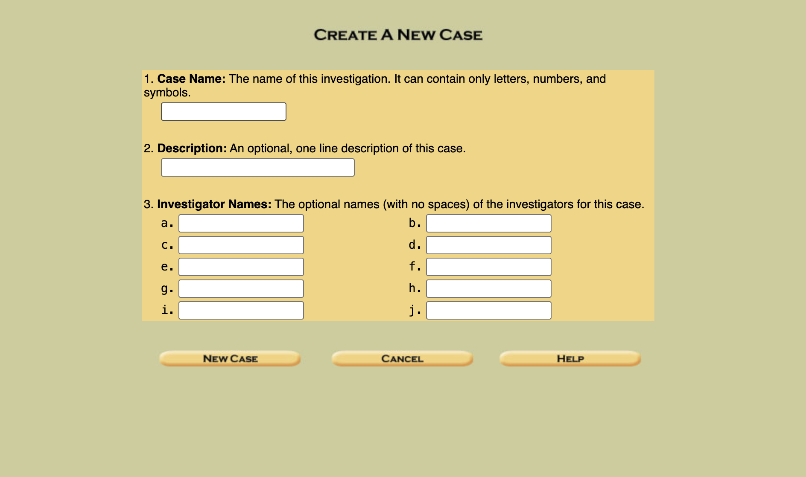

### Step 6: Add a Host
Click **Add Host** to include the system under investigation.


### Step 7: Confirm Host Creation
Once added, the host directory and configuration files will be created.
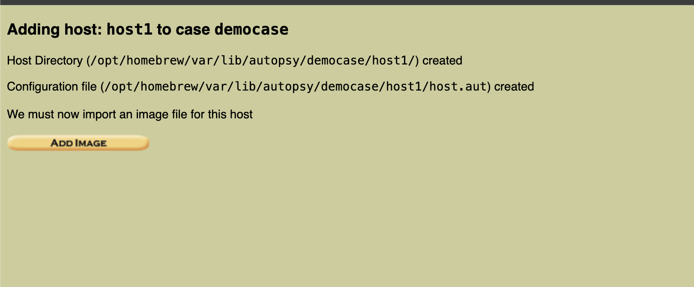

---

## Adding an Evidence Image

### Step 8: Download Sample Disk Image
Download an evidence image from the M57 Patents Scenario:  
🔗 [https://digitalcorpora.org/corpora/scenarios/m57-patents-scenario/](https://digitalcorpora.org/corpora/scenarios/m57-patents-scenario/)

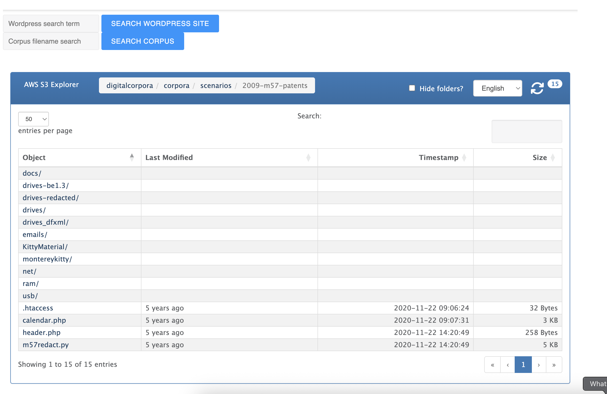

### Step 9: Add the Image in Autopsy
In the **Add New Image** section, provide the file path, select **Disk**, and choose **Symlink**.
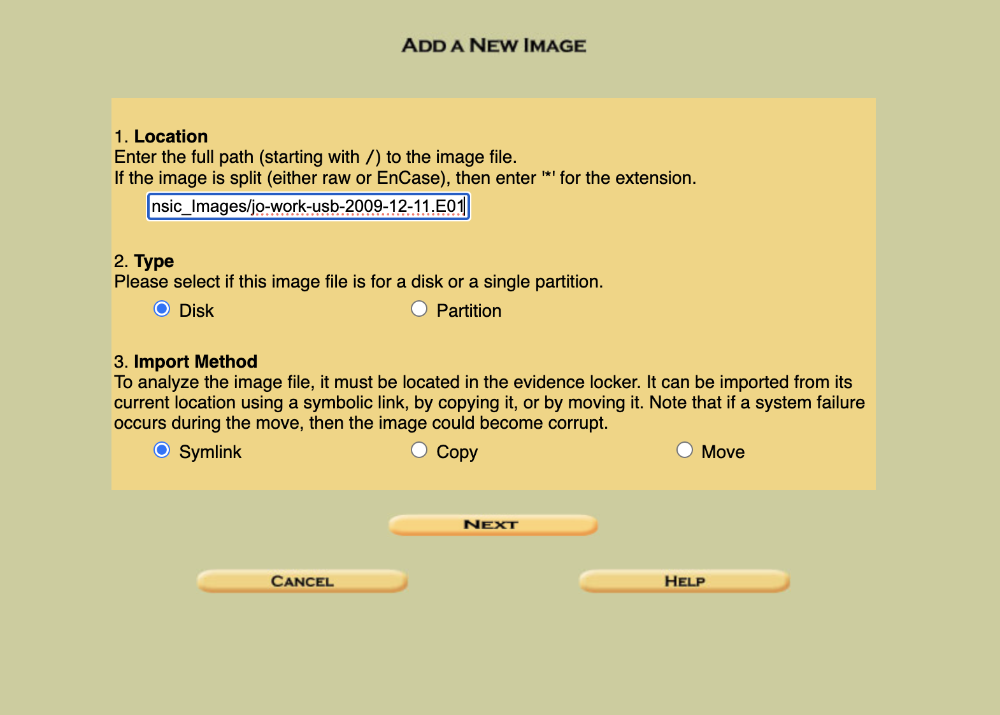

### Step 10: Confirm File System Details
Autopsy detects partitions and file systems using `mmls`. Select `FAT16` and mount as `C:`.
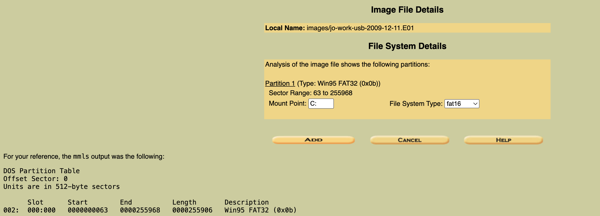

### Step 11: Testing and Linking
Autopsy verifies and links the image into the evidence locker.
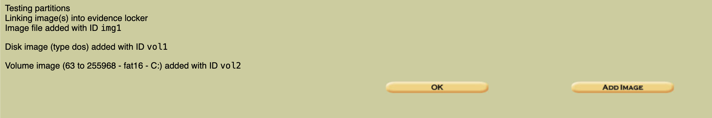

### Step 12: Review Host Manager
After linking, the image appears under the host for analysis.
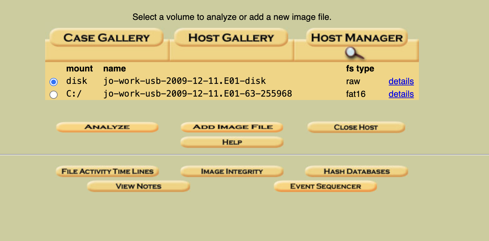

---

## Analyzing the Evidence

### Step 13: Open Case Gallery
Select the volume and click **Analyze**.
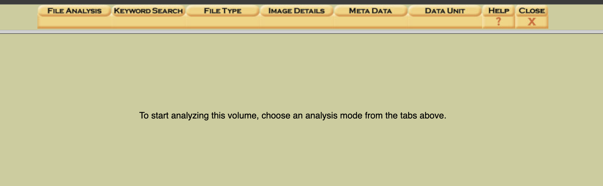

### Step 14: Choose Analysis Mode
Use File Analysis, Keyword Search, File Type, Image Details, or Metadata tabs.
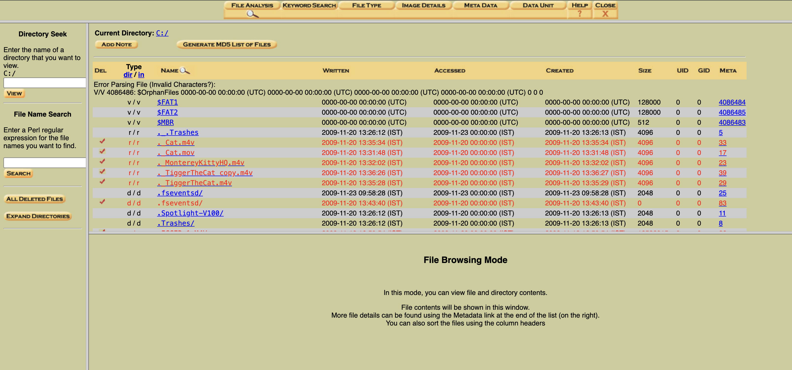

### Step 15: File Type Analysis
Sort and view files by type.
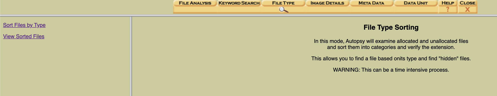

### Step 16: Keyword Search
Perform keyword searches (e.g., “cat”) to find related artifacts.
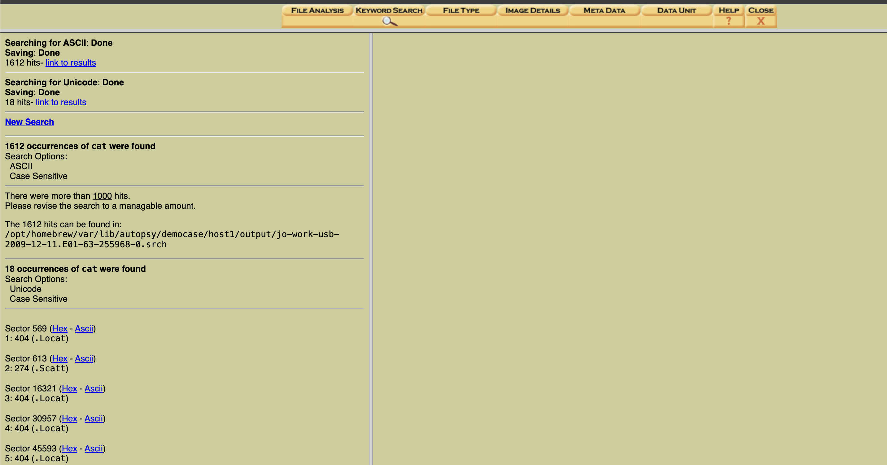

### Step 17: Metadata Mode
View directory entry structures and metadata details.
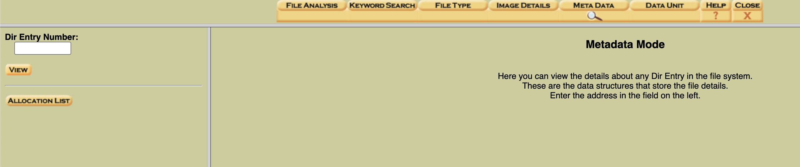

---

## Reporting and Hash Verification

### Step 18: Generate MD5 Hashes
Create an MD5 hash list to verify file integrity.
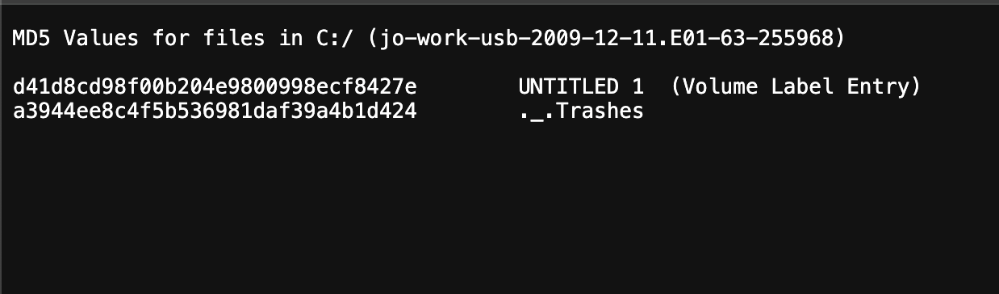

### Step 19: Generate Report from Terminal
In Terminal, go to your case folder and generate a recursive report.
```bash
cd /opt/homebrew/var/lib/autopsy/democase
ls -R > ~/Desktop/autopsy_demoreport.txt
open ~/Desktop/autopsy_demoreport.txt
```
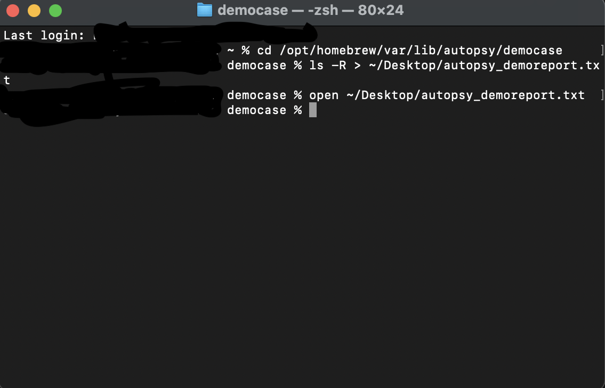

### Step 20: View Generated Report
Open and review the generated report file.
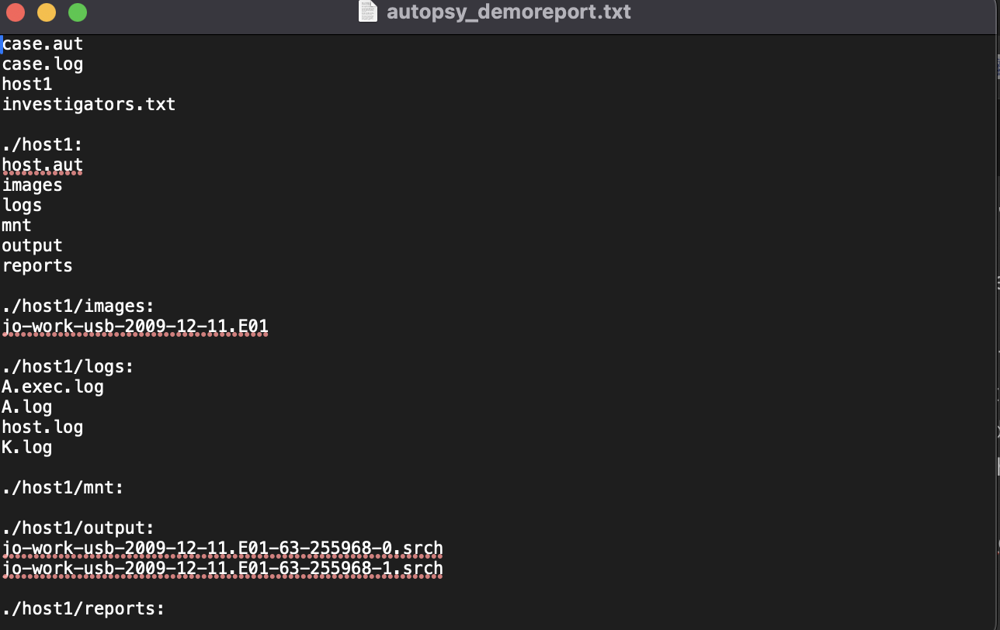

---

## Summary

| Action | Command Example | Description |
|--------|------------------|-------------|
| Start normally | `autopsy` | Default port 9999 |
| Change port | `autopsy -p 8080` | Runs on port 8080 |
| Custom evidence folder | `autopsy -d ~/Desktop/Forensics_Cases` | Store cases in a custom folder |
| Analyze mounted drive | `sudo autopsy -i /dev/disk2s1 ext4 /Volumes/USB` | Analyze mounted device |
| Disable cookies | `autopsy -C` | Disable cookies |
| Force cookies | `autopsy -c` | Force cookies |
| Custom folder & port | `autopsy -d ~/Forensic_Evidence -p 9090` | Custom port + folder |

---

## Credits

**Performed by:** *Your Name*  
**Course:** Digital Forensics Practical – Autopsy  
**Date:** November 2025  

**Tools Used:**  
- macOS Terminal  
- Autopsy (via Homebrew)  
- Digital Corpora Evidence Files: [M57 Patents Scenario](https://digitalcorpora.org/corpora/scenarios/m57-patents-scenario/)

---

⭐ *This practical demonstrates how Autopsy can be used for real-world forensic image analysis and evidence reporting.*
