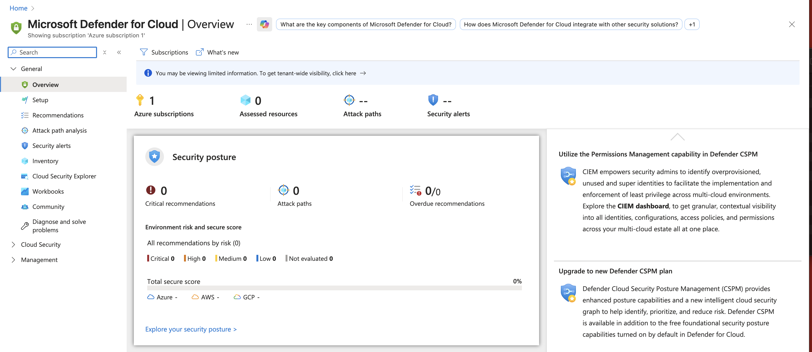
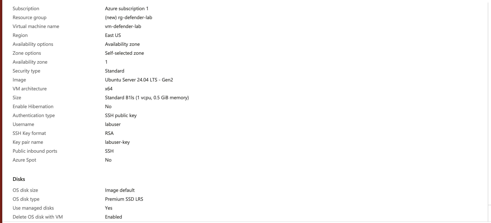
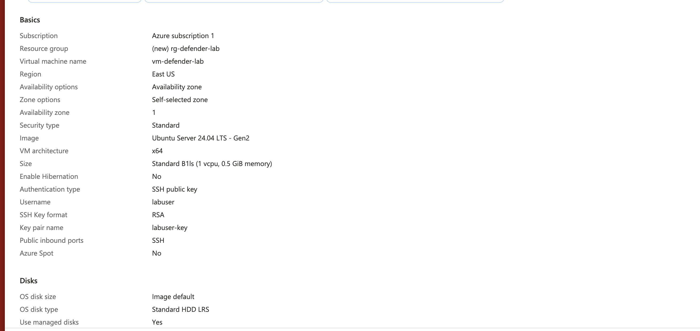
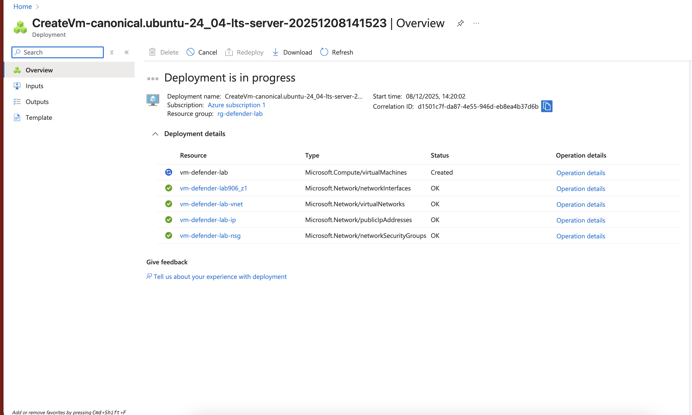
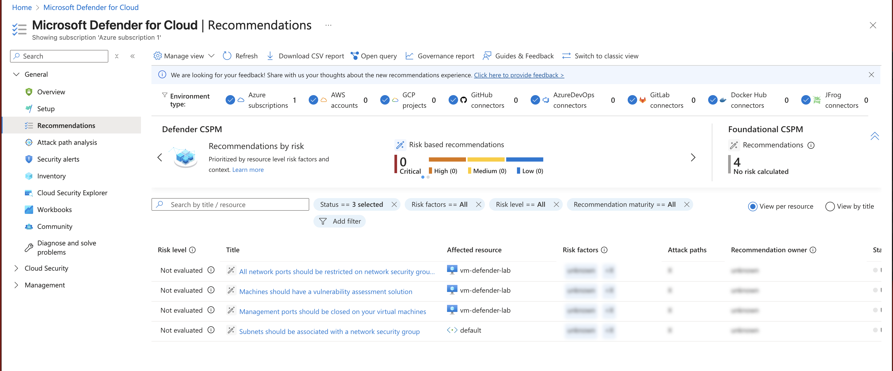

# Azure Defender for Cloud (Attack via Misconfiguration)

This lab demonstrates how **Microsoft Defender for Cloud** detects insecure configurations by intentionally deploying a poorly secured virtual machine and reviewing resulting security recommendations.

---

## **1. Overview**
In this lab you will:
- Enable and use Microsoft Defender for Cloud
- Deploy a virtual machine with insecure settings
- View and understand security recommendations generated from Defender for Cloud

---

## **2. Prerequisites**
- An Azure subscription (Defender for Cloud free tier is enabled by default)
- Permission to create virtual machines

---

## **3. Steps**

---

## **Step 1 – Open Defender for Cloud**
1. In the Azure Portal search bar, type **Defender for Cloud** → open it.
2. Verify your subscription appears.
3. Review the **Security posture** panel.

**Screenshot D1 – Defender for Cloud Overview**

---

## **Step 2 – Create a Small VM with Insecure Access**
1. Go to **Virtual machines**.
2. Click **Create → Azure virtual machine**.
3. Fill in the basics:
   - **Resource group:** `rg-defender-lab` (or reuse `rg-security-lab`)
   - **Name:** `vm-defender-lab`
   - **Region:** your usual region
   - **Image:** Ubuntu or Windows Server
   - **Size:** smallest available (e.g., `B1s`)
4. Admin account:
   - Username: `labuser`
   - Authentication: password or SSH key (password is simplest)
5. **Inbound ports:**
   - Allow **SSH (22)** or **RDP (3389)**
   - Source: **Any (0.0.0.0/0)** ← intentionally insecure

6. Click **Review + create**.

**Screenshot D2 – VM Review Page (Showing Open Ports)**

7. Click **Create**.
8. Wait for deployment to finish.
9. Click **Go to resource** (optional).

**Screenshot D3 – Deployment Progress**

---

## **Step 3 – View Defender for Cloud Recommendations**
After a few minutes, Defender for Cloud begins analyzing the VM.

1. Return to **Defender for Cloud**.
2. Go to **Recommendations**.
3. Filter:
   - **Resource type:** Virtual machines
4. You should see recommendations similar to:
   - *"Management ports of virtual machines should be closed"*
   - *"Virtual machines should have a vulnerability assessment solution installed"*
   - *"Subnets should be associated with a network security group"*

5. Click one of the recommendations.
6. View:
   - Description
   - Affected resources (should include **vm-defender-lab**)
   - Remediation steps

**Screenshot D4 – Defender Recommendations**

**Screenshot D5 – Recommendation Detail Page**

---

## **4. Cleanup**
To avoid charges:

1. Go to **Virtual machines**.
2. Select **vm-defender-lab**.
3. Click **Stop** (optional).
4. Click **Delete** → confirm.
5. If you created a new resource group (e.g., `rg-defender-lab`):
   - Go to **Resource groups** → select it → **Delete resource group**.

---
