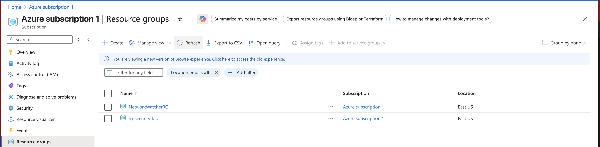
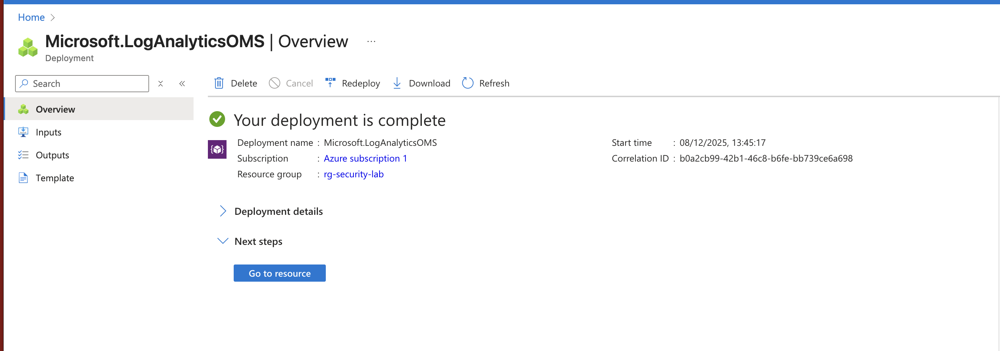
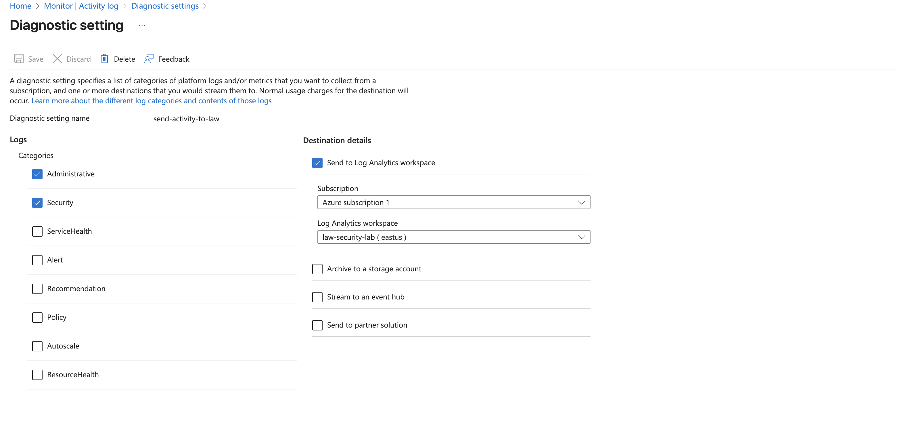
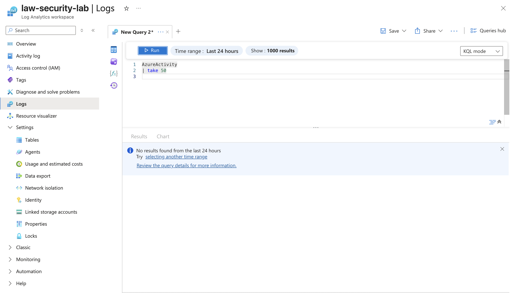
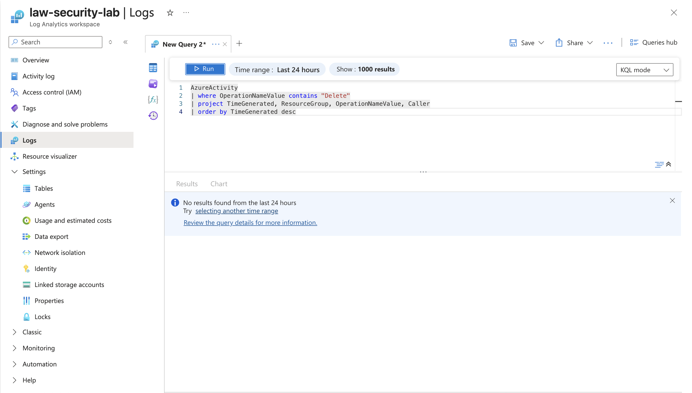
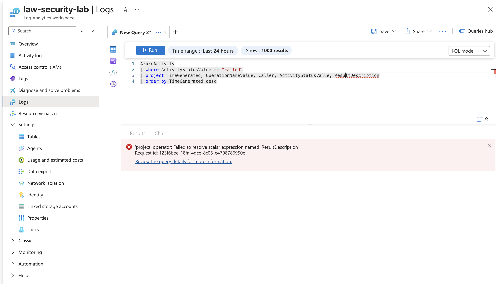
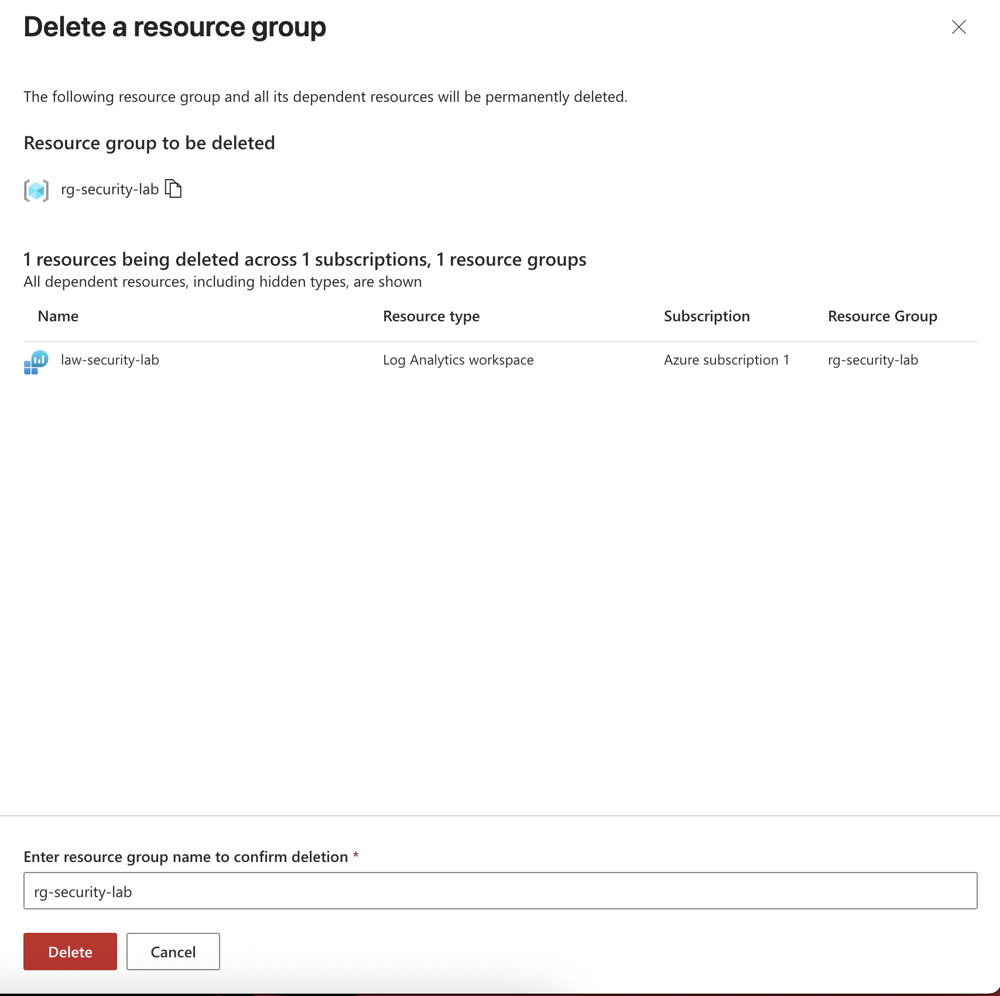

# Azure Log Analytics & KQL

This lab walks through creating a Resource Group, deploying a Log Analytics Workspace, configuring Activity Log export, and running KQL queries to analyze Azure Activity Logs.

---

## **1. Overview**
In this lab you will:
- Create a **Resource Group**
- Create a **Log Analytics Workspace**
- Connect **Activity Logs** to the workspace
- Run **Kusto Query Language (KQL)** queries

---

## **2. Prerequisites**
- Azure subscription (free or trial)
- Permissions to create Log Analytics Workspaces and Diagnostic Settings

---

## **3. Steps**

---

## **Step 1 – Create Resource Group**
1. In the Azure Portal, navigate to **Resource groups**.
2. Click **Create**.
3. Fill in:
   - **Subscription:** your main subscription
   - **Resource group name:** `rg-security-lab`
   - **Region:** choose one (e.g., West Europe)
4. Click **Review + create** → **Create**.
5. After deployment completes, click **Go to resource**.

**Screenshot A1 – Resource Group overview**



---

## **Step 2 – Create Log Analytics Workspace**
1. In the search bar, type **Log Analytics workspaces**.
2. Click **Create**.
3. Fill in:
   - **Subscription:** your main subscription
   - **Resource group:** `rg-security-lab`
   - **Name:** `law-security-lab`
   - **Region:** same as Resource Group
4. Click **Review + create** → **Create**.
5. After deployment completes, click **Go to resource**.

**Screenshot A2 – Workspace overview**



---

## **Step 3 – Send Activity Logs to Workspace**
1. Open **Monitor** from the Azure Portal.
2. In the left menu, select **Activity log**.
3. Click **Export Activity Logs** or **Diagnostic settings**.
4. Click **Add diagnostic setting**.
5. Configure:
   - **Name:** `send-activity-to-law`
   - Under **Logs**, check:
     - Administrative
     - Security
   - Under **Destination details**:
     - Check **Send to Log Analytics workspace**
     - Select `law-security-lab`
6. Click **Save**.

**Screenshot A3 – Diagnostic Setting**



---

## **Step 4 – Run KQL Queries**
1. Open **Log Analytics workspaces** → select `law-security-lab`.
2. Click **Logs**.
3. Wait for the query editor to load.

---

### **Query 1 – Basic Activity Log Query**
```kql
AzureActivity
| take 50
```
**Screenshot A4 – Query 1 Results**



---

### **Query 2 – Delete Operations**
```kql
AzureActivity
| where OperationNameValue contains "Delete"
| project TimeGenerated, ResourceGroup, OperationNameValue, Caller
| order by TimeGenerated desc
```
**Screenshot A5 – Query 2 Results**



---

### **Query 3 – Failed Operations**
```kql
AzureActivity
| where ActivityStatusValue == "Failed"
| project TimeGenerated, OperationNameValue, Caller, ActivityStatusValue, ResultDescription
| order by TimeGenerated desc
```
**Screenshot A6 – Query 3 Results**



---

## **4. Cleanup** (Optional)
You can remove all created resources by deleting the Resource Group:
1. Open **Resource groups**.
2. Select `rg-security-lab`.
3. Click **Delete resource group**.
4. Type the name to confirm and delete.

**Screenshot – Cleanup**



---
