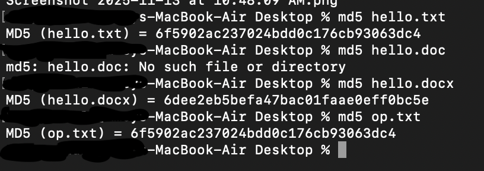
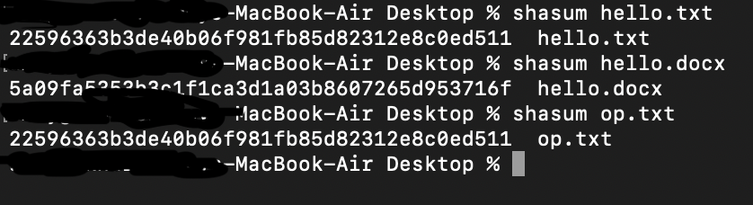

# Hash Practical — mac Terminal (macOS Desktop)

## Objective
Create three files (`hello.txt`, `op.txt`, and `hello.docx`) on macOS Terminal and compute their MD5 and SHA checksums. Observe and explain why the two `.txt` files produce the same hash while the `.docx` file produces a different one.

---

## Environment
- **System:** macOS (Terminal)
- **Location:** Desktop
- **Built-in commands used:** `touch`, `nano`, `md5`, `shasum`

---

## Steps Performed (as shown in screenshots)

### 1. Creating files
Using Terminal commands to create and edit files:
```bash
cd Desktop
touch hello.txt
nano hello.txt
touch op.txt
nano op.txt
```

Both text files were created and edited to include identical text (e.g., “Hello world”).

**Screenshot:**  


---

### 2. Running MD5 hash checks
```bash
md5 hello.txt
md5 hello.docx
md5 op.txt
```

**Observed output:**
```
MD5 (hello.txt) = 6f5902ac237024bdd0c176cb93063dc4
MD5 (hello.docx) = 6dee2eb5befa47bac01faae0eff0bc5e
MD5 (op.txt) = 6f5902ac237024bdd0c176cb93063dc4
```

**Screenshot:**  


**Observation:**
- `hello.txt` and `op.txt` have identical MD5 hashes — meaning their contents are exactly the same at the byte level.
- `hello.docx` has a completely different MD5 hash — indicating it contains a different binary structure.

---

### 3. Running SHA checks
```bash
shasum hello.txt
shasum hello.docx
shasum op.txt
```

**Observed output:**
```
22596363b3de40b06f981fb85d82312e8c0ed511  hello.txt
5a09fa525b3a1f1ca3d1a03b8607265d953716f  hello.docx
22596363b3de40b06f981fb85d82312e8c0ed511  op.txt
```

**Screenshot:**  


**Observation:**
- Again, both `.txt` files match perfectly.
- The `.docx` file differs.

---

## Explanation — Why the hashes differ
Hashes (MD5, SHA-1, etc.) depend on the *exact bytes* in a file. If even one byte changes, the hash changes completely.

- `hello.txt` and `op.txt` are **plain text** files with identical content → identical bytes → identical hashes.
- `hello.docx` is a **Word document** — it contains additional binary and XML data such as formatting, metadata, and internal structures → different bytes → different hashes.

Even if the visible text inside the `.docx` looks the same as the `.txt`, the underlying data structure is not. A `.docx` file is actually a ZIP archive containing XML and media files.

---

## Summary Table
| File Name    | Format    | MD5 Hash                              | SHA Hash                                   | Identical? |
|---------------|-----------|----------------------------------------|---------------------------------------------|-------------|
| hello.txt     | Plain text | 6f5902ac237024bdd0c176cb93063dc4 | 22596363b3de40b06f981fb85d82312e8c0ed511 | ✅ |
| op.txt        | Plain text | 6f5902ac237024bdd0c176cb93063dc4 | 22596363b3de40b06f981fb85d82312e8c0ed511 | ✅ |
| hello.docx    | Word doc  | 6dee2eb5befa47bac01faae0eff0bc5e | 5a09fa525b3a1f1ca3d1a03b8607265d953716f | ❌ |

---

## Why this happens
1. **Same content → same bytes → same hash.**  
2. **Different formats → different bytes → different hash.**  
3. File format metadata (author, timestamps, styles, etc.) in `.docx` makes it structurally unique.

---

## Security Note
- MD5 and SHA-1 are not cryptographically secure (vulnerable to collisions).  
  For stronger checks, use:
  ```bash
  shasum -a 256 hello.txt
  ```

---

## Conclusion
Identical text files produce identical hash values because their byte-level data matches exactly.  
The `.docx` file produces a different hash because it’s stored in a completely different format with additional metadata and structure.
