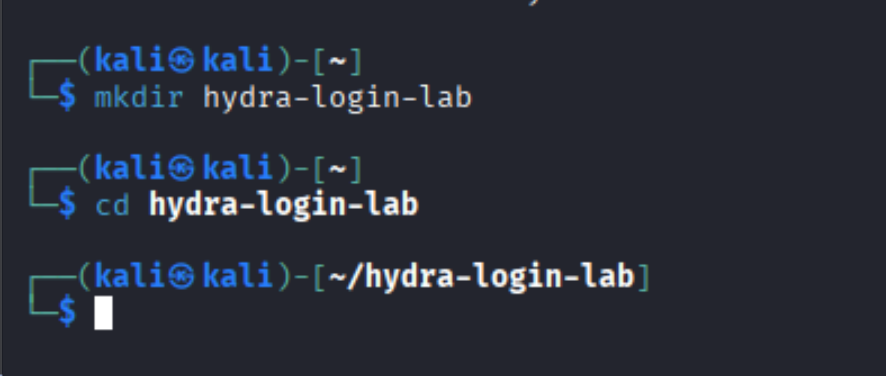
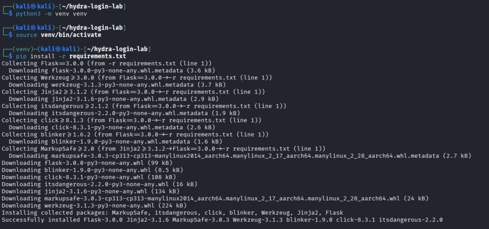
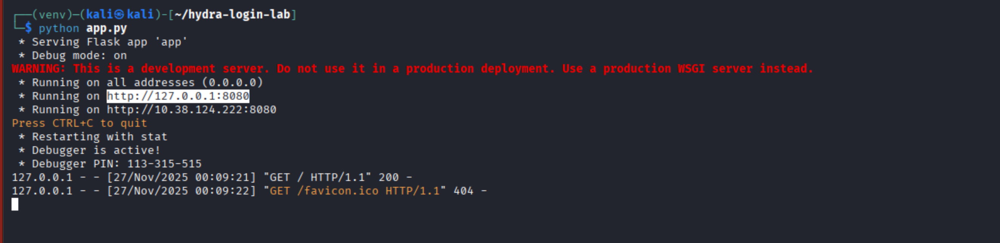
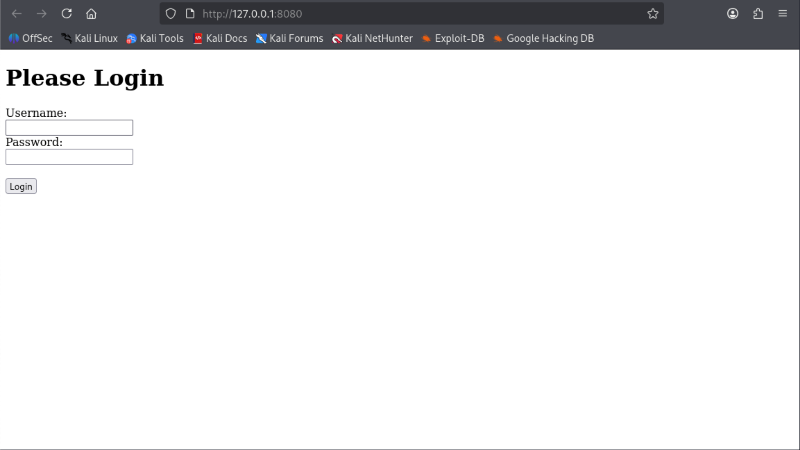
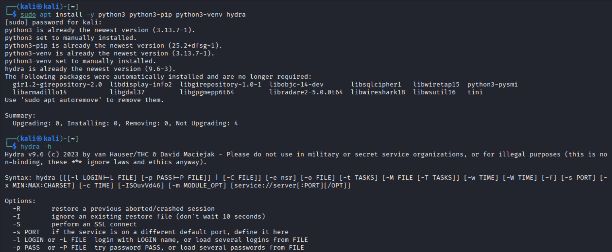
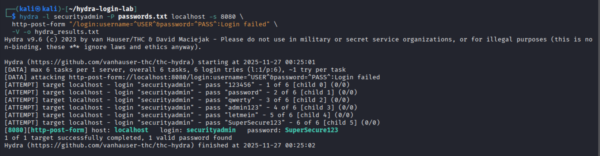

# Hydra Login Brute-Force Lab  
A self-contained vulnerable login lab built with **Flask** and tested using **THC-Hydra** on **Kali Linux**, then uploaded to GitHub via macOS.

> **Ethical & Legal Notice**  
> This lab is for **educational purposes only**. Only use Hydra against systems you own or have explicit permission to test.

---

## Project Overview
This project recreates a simple web login form so you can practice **HTTP POST brute-force attacks** with Hydra in a safe and controlled environment.

The web application:
- Runs locally on **Flask**
- Provides a simple `/login` route
- Displays *Login failed* on incorrect credentials
- Displays a success message when correct credentials are entered
- Allows Hydra to detect success/failure by reading the response text

---

#  Part 1 — Setting Up the Lab on Kali Linux

## Create the project directory
```bash
mkdir hydra-login-lab
cd hydra-login-lab
```

### Screenshot  


---

## Create & activate a Python virtual environment
```bash
python3 -m venv venv
source venv/bin/activate
```

### Screenshot  


---

## Install dependencies
```bash
pip install -r requirements.txt
```

(Shown in the screenshot above.)

---

## Run the Flask application
```bash
python app.py
```

The application launches at:

```
http://127.0.0.1:8080
```

### Screenshot  


---

# Part 2 — Testing the Login Page

## Open the login page
Navigate to:

```
http://127.0.0.1:8080
```

### Screenshot  


---

## Attempt a failed login  
Entering wrong credentials results in:

**Login failed**

### Screenshot  


---

## Attempt a successful login  
Use:

- Username: `securityadmin`
- Password: `SuperSecure123`

### Screenshot  


---

# Part 3 — Installing Hydra

Hydra is preinstalled on most Kali images, but you can confirm:

```bash
sudo apt install -y hydra
hydra -h
```

### Screenshot  


---

# Part 4 — Running Hydra Against the Login Form

Execute:

```bash
hydra -l securityadmin -P passwords.txt localhost -s 8080   http-post-form "/login:username=^USER^&password=^PASS^:Login failed"   -V -o hydra_results.txt
```

Hydra discovers the correct credential pair:

```
login: securityadmin   password: SuperSecure123
```

### Screenshot  


---

# Part 5 — Uploading the Lab to GitHub (via Mac)

### Steps:
1. Zip the project folder on Kali  
2. Transfer to Mac  
3. Unzip  
4. Initialize Git:

```bash
git init
git add .
git commit -m "Initial commit: Hydra login brute-force lab"
```

5. Create a GitHub repo  
6. Push:

```bash
git branch -M main
git remote add origin https://github.com/<your-username>/hydra-login-lab.git
git push -u origin main
```

---

# Files Included
- `app.py`
- `templates/login.html`
- `passwords.txt`
- `requirements.txt`
- `images/`
- `hydra_results.txt` (optional)

---

# Conclusion
This lab demonstrates how to create a local vulnerable login form and safely perform brute-force testing using Hydra.  
