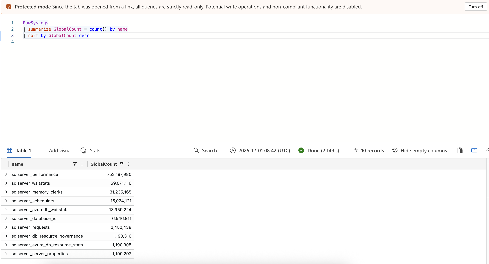
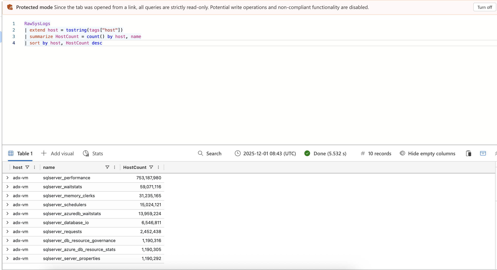
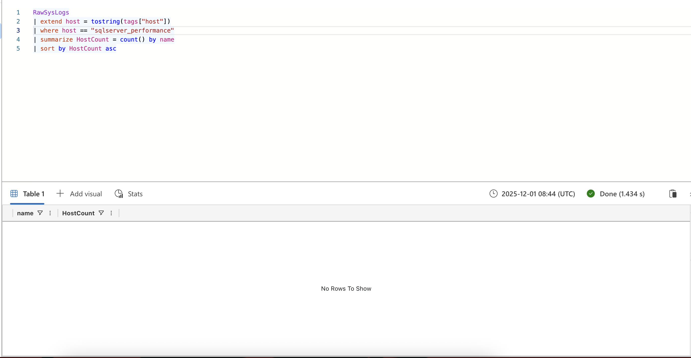
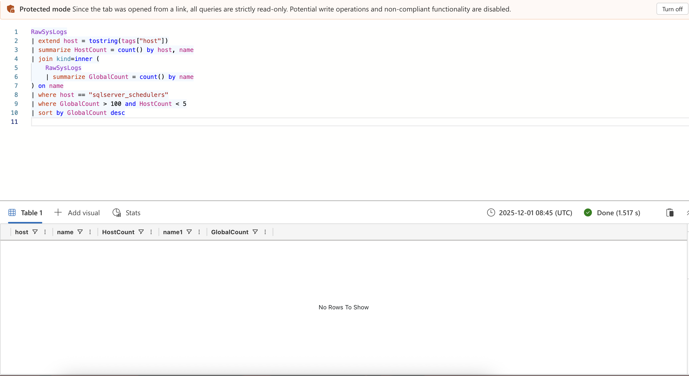

# Lab 2 – Threat Hunting: Rare vs Common Events (KQL)

## Objective
Hunt for **unusual behavior** by comparing:
- Global event frequency  
- Host-specific event frequency  

This helps detect **outlier activity**, similar to real Microsoft Sentinel threat-hunting.

---

## Step-by-Step Instructions (With Screenshot Moments)

### Step 1 — Check Global Frequency of Events  
**Where to click:**  
- Click inside query editor  
- Paste query  
- Click **Run**  

```kql
RawSysLogs
| summarize GlobalCount = count() by name
| sort by GlobalCount desc
```

Screenshot: `screenshots/step1.png`


---

### Step 2 — Count Per-Host Frequency  
**Where to click:**  
- Replace previous query  
- Click **Run**  

```kql
RawSysLogs
| extend host = tostring(tags["host"])
| summarize HostCount = count() by host, name
| sort by host, HostCount desc
```

Screenshot: `screenshots/step2.png`


---

### Step 3 — Choose One Host to Investigate  
Pick a host from Step 2 results.

**Where to click:**  
- Replace YOUR_HOST_HERE  
- Click **Run**  

```kql
RawSysLogs
| extend host = tostring(tags["host"])
| where host == "YOUR_HOST_HERE"
| summarize HostCount = count() by name
| sort by HostCount asc
```

Screenshot: `screenshots/step3.png`


---

### Step 4 — Rare vs Common Event Detection (Join Logic)  
**Where to click:**  
- Replace YOUR_HOST_HERE  
- Click **Run**  

```kql
RawSysLogs
| extend host = tostring(tags["host"])
| summarize HostCount = count() by host, name
| join kind=inner (
    RawSysLogs
    | summarize GlobalCount = count() by name
) on name
| where host == "YOUR_HOST_HERE"
| where GlobalCount > 100 and HostCount < 5
| sort by GlobalCount desc
```

Screenshot: `screenshots/step4.png`


---

##  Overall Summary of RawSysLogs Analysis

- **Most Frequent Event Type:** `sqlserver_performance` (~753M events)
- **Dataset Host:** All logs come from **one host (`adx-vm`)**
- **Event Type Analyzed:** `sqlserver_schedulers` (~15M events)
- **Host Event Count:** `adx-vm` → ~15M scheduler events
- **Timeline Behavior:**
  - Consistent 10-minute intervals
  - ~1200–1440 events per interval
  - No spikes, gaps, or anomalies

**Conclusion:**  
The dataset shows stable SQL server telemetry from a single VM, and the analysis demonstrates core KQL skills such as summarization, filtering, host extraction, and timeline analysis.

