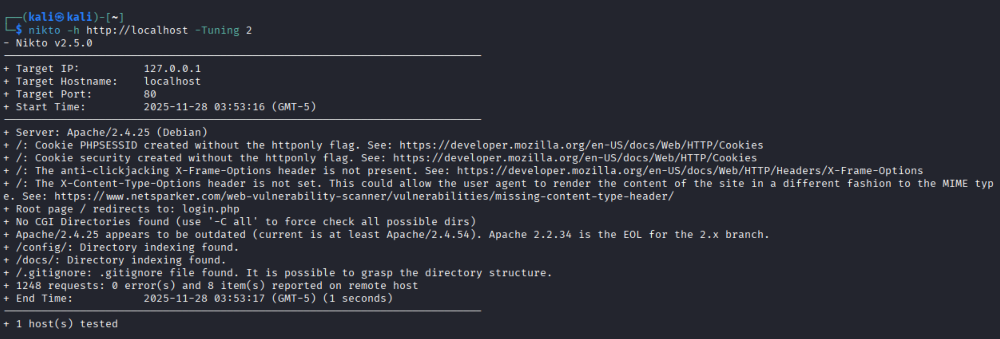
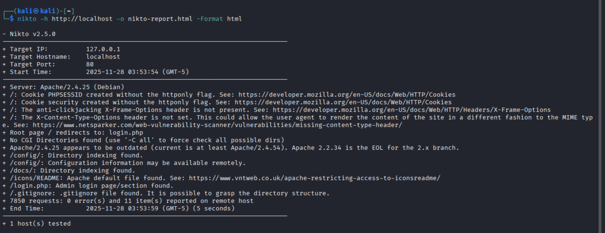

# 🔍Nikto Web Server Scanning Lab  
### Using DVWA on Kali Linux (VirtualBox on macOS M3)

This project demonstrates a **safe, offline web vulnerability scan** using **Nikto** against a locally-hosted instance of **DVWA (Damn Vulnerable Web Application)** running in a Docker container on a Kali Linux VM.

All testing was performed **legally**, **locally**, and **for learning purposes only**.

---

# Overview
This lab demonstrates:

- Running **amd64/x86 containers on ARM (M3 Mac)**
- Deploying DVWA inside Docker
- Performing a **Nikto web server vulnerability scan**
- Generating and analyzing security reports
- Identifying web misconfigurations and insecure defaults

---

# Tools Used
- Kali Linux on VirtualBox
- Docker + binfmt (multi-architecture)
- DVWA (vulnerables/web-dvwa)
- Nikto 2.5.0
- Firefox

---

# Setup Steps

### Update Kali  
```bash
sudo apt update
```

### Install Docker  
```bash
sudo apt install -y docker.io
```

### Enable Docker  
```bash
sudo systemctl enable docker --now
```

### Add User to Docker Group  
```bash
sudo usermod -aG docker $USER
```

### Install Multi-Arch Support  
```bash
sudo docker run --rm --privileged tonistiigi/binfmt --install all
```

### Pull DVWA  
```bash
docker pull vulnerables/web-dvwa
```

### Run DVWA  
```bash
docker run --rm --platform linux/amd64 -p 80:80 vulnerables/web-dvwa
```

📸 **DVWA Startup:**  


---

# Access DVWA  
Open Firefox:

```
http://localhost
```
---

# Nikto Scan

### Basic Scan  
```bash
nikto -h http://localhost
```


---
### Tuning Scan  
```bash
nikto -h http://localhost -Tuning 2
```

📸  


---
### Save HTML Report  
```bash
nikto -h http://localhost -o nikto-report.html -Format html
```




---
### Open HTML Report in browser
```bash
firefox nikto-report.html
```


📸 Browser Report:**  


# 📊 Findings

- Missing secure/httponly cookie flags  
- Missing security headers  
- Outdated Apache version  
- Directory indexing enabled  
- Default Apache files exposed  
- `.gitignore` accessible  

---


