#*Phishing Email Triage & Malicious Document Analysis (Kali Linux)*

---

## Overview  
This practical demonstrates **core digital forensics techniques** used in real-world incident response:

- Investigating phishing emails  
- Extracting hidden or embedded payloads  
- Parsing metadata and MIME structures  
- Examining HTML phishing pages  
- Analyzing Office documents for macros and malicious behavior  

Email phishing remains one of the **primary initial infection vectors** used by attackers.  
This lab recreates the workflow used by security analysts, SOC teams, and digital forensics professionals.

---

# Part A – Phishing Email Analysis

---

## 1. Creating a Working Directory  
We create a dedicated working directory to maintain a clean forensic workspace, ensuring **evidence isolation**.

```bash
mkdir -p ~/phishlab/sample1
cd ~/phishlab/sample1
```

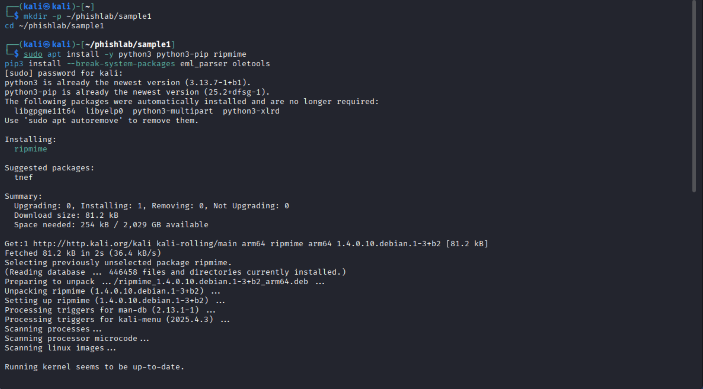

---

## 2. Installing Required Tools  

### **Theory**  
- **ripmime** extracts MIME attachments without modifying content.  
- **eml_parser** decodes email structure into JSON for deeper analysis.  
- **oletools** is a suite for document forensics (used in Part B).  

These tools are standard in email forensics workflows.

```bash
sudo apt install -y python3 python3-pip ripmime
pip3 install --break-system-packages eml_parser oletools
```


---

## 3. Downloading a Phishing Email  

### **Theory**  
Raw `.eml` files preserve **full headers**, **multipart structures**, and **attachments**.  
This allows analysts to trace the sender, origin, relay servers, and potential spoofing.

```bash
wget "https://raw.githubusercontent.com/.../sample-100.eml" -O phish1.eml
ls
```

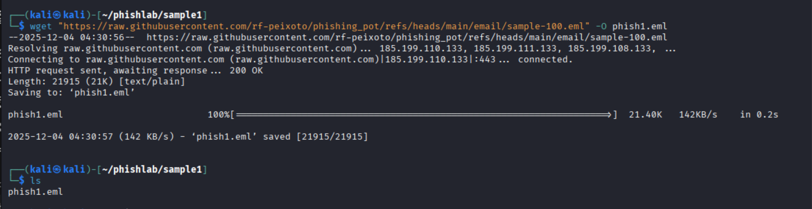

---

## 4. Manual Header Inspection  

### **Theory**  
Headers reveal critical forensic data:  
- **From** can be spoofed  
- **Reply-To** differences indicate intent to divert responses  
- **Received** shows actual mail path  
- **SPF/DKIM/DMARC** indicate authentication failures  
- Encoded subject lines often bypass filters  

Analysts use this to determine whether the email was legitimately sent.

```bash
less phish1.eml
```

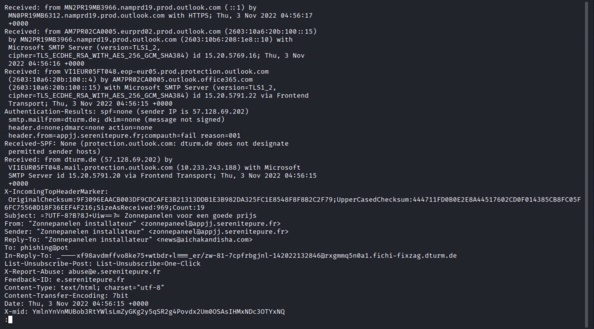

---

## 5. Parsing the Email Using eml_parser  

### **Theory**  
Manual header review is useful, but automated parsing:  
- Extracts structured data  
- Reveals hidden MIME parts  
- Uncovers tracking URLs  
- Highlights encoded HTML content  

```bash
python3 parse_eml.py > parsed.json
```

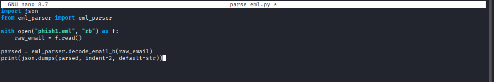

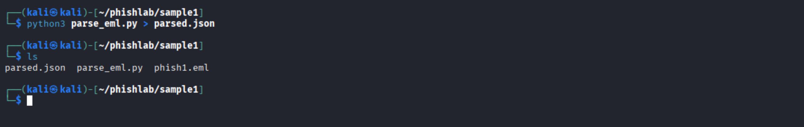

---

## 6. Reviewing Parsed Output  

### **Theory**  
The JSON output provides:  
- Body text and HTML  
- Embedded URLs  
- Charset and encoding types  
- Timestamps  
- Hashes for correlation and malware analysis  

This makes automated triage fast and consistent.

```bash
less parsed.json
```

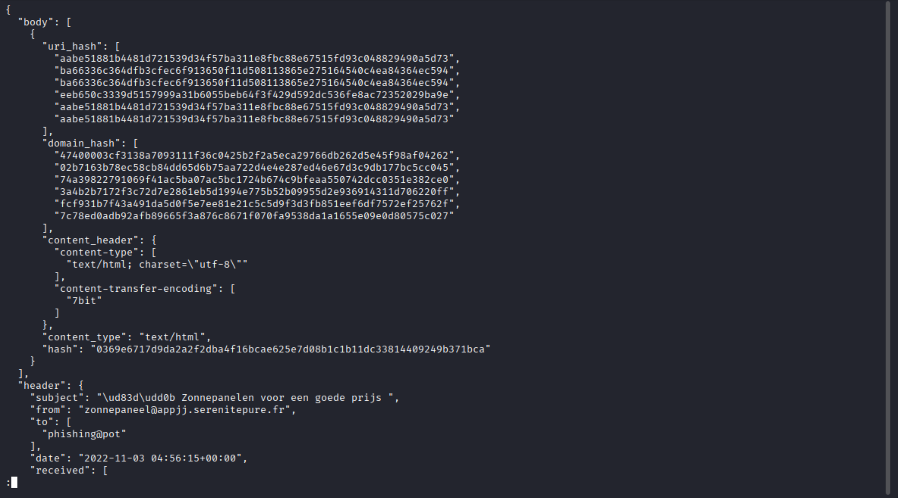

---

## 7. Extracting Attachments  

### **Theory**  
Most phishing emails contain harmful attachments such as:  
- HTML phishing forms  
- DOCM files containing macros  
- ZIP files with malware droppers  
- PDFs with malicious links  

`ripmime` extracts these without execution.

```bash
mkdir attachments
ripmime -i phish1.eml -d attachments
```

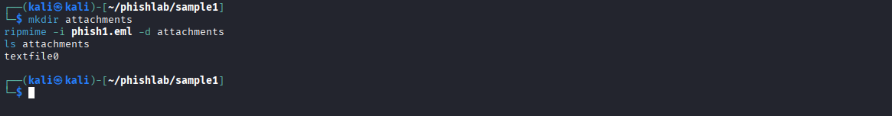

---

## 8. Inspecting HTML Attachment  

### **Theory**  
HTML-based phishing pages are used to bypass email security scanners.  
Typical indicators include:  
- Inline CSS  
- External JavaScript trackers  
- Redirect URLs  
- Fake branding  

```bash
file textfile0
head -20 textfile0
```

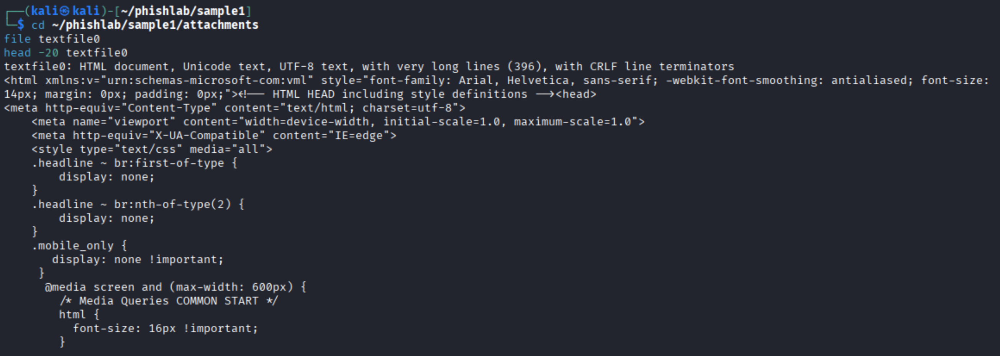

---

## 9. Rendering the HTML Phishing Page  

### **Theory**  
Viewing the phishing page helps identify:  
- Social engineering themes  
- Fake logos/branding  
- Suspicious forms or credential theft components  

```bash
mv textfile0 phish_page.html
firefox phish_page.html &
```

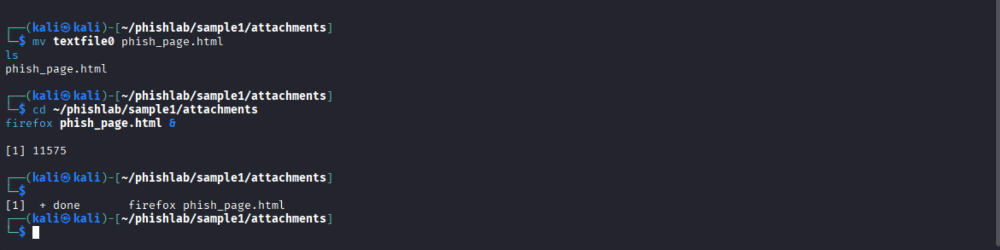


---

## 10. Extracting URLs  

### **Theory**  
URLs in phishing pages often lead to:  
- Credential harvesting sites  
- Fake login portals  
- Malware download servers  
- Tracking links  

Extracting them is essential for:  
- Threat intelligence  
- Blacklisting  
- Matching campaigns across incidents  

```bash
grep -oE 'https?://[^"'\' ]+' phish_page.html | sort -u
```


---

# 📄 Part B – Macro Document Analysis

---

## 1. Downloading DOCM Sample  

### **Theory**  
DOCM files are macro-enabled Word documents commonly used for malware delivery.  
Attackers embed VBA or DDE code that runs automatically.

```bash
wget ".../dde-test.docm" -O dde-test.docm
```

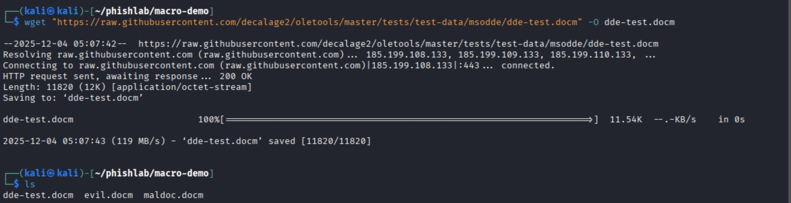

---

## 2. Running oleid  

### **Theory**  
`oleid` gives a **high-level risk assessment**:  
- Presence of VBA/XLM macros  
- Encryption (often suspicious)  
- External relationships linked to remote payloads  
- Indicators such as AutoOpen/AutoExec  

```bash
oleid dde-test.docm
```

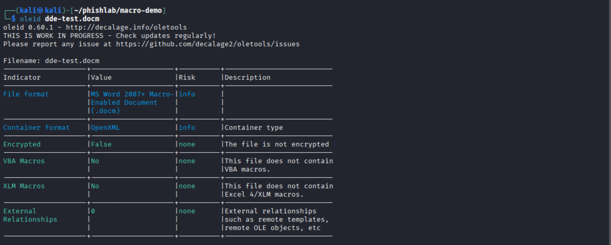

---

## 3. Running olevba  

### **Theory**  
`olevba` extracts macro code, revealing:  
- Shell commands  
- PowerShell scripts  
- Downloaders  
- Base64 payloads  
- Obfuscated strings  

This file contained **no macros**, serving as a clean baseline.

```bash
olevba dde-test.docm > macro_analysis.txt
```


---


