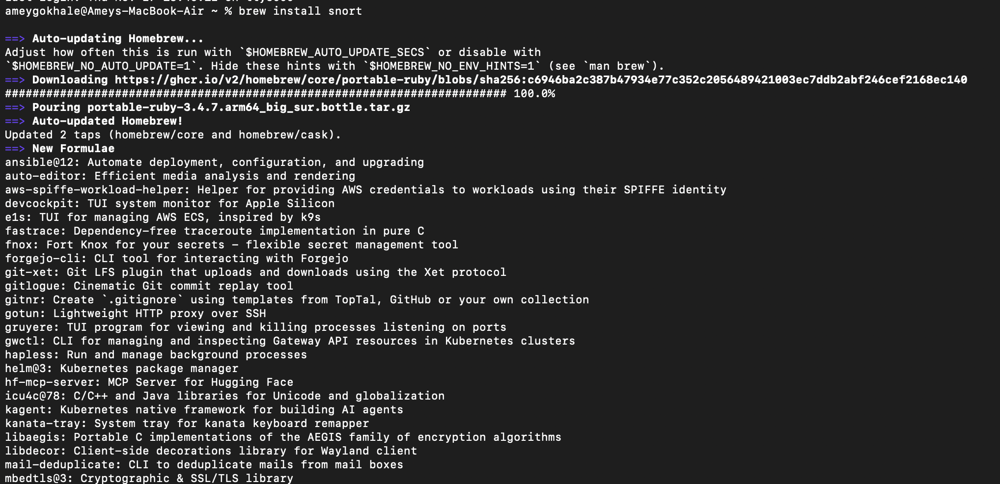
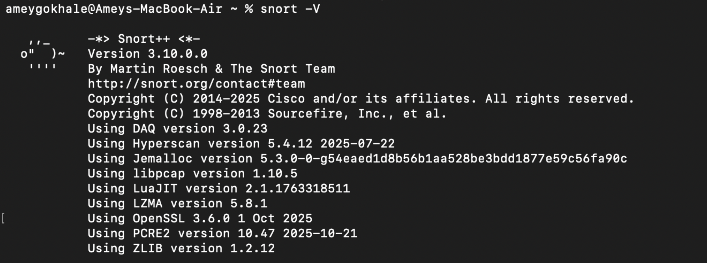
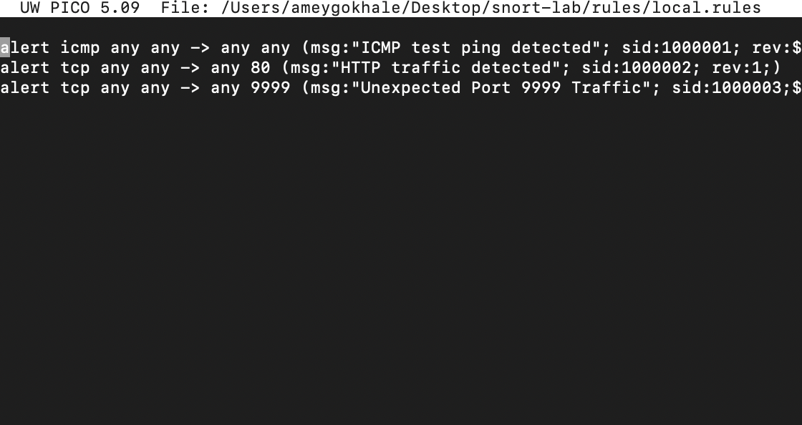
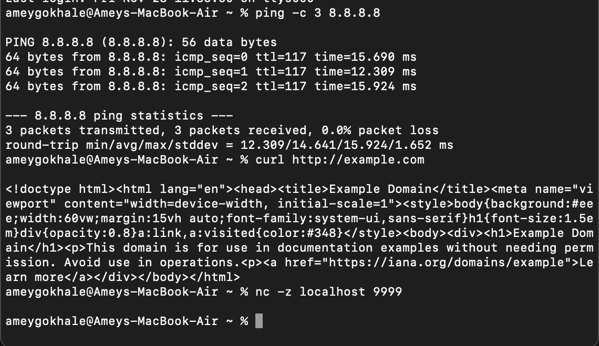
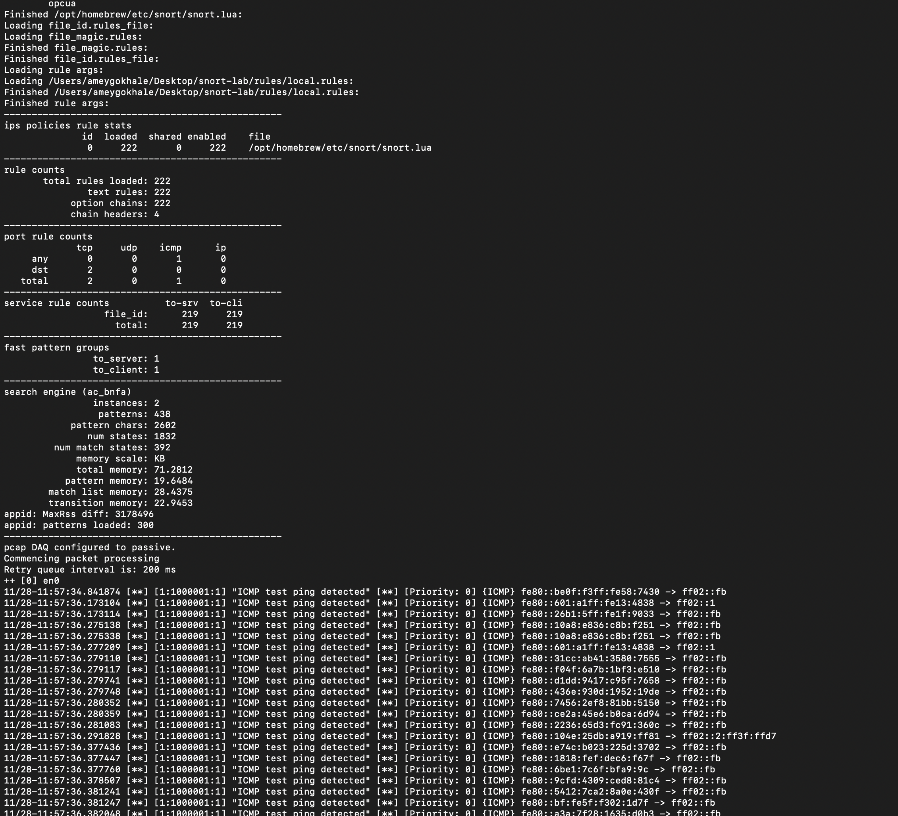

# Snort 3 Intrusion Detection Lab on macOS (Apple Silicon M3)

This project demonstrates how to install, configure, and run **Snort 3** as a Network Intrusion Detection System (NIDS) on a **MacBook Air M3**.  
It includes writing custom Snort rules, generating test traffic, capturing alerts, and validating Snort’s behavior.
---
# Snort Theory (Explained Simply)

## 🔍 What is Snort?
Snort is one of the most widely-used **Network Intrusion Detection Systems (NIDS)**.  
It performs:

- **Packet Capture**  
- **Packet Decoding**  
- **Normalization**  
- **Rule-based detection**  
- **Alerting & logging**

## How Snort Works Internally

### 1. **Packet Acquisition**
Snort uses **libpcap** to capture packets from an interface (e.g., en0).

### 2. **Decoding**
Snort parses frames layer-by-layer:

- Ethernet  
- IP  
- TCP / UDP / ICMP  
- Application protocols (HTTP, DNS, SSH, etc.)

### 3. **Detection Engine**
Snort matches packets against rules.

Each rule has:

```
header  (protocol, IPs, ports)
options (msg, sid, content, flags…)
```

Example:
```
alert tcp any any -> any 80 (msg:"HTTP traffic detected"; sid:1000002;)
```

### 4. **Output Module**
Snort outputs alerts:

- Console  
- Files  
- JSON  
- Unified2  
- Syslog  
- Custom scripts  

In our setup, we captured console output with `tee`.

---

# 🧩 Why These Rules Work

### ICMP Rule  
Snort inspects ICMP packets → detects ping.

### HTTP Rule  
Snort matches any TCP → port 80 → triggers alert.

### Port 9999 Rule  
Since port 9999 is uncommon, this rule simulates detecting suspicious or scanning behavior.

---

# Steps:

# 1. Installing Snort 3 (macOS)

Snort was installed via **Homebrew**, the recommended package manager for macOS.

```bash
brew install snort
```

### 📸 Installation Screenshot  


After installation, verify Snort:

```bash
snort -V
```

### 📸 Snort Version Output  


---

# 2. Creating Custom Snort Rules

A `local.rules` file was created to detect:

- ICMP pings  
- HTTP traffic on port 80  
- Traffic on unusual port 9999  

### `local.rules`:

```
alert icmp any any -> any any (msg:"ICMP test ping detected"; sid:1000001; rev:1;)
alert tcp any any -> any 80 (msg:"HTTP traffic detected"; sid:1000002; rev:1;)
alert tcp any any -> any 9999 (msg:"Unexpected Port 9999 Traffic"; sid:1000003; rev:1;)
```

### 📸 Rules Screenshot  


---

# 3. Running Snort With Custom Rules

Snort 3 command used:

```bash
sudo snort   -c /opt/homebrew/etc/snort/snort.lua   -R ~/Desktop/snort-lab/rules/local.rules   -i en0   2>&1 | tee ~/Desktop/snort-lab/logs/snort-console.txt
```

This command:

- Loads the main Snort config (`snort.lua`)
- Loads your custom rules (`-R local.rules`)
- Monitors the interface (`en0`)
- Stores all console output into a log file using `tee`

---

# 4. Generating Traffic to Trigger Rules

## ICMP Test (Ping)
```bash
ping -c 3 8.8.8.8
```

### 📸 Screenshot  


---

## HTTP Traffic (Port 80)
```bash
curl http://example.com
```

---

## Port 9999 Scan
```bash
nc -z localhost 9999
```

---

# 5. Snort Alert Output

Snort triggered alerts successfully as expected:

- ICMP Ping Alerts  
- HTTP Traffic Alerts  
- Port 9999 Alerts  

### 📸 Snort Console Alert Output  


Logs were also saved to:

```
~/Desktop/snort-lab/logs/snort-console.txt
```

---

