# Splunk Apache Web Traffic Lab (macOS, Free License)

This repository documents a hands‑on Splunk lab I built on my **Mac (Apple Silicon M3)** using the **free license** of Splunk Enterprise.

The goal of this lab is to show **end‑to‑end SIEM skills**:

- Installing and configuring Splunk on macOS  
- Creating custom indexes  
- Ingesting Apache web server logs  
- Writing SPL (Search Processing Language) queries  
- Performing basic **web traffic analysis**  
- Building a reusable **Apache Web Traffic Dashboard**  

I use Apache logs as the fully documented example.  
The same pattern can be applied to other log sources (Linux auth, Windows, Mac system, HDFS, OpenSSH, etc.).

---

## 1. Lab Architecture & Datasets

**Environment**

- macOS (M3 MacBook Air)
- Splunk Enterprise running locally on `http://localhost:8000`
- Splunk Free license (500 MB/day)

**Data Flow (for this README)**

`Apache access log file → Upload via Splunk Web → Custom index "apache" → Searches & Dashboards`

Other datasets (Linux, Windows, HDFS, MacOS, OpenSSH) can be ingested **the same way**, but are not documented step‑by‑step here to keep the README focused.

---

## 2. Installing & Starting Splunk on macOS

### 2.1. Download Splunk

I first downloaded the Splunk installer / forwarder in a terminal session:

```bash
cd ~/Downloads
ls
```

Example terminal view:


*(This screenshot simply proves I worked with Splunk artifacts on the command line.)*

### 2.2. Start Splunk for the First Time

Splunk was installed under `/Applications/splunk`.  
To start it for the first time and accept the license:

```bash
cd /Applications/splunk/bin
sudo ./splunk start --accept-license
```

Splunk then walks through:

- Accepting the license  
- Creating the **admin** user  
- Starting `splunkd` and the web UI  

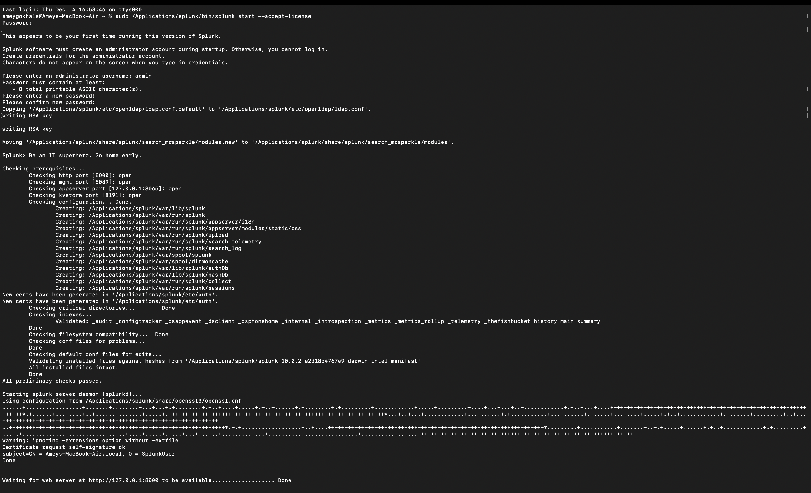

### 2.3. Log In to Splunk Web

Once `splunkd` is running, the web UI is available at:

> http://localhost:8000

I logged in with the admin credentials created in the previous step.

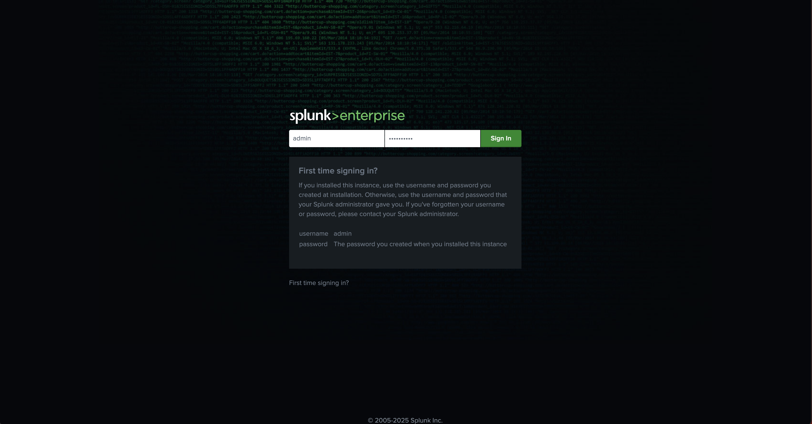

---

## 3. Switching to the Free License

For this lab I used the **Free license group** (500 MB/day), which is perfect for a home lab.

Under **Settings → Licensing** you can see the local server information and license status:

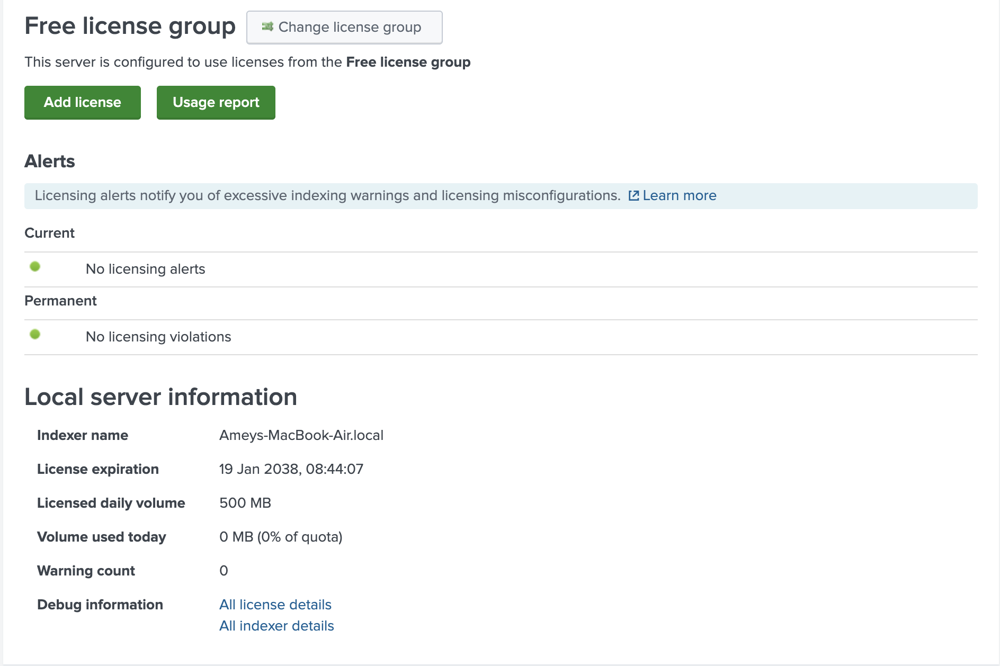

Key points:

- License type: **Free license group**  
- Daily volume: **500 MB** (more than enough for sample logs)  
- No license violations  

---

## 4. Creating Indexes

An **index** in Splunk is a logical repository to store events.  
I created separate indexes for each log family (apache, linux_auth, macos, openssh, hdfs, windows), but this README fully documents only the **apache** index.

### 4.1. New Index Screen

Navigate to:

> **Settings → Indexes → New Index**

This opens the **New Index** form:

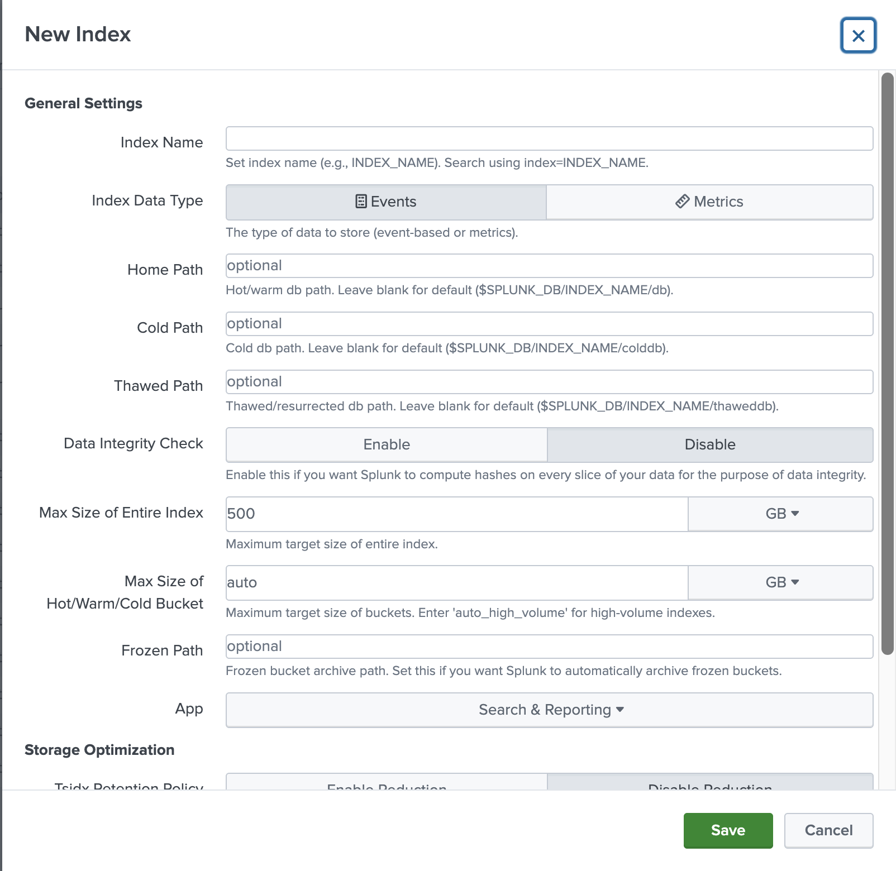

### 4.2. Create the `apache` Index

In the New Index dialog I filled out:

- **Index Name:** `apache`  
- **Index Data Type:** Events  
- All other settings left at defaults  

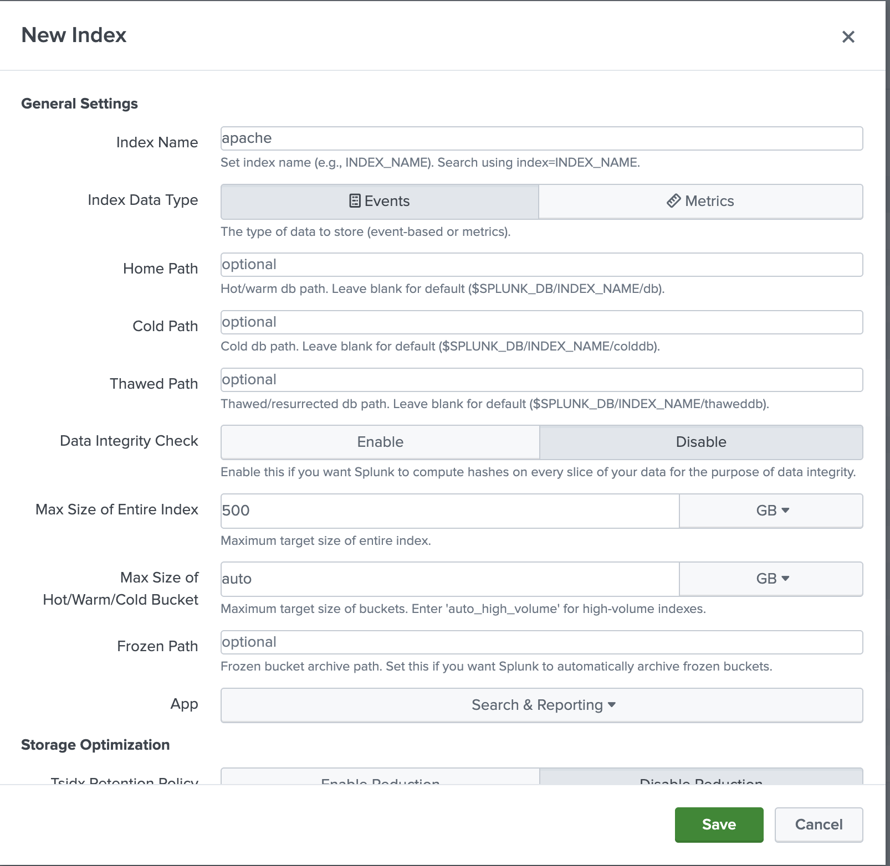

Clicking **Save** creates the index.

### 4.3. Verifying All Indexes

After creating all my indexes, the Indexes page shows them in a list:

- `apache`  
- `linux_auth`  
- `macos`  
- `openssh`  
- `hdfs`  
- `windows`  


> For this README I focus on the **apache** index, but the other indexes were created for future datasets using the same workflow.

---

## 5. (Optional) Receiving Data via Forwarder

For completeness I also configured Splunk to listen on TCP port `9997`, which is the standard receiving port for Splunk forwarders.

Under **Settings → Forwarding and receiving → Receive data**:

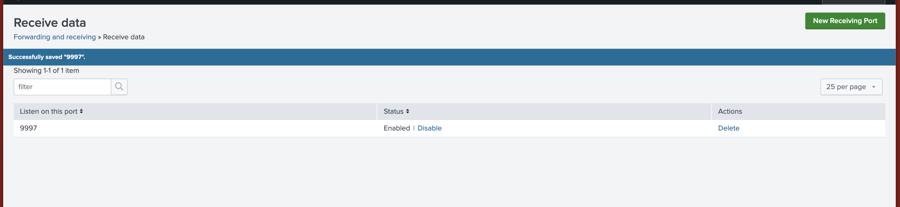

This isn’t required for the Apache file upload in this README, but it demonstrates understanding of forwarder‑based architectures.

---

## 6. Ingesting Apache Access Logs

### 6.1. Add Data → Upload

From the Splunk home page:

> **Settings → Add Data**

Splunk shows several ways to bring data in.  
For this lab I used **Upload → files from my computer**:

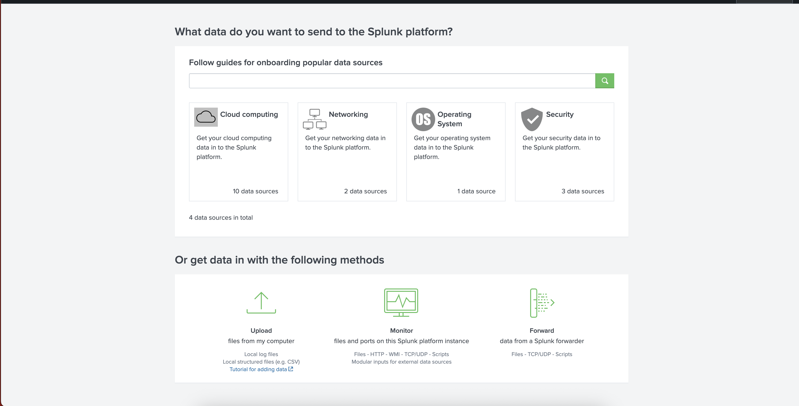

### 6.2. Upload the Apache Log File

Steps:

1. Click **Upload – files from my computer**  
2. Click **Select File** and choose `apache_access.log`  
3. Click **Next**  
4. On the Input Settings page:
   - **Source type:** `access_combined` (or `apache_access`)  
   - **Index:** `apache`  

After saving, Splunk begins ingesting the events into the `apache` index.

---

## 7. Verifying Apache Events with SPL

### 7.1. Basic Search by Source

Open **Search & Reporting** and run:

```spl
source="apache_access.log" index="apache" sourcetype="access_combined"
```

This returns the raw Apache access log events:

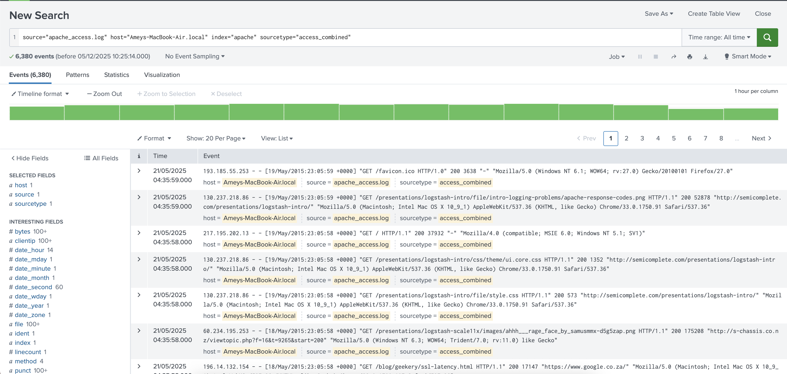

### 7.2. Search by Index

A simpler check is:

```spl
index="apache"
```

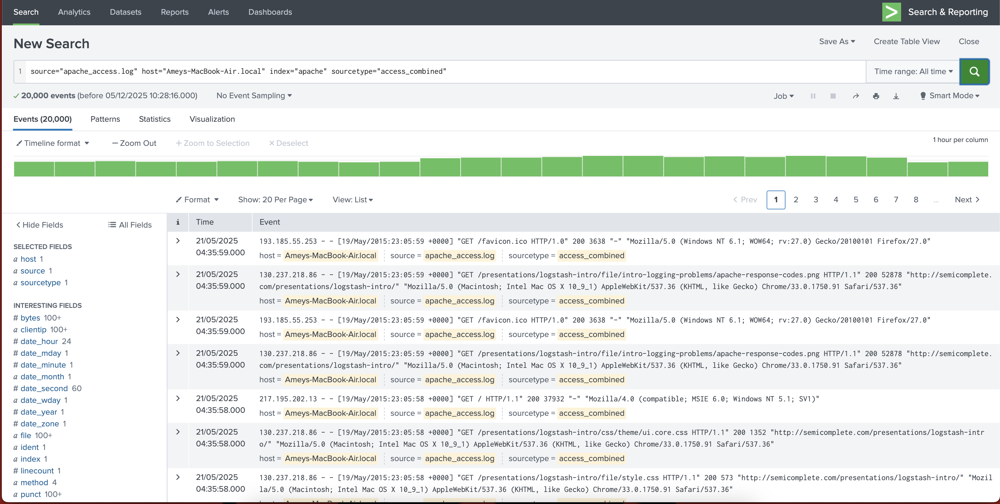

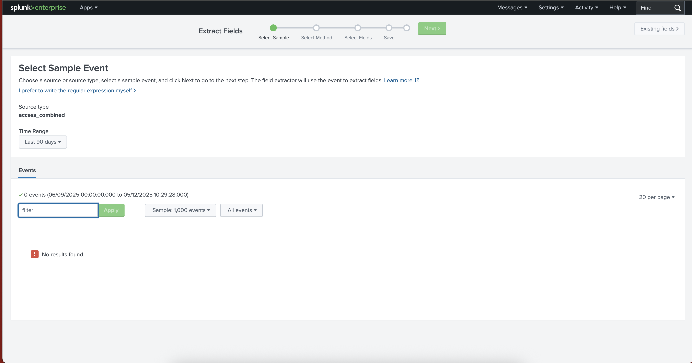

### 7.3. Another Example Search

I also ran variations of the search to show the volume of events and confirm all timestamps, hosts, and sourcetypes looked correct:

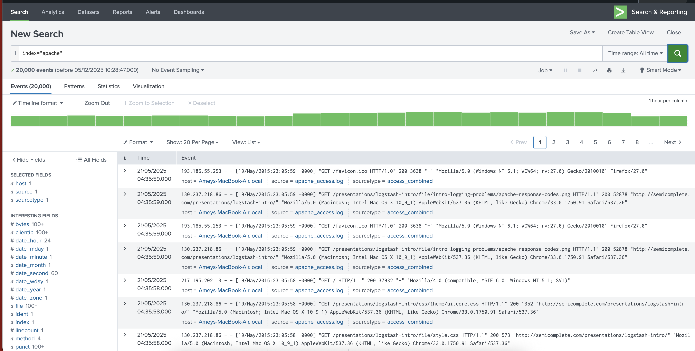

**Theory:**  
At this point Splunk has parsed the raw log file into individual events.  
Each event has metadata such as:

- `index` (apache)  
- `sourcetype` (access_combined)  
- `host` (local hostname)  
- `_time` (event timestamp in Splunk)  

This metadata is crucial for building reusable searches and dashboards.

---

## 8. Basic Apache Web Traffic Analysis with SPL

With data in the `apache` index, I built several SPL queries to answer common web‑traffic questions.

### 8.1. Requests Over Time

```spl
index=apache
| timechart span=1m count
```

This command:

- Buckets events into 1‑minute intervals  
- Counts the number of requests in each bucket  

I later turned this query into a **dashboard panel**.

### 8.2. HTTP Status Code Distribution

```spl
index=apache
| stats count by status
| sort - count
```

This produces a table of HTTP status codes (200, 404, 500, etc.) sorted by frequency:


### 8.3. Top Requested URLs

```spl
index=apache
| stats count by uri_path
| sort - count
| head 10
```

This shows the **Top 10 most requested URL paths**:


*(If this image doesn’t exist in the repo yet, you can easily add a screenshot of this query and name it `topurls.png`.)*

### 8.4. 404 Errors by URL

```spl
index=apache status=404
| stats count by uri_path
| sort - count
| head 10
```

This highlights the URLs triggering the most 404 errors—useful for:

- Broken links  
- Bruteforcing non‑existent pages  
- Misconfigured applications  


*(Similarly, if the image is not present yet, add it later under `images/404urls.png`.)*

---

## 9. Building the Apache Web Traffic Dashboard

The next step was to turn the useful searches into a **reusable dashboard** called:

> **Apache Web Traffic Dashboard**

### 9.1. Save “Requests Over Time” as a Panel

From the search:

```spl
index=apache
| timechart span=1m count
```

I clicked:

> **Save As → Dashboard Panel**

Then chose:

- **Dashboard Title:** Apache Web Traffic Dashboard  
- **Dashboard Type:** Classic Dashboards  
- **Panel Title:** Requests Over Time  

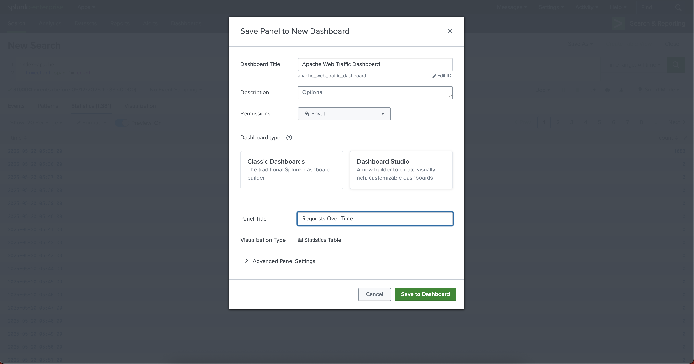

### 9.2. Add Additional Panels

I repeated the same **Save As → Dashboard Panel** process for:

1. **Status Code Distribution**

   ```spl
   index=apache
   | stats count by status
   | sort - count
   ```

2. **Top Requested URLs**

   ```spl
   index=apache
   | stats count by uri_path
   | sort - count
   | head 10
   ```

3. **404 Errors by URL**

   ```spl
   index=apache status=404
   | stats count by uri_path
   | sort - count
   | head 10
   ```

### 9.3. Final Dashboard View

Once all panels were saved to the **Apache Web Traffic Dashboard**, it looked like this:

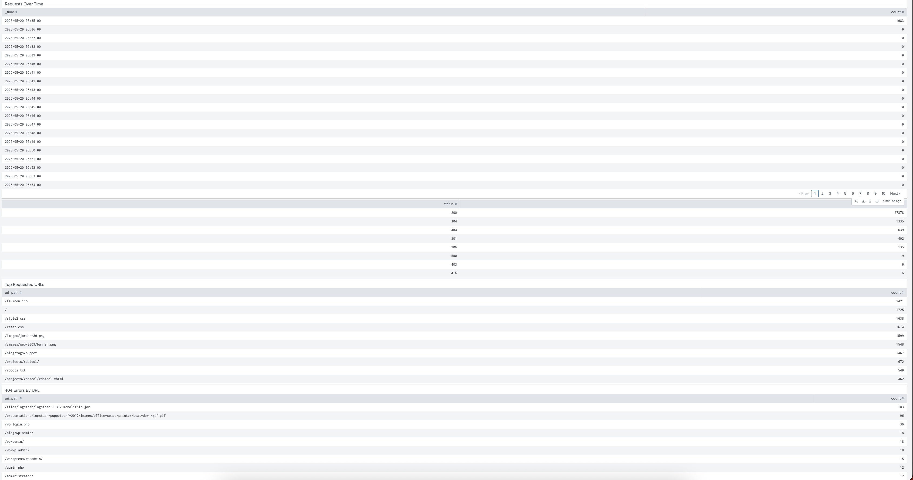

Panels:

1. **Requests Over Time** – volume trends  
2. **HTTP Status Codes** – error vs success rate  
3. **Top Requested URLs** – most popular content  
4. **404 Errors by URL** – broken/missing endpoints  

**Theory:**  
This dashboard demonstrates how a SOC or SRE team can quickly:

- Spot traffic spikes  
- See if error rates are increasing  
- Identify problematic URLs  
- Monitor overall web health  

---

## 10. How to Extend This Lab

While this README focuses on Apache logs, I also created indexes for:

- `linux_auth` (Linux authentication logs)  
- `macos` (macOS system logs)  
- `openssh` (SSH logs)  
- `hdfs` (HDFS service logs)  
- `windows` (Windows logs)  

To extend the lab:

1. Upload each dataset using **Settings → Add Data → Upload**  
2. Map it to the correct index and sourcetype  
3. Re‑use the same steps:
   - Validate with `index=<name>` searches  
   - Build SPL queries for that dataset  
   - Save useful searches as dashboard panels  

In an interview or conversation with a recruiter, I can explain:

> “I treated Apache as my fully‑documented example, but set up additional indexes ready for Linux, macOS, Windows, HDFS and OpenSSH logs. The ingestion, SPL, and dashboard pattern is the same, which shows that I understand the generic Splunk workflow, not just a single hard‑coded example.”

---

## 11. What This Lab Demonstrates

**Technical Skills**

- Splunk Enterprise installation and configuration on macOS  
- Working with the **Free license** limits and features  
- Creating and managing **indexes**  
- Ingesting log files via Upload  
- Writing SPL for time‑series and statistical analysis  
- Building multi‑panel dashboards for web analytics  

**Security / Observability Mindset**

- Monitoring HTTP status codes and errors  
- Detecting spikes in web traffic  
- Identifying problematic URLs and 404 hot spots  
- Laying groundwork for extending to auth / SSH / Windows logs  

---

## 12. How to Run This Lab Yourself

1. Install Splunk Enterprise on macOS  
2. Start Splunk and log in  
3. Switch to / confirm **Free license**  
4. Create an `apache` index  
5. Upload an Apache access log as `access_combined` into the `apache` index  
6. Run the SPL queries from Sections 8–9  
7. Build the **Apache Web Traffic Dashboard**  
8. Optionally repeat for other datasets using their own indexes  

---
