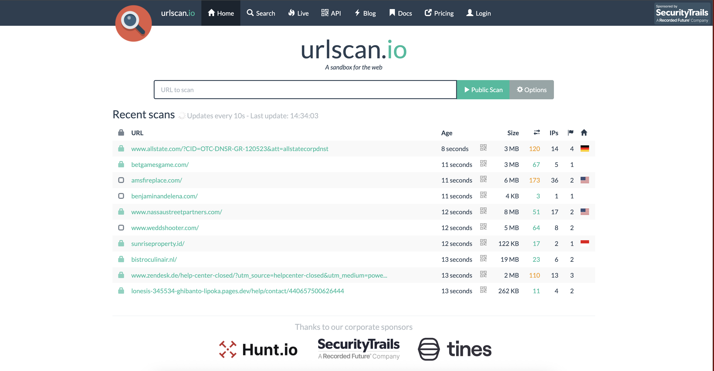
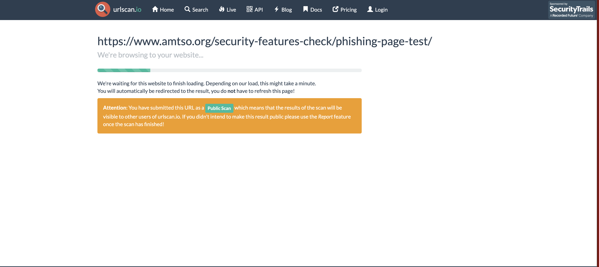
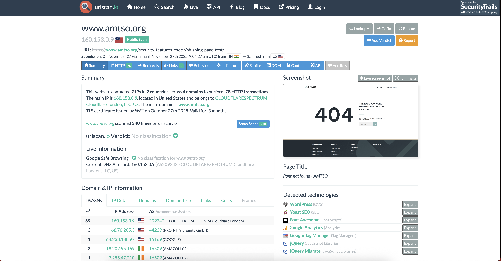
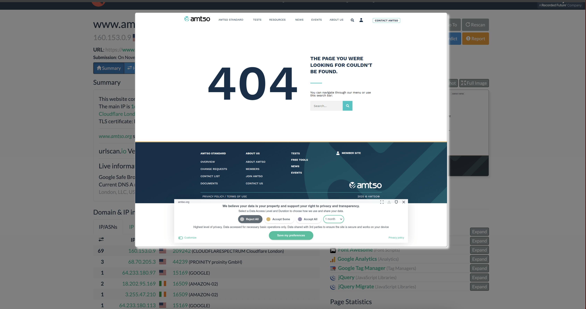
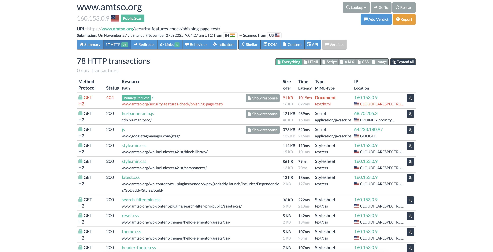
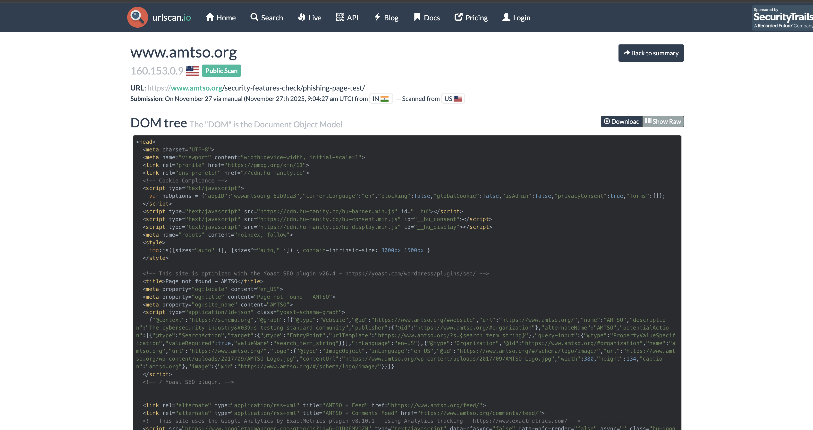

# URLScan.io Lab – AMTSO Phishing Test Page

This lab demonstrates how to analyze a URL using **URLScan.io**, a browser-based sandbox that loads, observes, and records website behavior.  
We will analyze the safe AMTSO phishing test page and document each stage with screenshots.

---

# **What is URLScan.io? (Theory Section)**

**URLScan.io** is an online web analysis sandbox used by security analysts to:

- Load a webpage inside a controlled, isolated environment  
- Capture a **screenshot** of what the page looks like  
- Collect **HTTP requests**, redirects, and external resources  
- Analyze **JavaScript**, HTML, and hidden elements  
- Identify suspicious behavior  
- Observe trackers, cookies, forms, and third-party connections  

It is commonly used for:

- **Phishing investigations**  
- **Malicious URL triage**  
- **Threat intelligence enrichment**  
- **Incident response reports**  

URLScan **does NOT execute malware**, but it **renders webpages** and allows analysts to safely inspect how a page behaves without interacting with it directly on their machine.

---

# **Lab Steps**

Below are the screenshots and explanations from scanning the AMTSO phishing test URL.

---

## Step 1 – Open URLScan.io

Go to: https://urlscan.io  
This is the main dashboard where you submit URLs.



---

## Step 2 – Submit the AMTSO Phishing Test URL

We will analyze the following safe test URL:

```
https://www.amtso.org/security-features-check/phishing-page-test/
```

Paste the URL into the search bar and begin a **Public Scan**.



---

## Step 3 – View the Scan Summary

The summary page shows:

- IP address and geolocation  
- TLS certificate  
- Screenshot preview  
- Technologies detected  
- Initial verdict and classifications  

This gives a quick overview of the website’s structure and trustworthiness.



---

## Step 4 – Page Screenshot View

URLScan.io loads the webpage in a sandboxed browser and displays the final rendered result.

This allows analysts to view **what the victim would see**, without opening the site directly.



---

## Step 5 – HTTP Transactions

Here we can inspect:

- All outbound requests  
- Loaded scripts and resources  
- Third‑party connections  
- Redirect behavior  
- Status codes (e.g., 200, 404, 302)  

This is extremely useful for identifying malicious redirects or suspicious external services.



---

## Step 6 – DOM Analysis

The **DOM Tree** shows:

- Original HTML source  
- JavaScript scripts loaded  
- Forms and inputs  
- Tracking elements  
- Hidden or obfuscated components  

Analysts can inspect phishing components, form actions, and embedded scripts.



---


Feel free to expand this lab by scanning additional safe URLs or comparing results.

