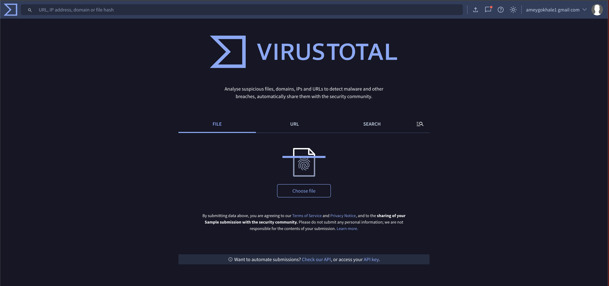
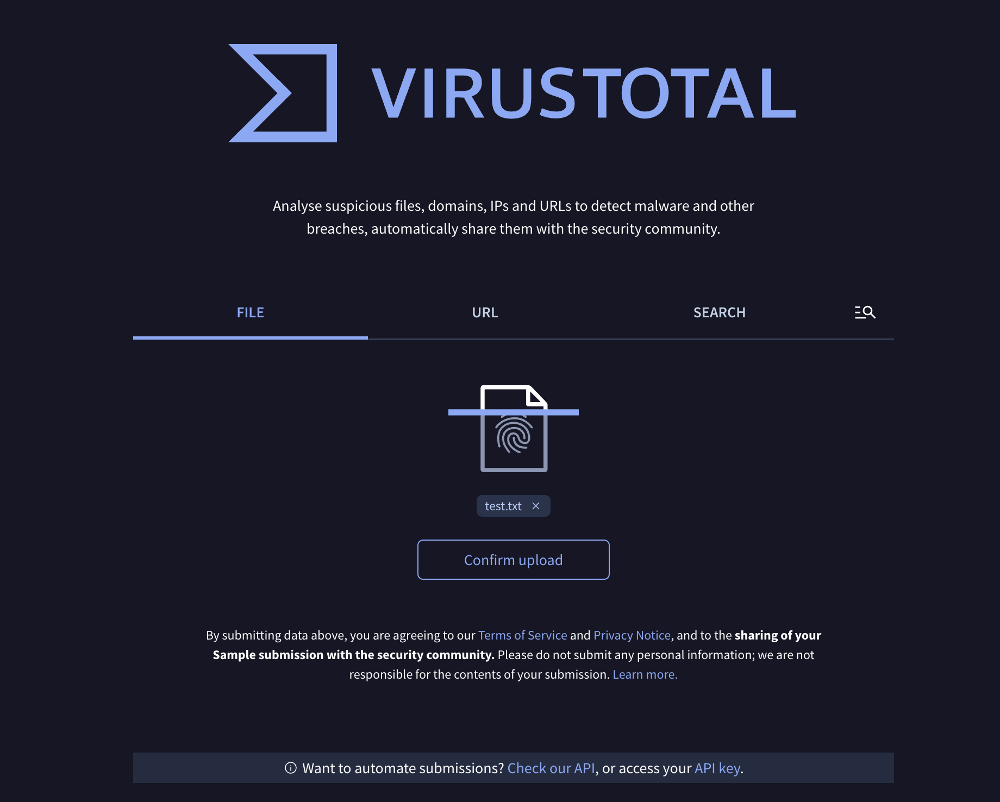
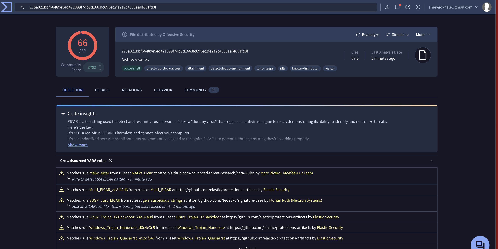
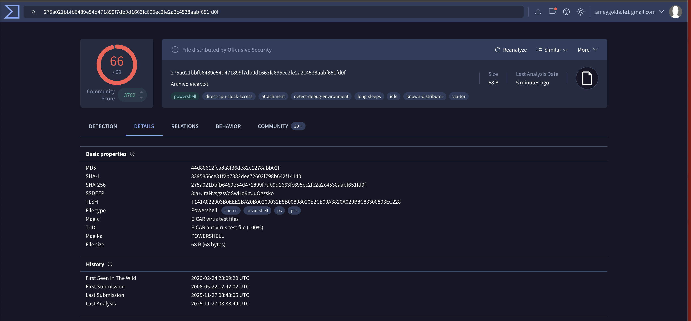
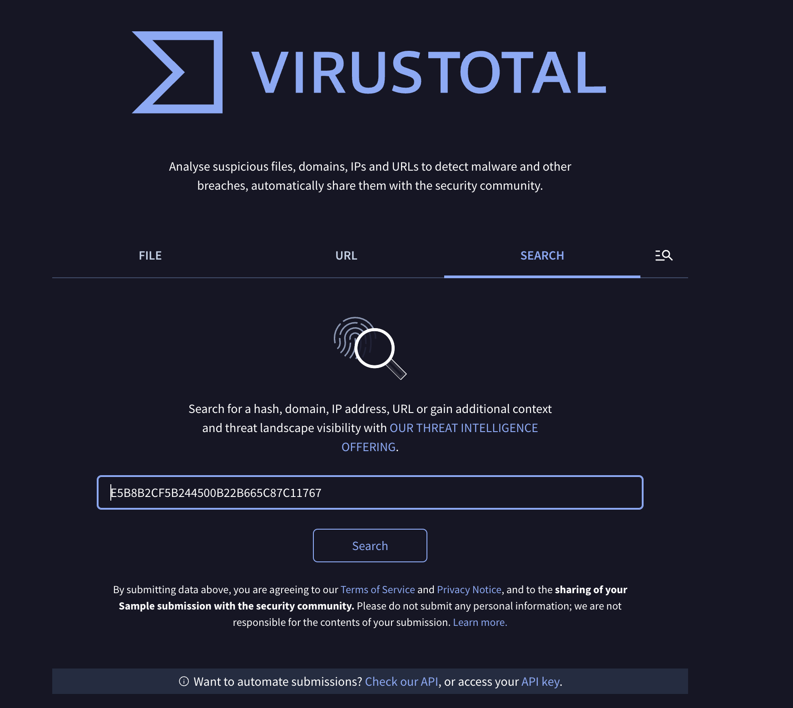
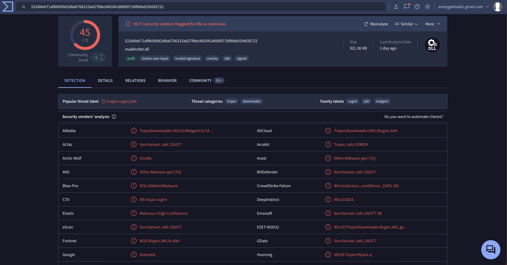
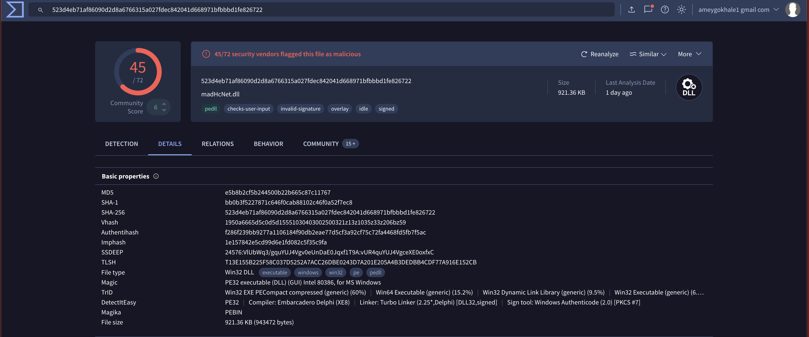

# VirusTotal Analysis Lab  
### *File Upload + Hash Search Walkthrough*

This lab demonstrates how to analyze suspicious files using **VirusTotal**, including:

- Uploading a file directly  
- Searching by file hash (MD5)  
- Reading detection results  
- Viewing metadata and threat labels  

All screenshots used in this documentation are stored inside the **`images/`** folder.

---

## 📌 1. VirusTotal Main Page

Start by navigating to the main VirusTotal dashboard.  
This is where you can choose between scanning a **file**, entering a **URL**, or searching by **hash**.

---

## 📌 2. Uploading a File for Analysis

Click **"Choose file"** on the FILE tab to upload a sample into VirusTotal.

Here is the screenshot of selecting a file for upload:

After confirming the upload, VirusTotal will process the file and redirect you to the analysis page.

---

## 📌 3. File Detection Results (EICAR Test File)

Once scanned, VirusTotal displays the **Detection** tab with the number of engines that flagged the file.

This file is the **EICAR test file**, a harmless industry-standard test string that allows users to verify antivirus detection functionality.

---

## 📌 4. File Details (EICAR)

Switching to the **Details** tab provides metadata such as:

- MD5  
- SHA-1  
- SHA-256  
- File type  
- Size  
- Magic/TRiD identification  
- First/Last seen timestamps  

---

## 📌 5. Searching by File Hash (Tusk Sample)

VirusTotal also allows analyzing a file **without uploading it**, by using its **hash** (MD5/SHA1/SHA256).

Enter the hash into the **SEARCH** bar, as shown:

Then press **Search**.

---

## 📌 6. Detection Results (Tusk Malware Sample)

Here are the results for the Tusk-related DLL sample (`madHcNet.dll`), which is flagged by multiple security vendors.

This page shows:

- Total vendors marking the file malicious  
- Threat categories (Trojan, Downloader, etc.)  
- Common family names  

---

## 📌 7. File Details (Tusk Sample)

Under the **Details** tab, VirusTotal displays:

- MD5 / SHA-1 / SHA-256 hashes  
- PE file metadata  
- Compiler/Linker info  
- Authenticode signature details  
- Size and file type  

---

