# Windows Memory Analysis with Volatility 3  
**DFIR / Memory Forensics Practical**

# Theory – Why Memory Forensics?

Memory forensics focuses on analyzing a RAM dump to uncover activity that may **never touch the disk**, including:

- Malware injected into processes  
- Credential theft tools  
- Suspicious network connections  
- Hidden/terminated processes  
- Artifacts of command execution  
- Kernel structures revealing system state  

Volatility 3 is the leading open‑source memory forensic framework and works by parsing internal OS memory structures.

---

# Practical Steps

---

## Step 1 — Install Dependencies

```bash
sudo apt update && sudo apt -y upgrade
sudo apt install -y python3 python3-pip git
```

### Screenshot 1  
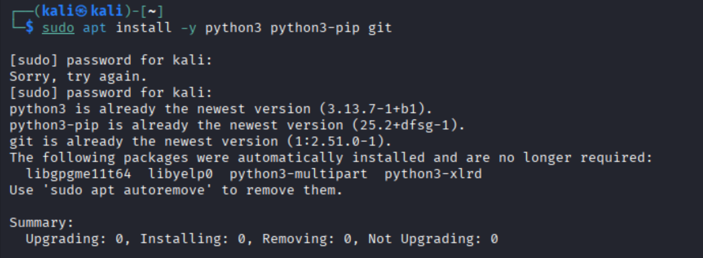

---

## Step 2 — Install Volatility 3

```bash
git clone https://github.com/volatilityfoundation/volatility3.git
cd volatility3
pip3 install -r requirements.txt --break-system-packages
python3 vol.py --help
```

### What this step tells you (theory)

Volatility 3 is written in Python and requires parsing libraries for Windows kernel structures.  
Running `--help` confirms the installation and lists available plugins.

### Screenshots 2.1–2.3  
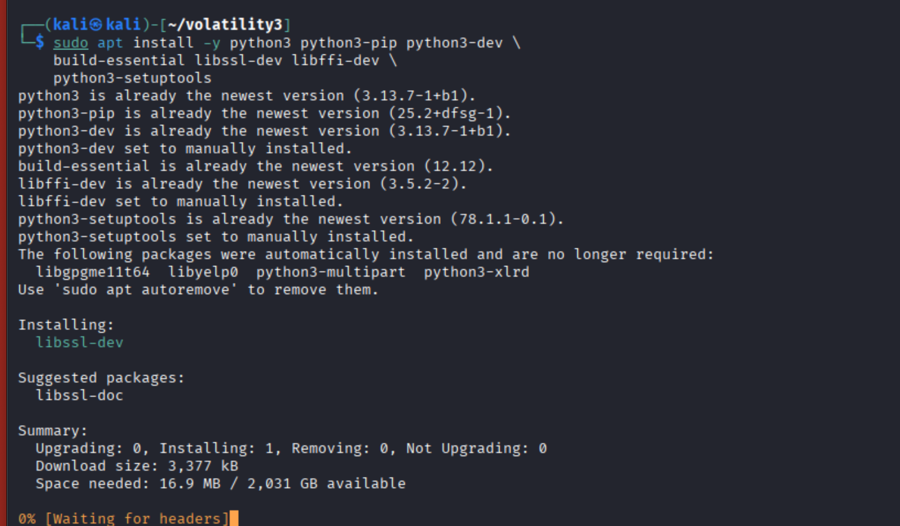
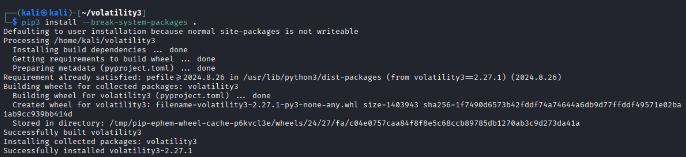
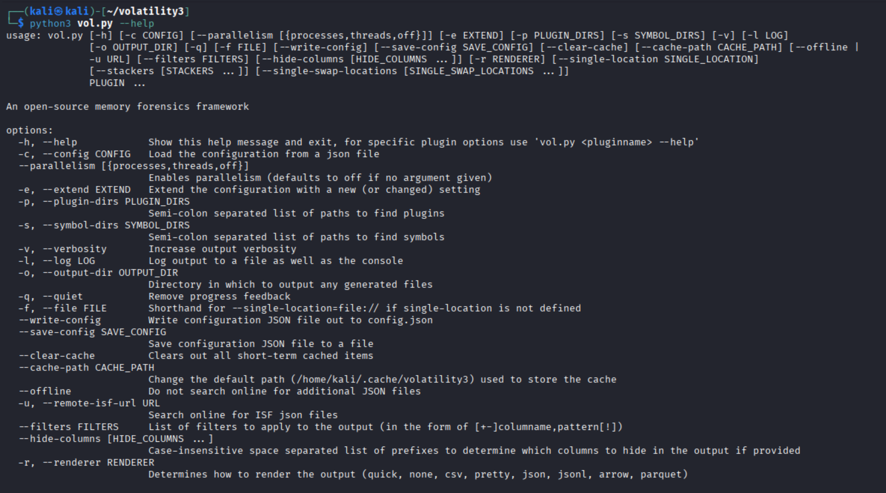

---

## Step 3 — Load & Verify Memory Image

```bash
mkdir -p ~/memlabs/lab1
cd ~/memlabs/lab1
file dump.raw
ls -lh dump.raw
```

### Theory

Memory dump formats vary: `.raw`, `.mem`, `.vmp`, `.lime`.  
`file` confirms the dump is recognized and intact.

### Screenshot 3  
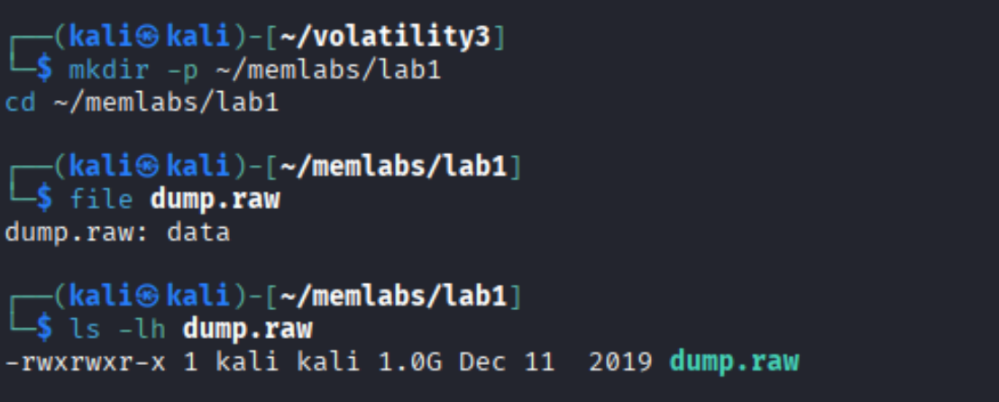

---

## Step 4 — Extract OS Information

```bash
python3 ~/volatility3/vol.py -f dump.raw windows.info
```

### What this reveals

- Windows version  
- Kernel base address  
- Build number  
- System time at capture  
- Whether 32‑bit or 64‑bit  

This confirms Volatility parsed the dump correctly.

### Screenshot 4  
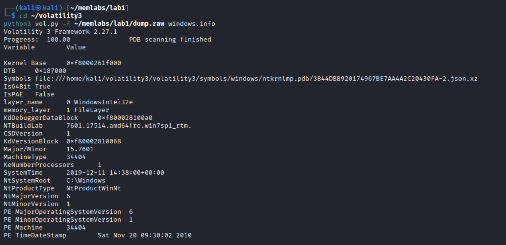

---

## Step 5 — Process Listing (pslist & pstree)

---

### **pslist**

```bash
python3 vol.py -f dump.raw windows.pslist
```

### Theory

`pslist` displays process information from the active process list.  
It **does not** show hidden or unlinked processes.

### Screenshot 5.1  
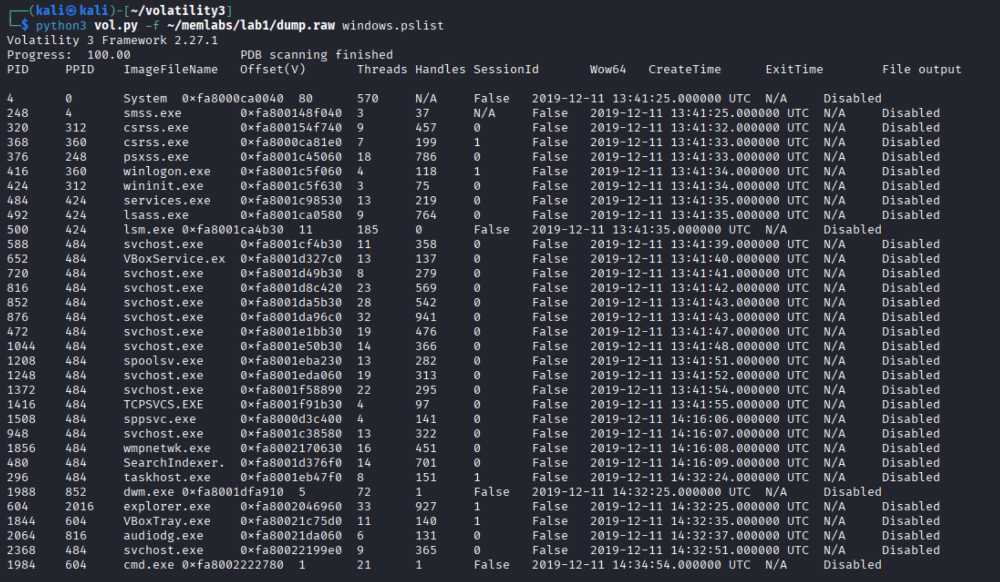

---

### **pstree**

```bash
python3 vol.py -f dump.raw windows.pstree
```

### Theory

Shows parent/child relationships.  
Anomalies include:

- Orphaned processes  
- Wrong parents  
- Suspicious process names mimicking system files  

### Screenshot 5.2  
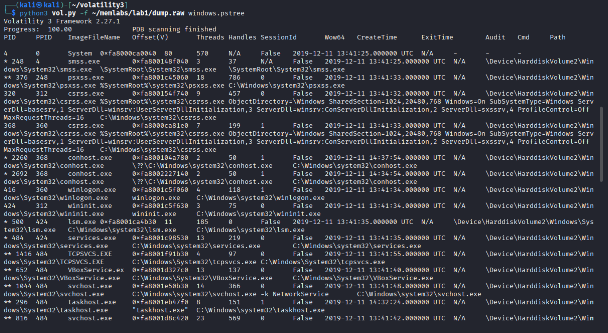

---

## Step 6 — Identify Hidden/Terminated Processes (psscan)

```bash
python3 vol.py -f dump.raw windows.psscan
```

### Theory

`psscan` manually scans memory for EPROCESS structures.

This finds:
- Hidden processes  
- Terminated but still resident processes  
- Malware unlinking itself from the active list  

### Screenshot 6  
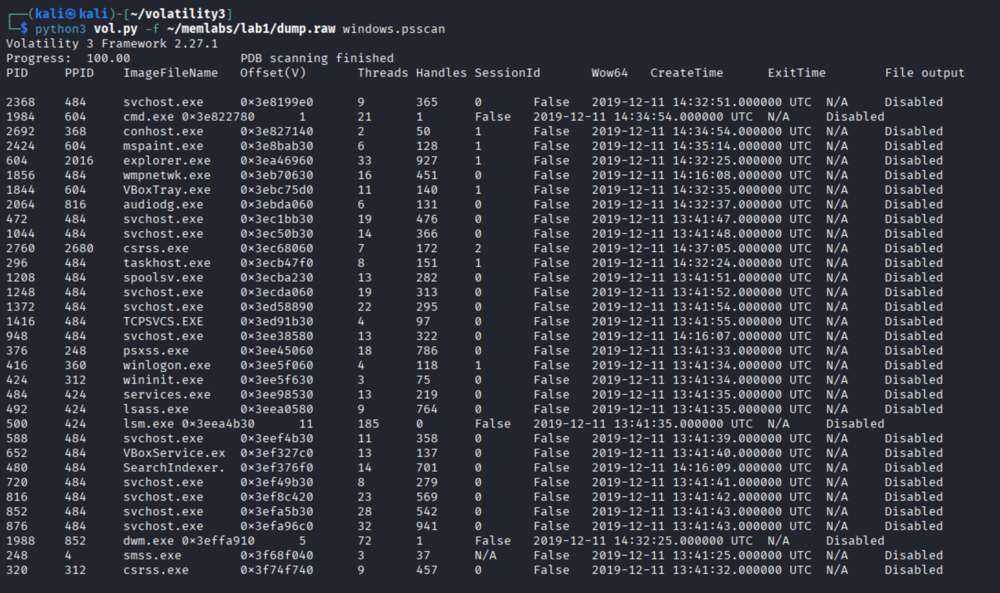

---

## Step 7 — Network Connections (netstat)

```bash
python3 vol.py -f dump.raw windows.netstat
```

### Theory

Shows:
- TCP/UDP sockets
- Listening ports
- Process IDs responsible for network activity

Used to identify:
- Malware C2
- Backdoors
- Suspicious remote sessions

### Screenshot 7  
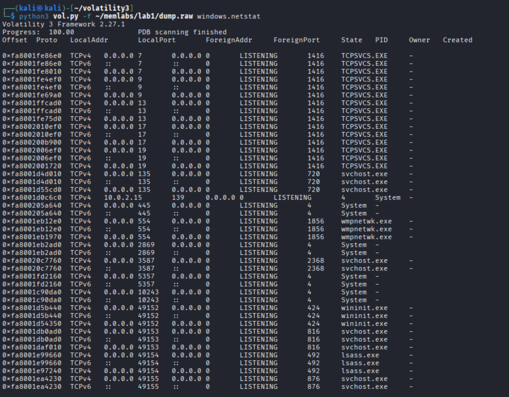

---

## Step 8 — Detect Code Injection (malfind)

```bash
python3 vol.py -f dump.raw windows.malfind
```

### Theory

`malfind` identifies:
- Executable memory regions (RWX)
- Injected shellcode
- Malicious DLL injection
- Suspicious assembly instructions

You look for:
- PAGE_EXECUTE_READWRITE regions  
- Shellcode-like patterns  
- AED64 calling conventions  
- JMP-to-register sequences  

### Screenshot 8  
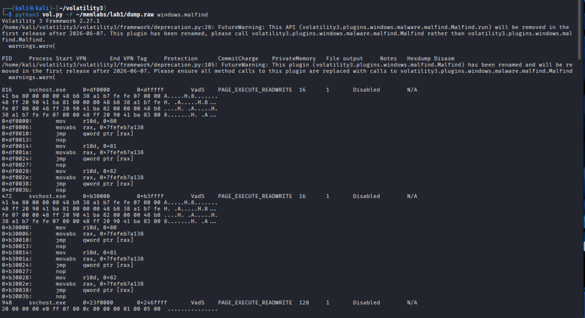

---

# Summary

**Suspicious process identified:**  
- Injected memory inside `svchost.exe`  
- RWX memory at multiple virtual addresses  
- Shellcode‑like instructions  
- No legitimate reason for RWX memory pages  

**Network findings:**  
- Several listening ports  
- Potential communication paths for injected malware  

**Overall conclusion:**  
The memory image shows clear indicators of **process injection** into `svchost.exe`, likely malicious activity.

---

