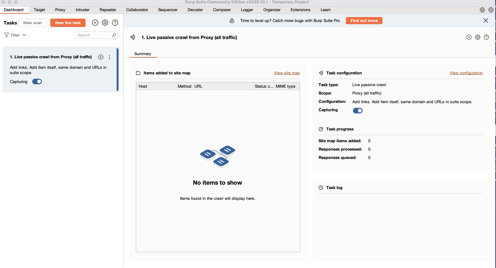
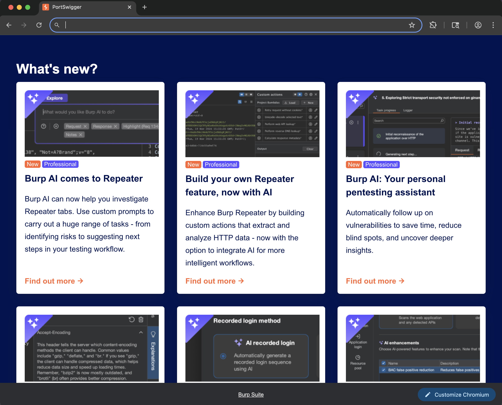
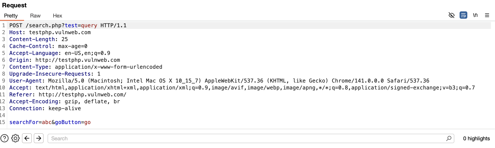
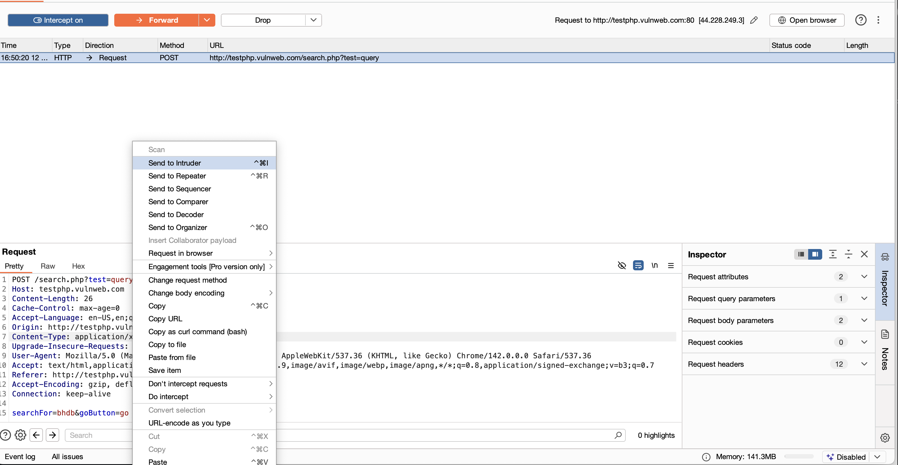
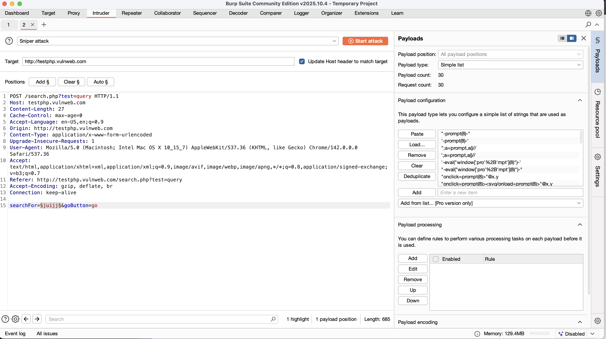
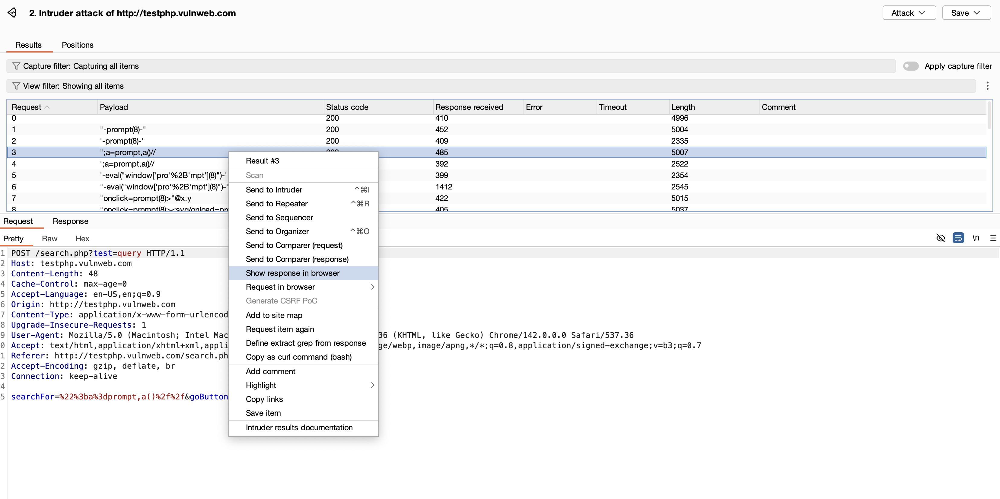
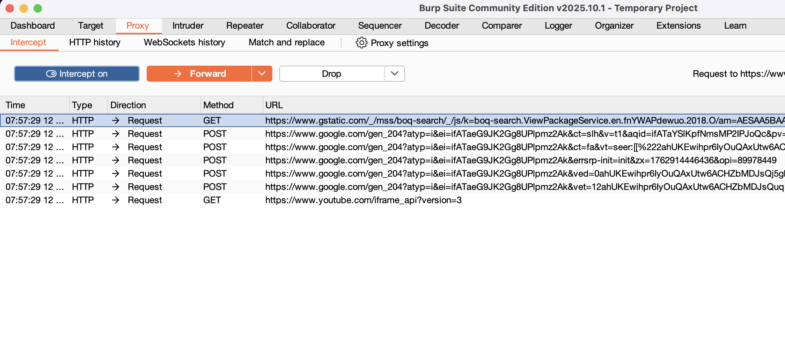

# Burp Suite Community Edition on macOS

This guide walks you through installing Burp Suite Community Edition on macOS, setting up the proxy, intercepting and manipulating web requests, running XSS payloads using **Intruder**, and confirming results with **Repeater** — all visually, no coding required.

---

## Prerequisites

* macOS (latest version)
* [Burp Suite Community Edition](https://portswigger.net/burp/communitydownload) installed
* A legal test target (e.g., `http://testphp.vulnweb.com`)
* An XSS payload list file, such as [PayloadBox XSS Payload List](https://github.com/payloadbox/xss-payload-list)

---

## Download and Install Burp Suite

1. Visit [https://portswigger.net/burp/communitydownload](https://portswigger.net/burp/communitydownload)
2. Click **Download Burp Suite Community Edition** for macOS.
3. Open the `.dmg` file and drag **Burp Suite** to **Applications**.
4. Open **Launchpad → Burp Suite**. If macOS blocks it, right-click → **Open**.

---

## Set Up the Proxy and Browser

1. In Burp, navigate to **Proxy → Options**.
2. Verify the listener is active on `127.0.0.1:8080`. If not, click **Add**.

3. Go to **Proxy → Intercept** and click **Open Browser**. Burp will launch a Chromium-based browser preconfigured to use Burp’s proxy.

4. In the Burp browser, open `http://testphp.vulnweb.com`.

> ⚠️ **Note**: For HTTPS sites, export Burp’s CA certificate from **Proxy → Options → Import/Export CA Certificate** and install it in your Burp browser for SSL interception.

---

## Intercept a Request

1. In **Burp → Proxy → Intercept**, ensure **Intercept is on**.
2. On the website, enter a search term (e.g., `abc`) and click **Go**.
3. The request will appear under the **Intercept** tab.

4. Review request details (method, headers, parameters).

---

## Send the Request to Intruder

1. Right-click the intercepted request → **Send to Intruder**.

2. Navigate to the **Intruder → Positions** tab.
3. Highlight the parameter value (e.g., `searchFor`) and click **Add §**.
4. Select **Sniper** as the attack type (suitable for a single input).

---

## Add Payloads and Start the Attack

1. Open **Intruder → Payloads**.
2. Click **Load** and select your XSS payload list (e.g., `xss-payload-list.txt`).

3. Click **Start Attack**. The Intruder window opens, sending each payload sequentially.
4. Observe the **Status**, **Length**, and **Response** for anomalies that may indicate a reflected payload.

---

## Analyze the Response

1. Right-click a result that looks promising → **Show Response in Browser**.
2. Observe if the payload renders or executes.
3. Note which payloads succeeded.

---

## Confirm with Repeater

1. Re-intercept the same request or use the one from history.
2. Right-click → **Send to Repeater**.

3. Modify the input parameter in **Repeater**, then click **Send**.
4. Analyze the response under the **Pretty**, **Raw**, or **Render** tabs.

> You can confirm successful XSS reflection if the payload is visible or executes in the rendered output.

---

## Summary Table — Burp Tabs Overview

| Tab           | Purpose                                                       |
| ------------- | ------------------------------------------------------------- |
| **Proxy**     | Intercept, forward, or drop live requests                     |
| **Intruder**  | Automate payload-based attacks (e.g., fuzzing or XSS tests)   |
| **Repeater**  | Manually resend and modify requests to verify vulnerabilities |
| **Dashboard** | Monitor live crawling and background tasks                    |

---

## Troubleshooting

* **No requests captured?** Ensure you’re using the Burp browser or your system proxy is set to `127.0.0.1:8080`.
* **SSL certificate errors?** Import Burp’s CA certificate into the browser.
* **Intruder too slow?** Community Edition throttles attacks — use smaller payload sets.
* **Intercept not working?** Confirm “Intercept is on” and Burp listener is running.

---

## 🧠 Notes

* Always use **authorized test sites** only.
* Use **Sniper mode** for single-parameter testing.
* Inspect differences in **response length** and **status code** to identify potential reflections.
* Save your Burp project frequently (**Project → Save As**).

---

## 📸 Screenshots Summary

* **Burp Dashboard:** `images/burpsuit-dashboard.png`
* **Proxy Settings:** `images/proxytab.png`
* **Open Browser:** `images/openbrowser.png`
* **Target Site:** `images/openphptest.png`
* **Intercept Request:** `images/interceptedmessage.png`
* **Send to Intruder:** `images/openinintruder.png`
* **Add Payloads:** `images/add-payload-intruder.png`
* **Run Intruder Attack:** `images/open-in-browser.png`
* **Send to Repeater:** `images/openinrepeater.png`
* **Repeater Results:** `images/reapterresponse.png`, `images/response-repeater.png`, `images/afterinspecton.png`

---

### ⚠️ Disclaimer

This guide is for **educational use only** on systems you own or have explicit authorization to test. Unauthorized testing or scanning of third-party systems is illegal.
