# DHCP & DNS  

## Summary  
This lab focuses on two major network-management services:  

- **DHCP** – Automatically assign IP configuration  
- **DNS** – Resolve hostnames to IP addresses  

You will implement DHCP and DNS on Cisco routers and capture packets using Wireshark to understand message-level behavior.

---

# Objective 1 — DHCP Basics

### **Topology**  
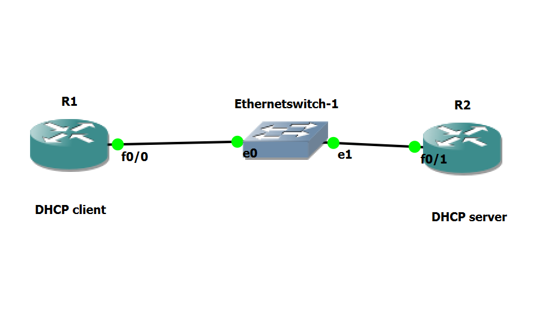

---

## Configure R1 as DHCP Client  
Paste screenshot of R1’s f0/0 configuration:  
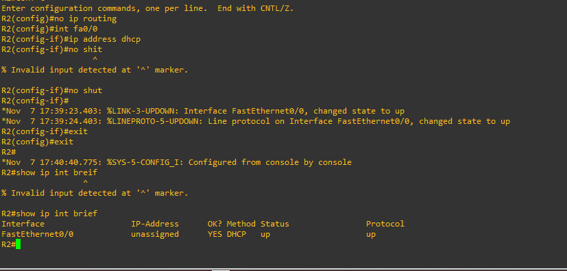

---

## Where to Capture Wireshark?  
Capture should be started on the interface **between R1 and R2**, where DHCP messages will be exchanged.

---

## Does R2 Need Additional Configuration?  
Yes — R2 needs:  
- A **static IP** on f0/1  
- A **DHCP pool**  
- **Excluded addresses**  
- `no shutdown` on active interfaces  

---

## DHCP Server Configuration on R2  
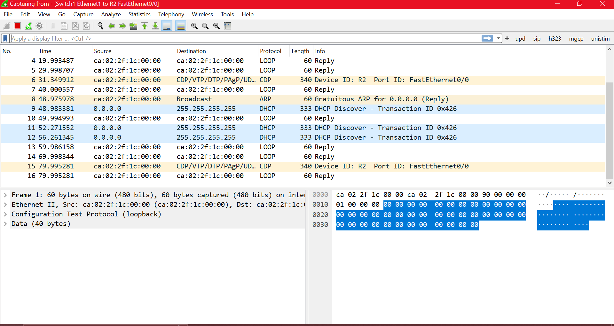

---

## Did R1 Receive an IP?  
Check using:  
```
show ip interface brief
```

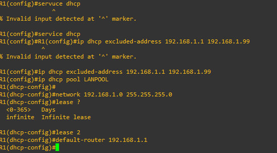

---

## DHCP Message Breakdown  
DHCP uses 4 steps:

1. **Discover** → Broadcast  
2. **Offer** → Server to client  
3. **Request** → Broadcast  
4. **ACK** → Server to client  

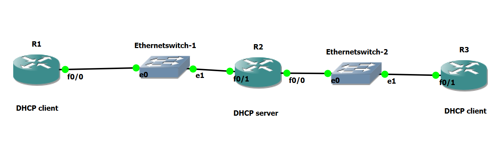

---

## Which DHCP Messages Are Broadcast?  

| Message | L2 | L3 |
|---------|------|------|
| Discover | Broadcast | Broadcast |
| Offer | Unicast | Broadcast |
| Request | Broadcast | Broadcast |
| ACK | Unicast | Broadcast |

---

## Additional Messages in Wireshark  
Yes — **ARP** messages appear to check for IP conflicts.

---

# Objective 2 — DHCP With Multiple Clients

### Multi-Client Topology  
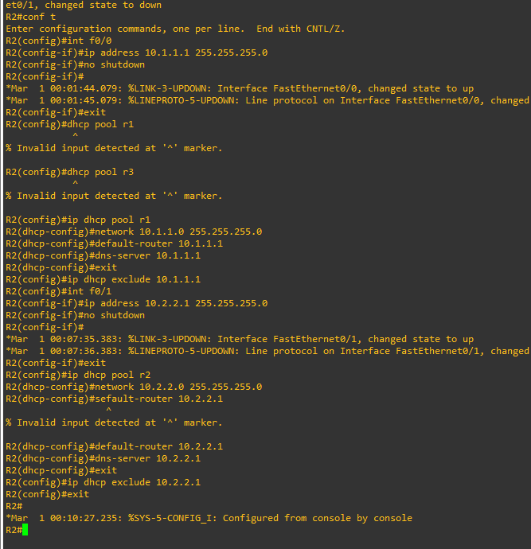

A single DHCP server **can** serve multiple networks by configuring **multiple DHCP pools**.

---

## R3 Configured as DHCP Client  
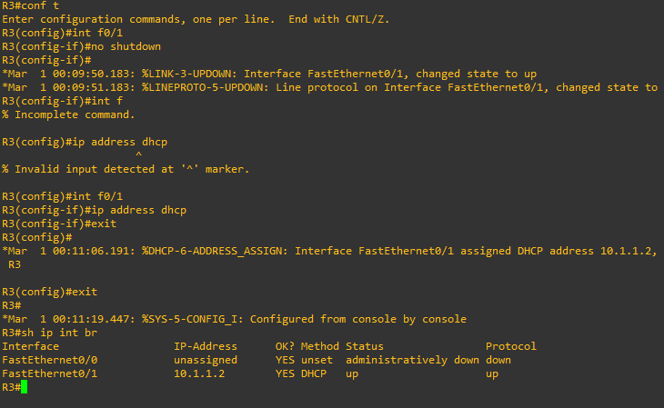

DHCP pool selection is based on the **interface receiving DISCOVER**, allowing router to choose correct pool.

---

## Excluded Addresses  
Used to reserve IPs for:  
- Routers  
- Servers  
- Critical hosts  

Example on R2:  


---

## Can R1 and R3 Communicate?  
Yes — because both are connected to R2, which performs routing.  
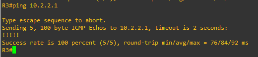

---

## TCP vs UDP Differences  
| TCP | UDP |
|-----|-----|
| Reliable | Unreliable |
| Slow | Fast |
| 3-way handshake | No handshake |
| For critical apps | For real-time apps |

---

## DHCP Release  
Command:  
```
ip dhcp release f0/0
```

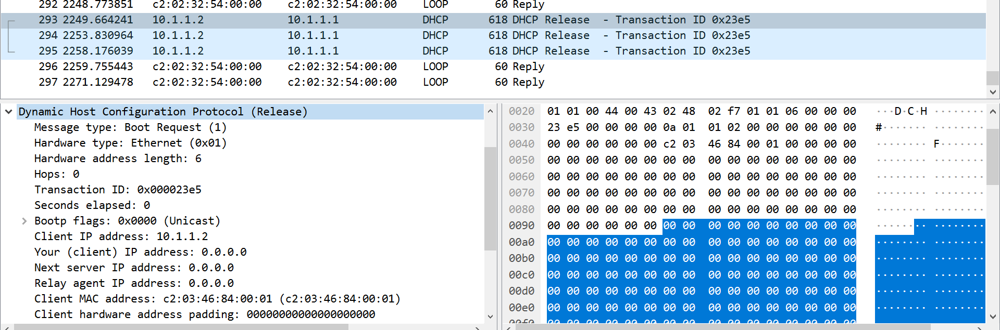

---

## Server Retrieving Lease Early  
Command on server:  
```
clear ip dhcp binding <ip-address>
```

---

## Enable DHCP Debugging  
```
debug dhcp detail
```

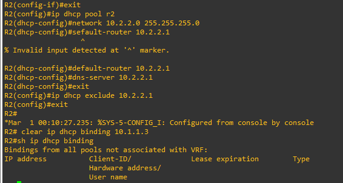

---

## Adding DNS Option to DHCP  
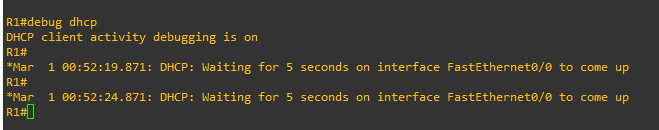

---

## DHCP Debug Success Messages  
R1:  
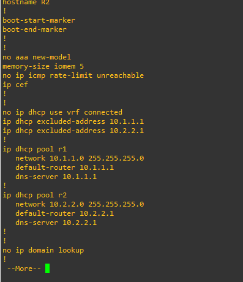

R3:  
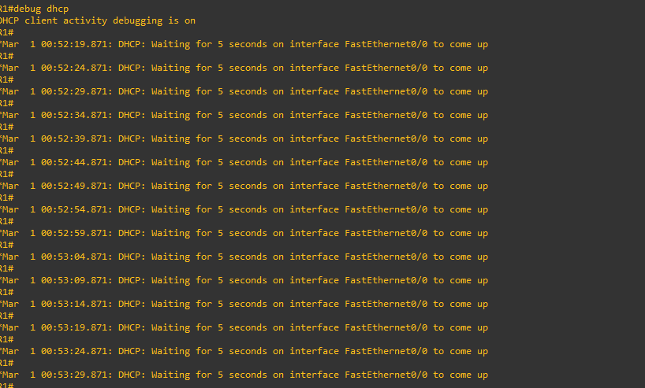

---

# Objective 3 — DNS

## Configure R2 as DNS Server  
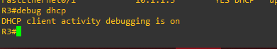

---

## Additional Configuration Needed?  
Yes — R1 & R3 need DNS server configured (usually provided via DHCP option).

---

## Test DNS Resolution  
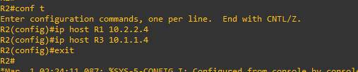  
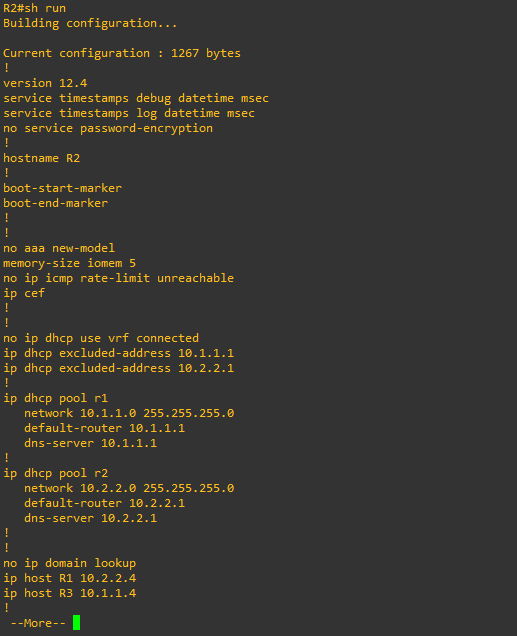

---

## Wireshark Capture of DNS  
Capture on interface between R1 and R2.  
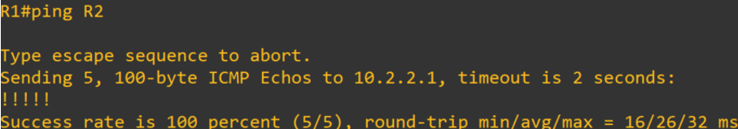

---

## DNS Message Flow  
1. Client queries DNS server  
2. Server responds with IP  
3. Client pings resolved IP  
4. Target host responds  

---

## DNS Transport Protocol  
- Uses **UDP** normally  
- Uses **TCP** when responses exceed 512 bytes or during zone transfers

---

# Objective 4 — Report Questions

## Laptop DNS Server  
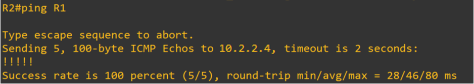

`ipconfig /all` shows DNS server.

---

## DNS Query/Response Ports  
- Query: **Source ephemeral → Destination 53**  
- Response: **Source 53 → Destination ephemeral**

---

## Clear DNS Cache  
```
ipconfig /flushdns
```

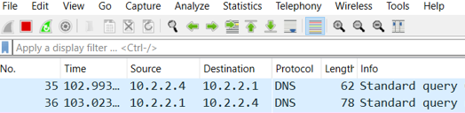

---

## DNS Message Flow Without Cache  
1. Laptop → Root DNS  
2. Root → TLD server  
3. TLD → Authoritative server  
4. Authoritative → Laptop  

---

## DNS Record Types  
- **A** → IPv4  
- **AAAA** → IPv6  
- **CNAME** → Alias  
- **NS** → Name server  
- **MX** → Mail exchange  

---

## DNS Nameserver Types  
- Primary  
- Secondary  
- Cache-only  
- Forwarder  

Yes — laptop can be a **caching server** with proper software.

---

## HTTP Error Codes  
400, 301, 401, 403

---

## HTTP Methods  
GET, POST, PUT, PATCH, DELETE

---

## Proxy Web Server Advantages  
- Security  
- Bandwidth reduction  
- Access control  
- Caching performance  

---

## Troubleshooting Slow Website  
Possible causes:  
- DNS failure  
- Server overloaded  
- Routing issue  
- Firewall block  

Steps shown in lab text.

---

## HTTP Disadvantage & Solution  
Problem: **No encryption**  
Use: **HTTPS**

---

# Extra Credit — DHCP Relay

### Relay Topology  
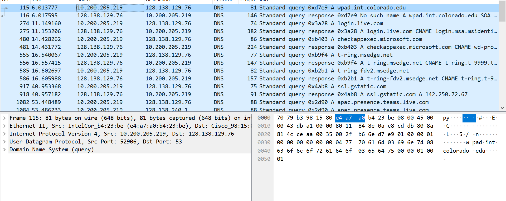

---

## DHCP Relay Explanation  
Used when DHCP server is on a **different network**.

---

## Configurations of R1, R2, R3  
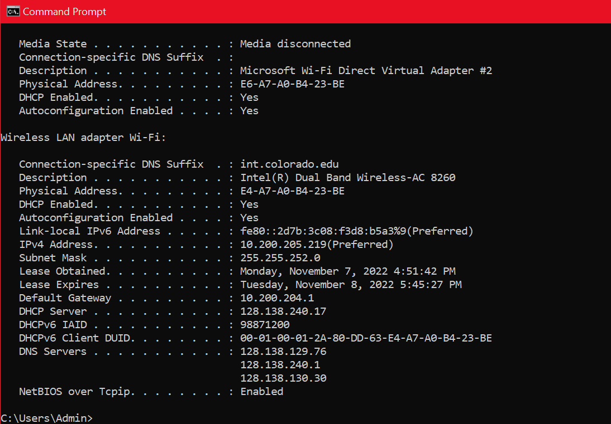

Additional config:  
```
ip helper-address <DHCP-server-ip>
```

---

## Wireshark Capture (Switch 1 & 2)  
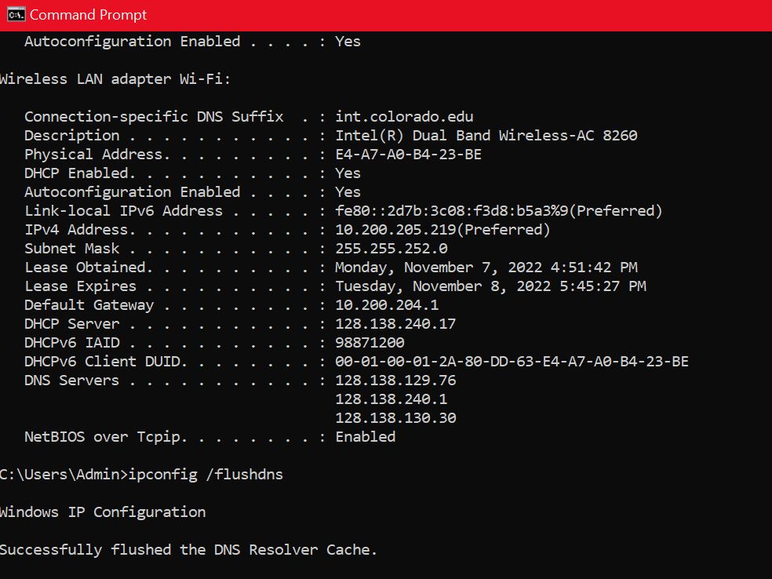  
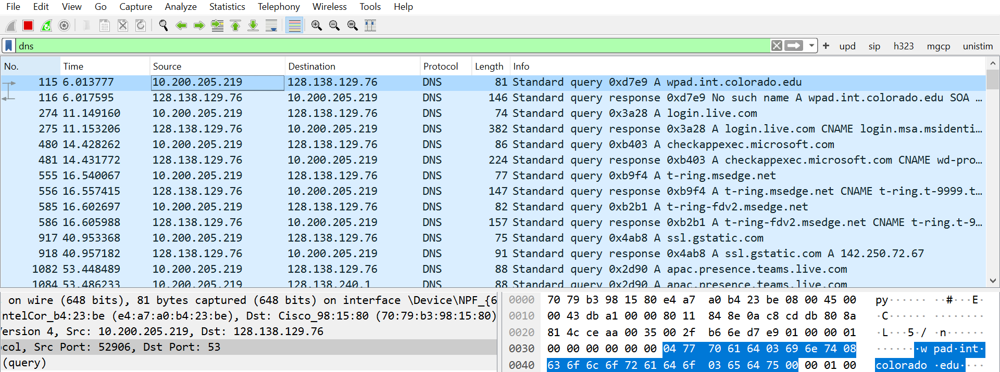

Each message categorized by:  
- Src IP  
- Dest IP  
- Src MAC  
- Dest MAC  
- L2 broadcast/unicast  
- L3 broadcast/unicast

---