# Malware Reverse Engineering — Ghidra Lab  
**Platform:** Kali Linux  
**Tools Used:** GCC, Ghidra, Terminal  
**Architecture:** AARCH64 (ARM64)

---

## Overview

This project demonstrates a complete beginner-level malware reverse engineering workflow using **Ghidra**, analyzing a harmless toy binary (`toy_crackme`) that mimics the behavior of password-checking malware.

The objective is to:

- Compile a small C crackme  
- Load the ELF binary into Ghidra  
- Analyze the program structure  
- Reverse-engineer the `check_key()` function  
- Discover the hidden password  
- Validate findings by running the program  

---

# 1. Compiling the Target Binary

We start by compiling the C source:

```bash
gcc -O0 -g toy_crackme.c -o toy_crackme
```

### ✔ Binary compilation output  
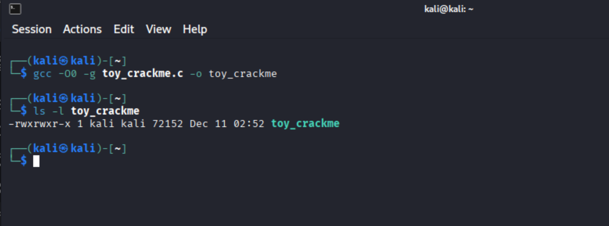

---

# 2. Installing & Launching Ghidra

Install Ghidra on Kali:

```bash
sudo apt install ghidra -y
```

### ✔ Installation confirmation  
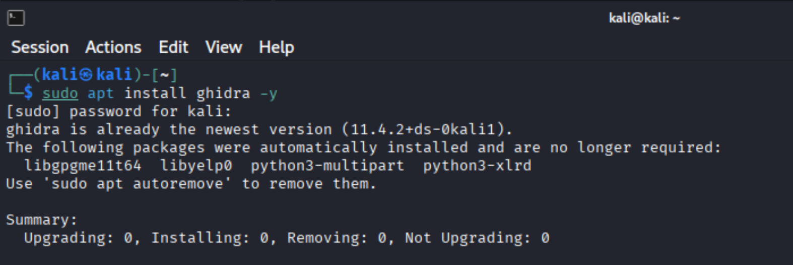

When launched, Ghidra displays:

### ✔ No active project yet  
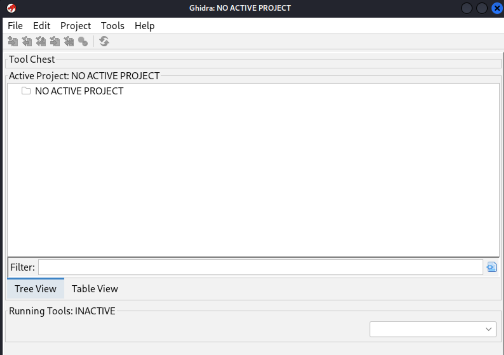

---

# 3. Creating a New Ghidra Project

Create a **Non-Shared Project** named `ToyCrackmeLab`.

### ✔ Project created successfully  
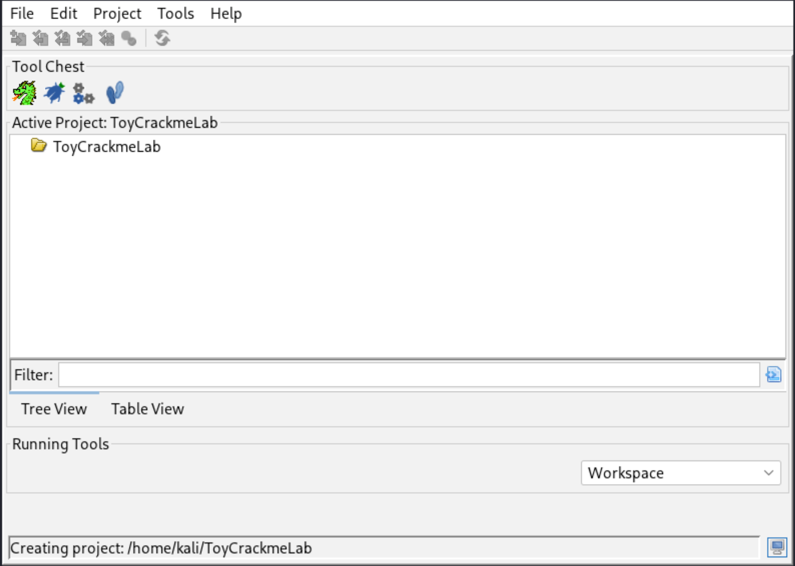

---

# 4. Importing the ELF Binary

Ghidra detects the format and architecture automatically.

### ✔ ELF Import Dialog  
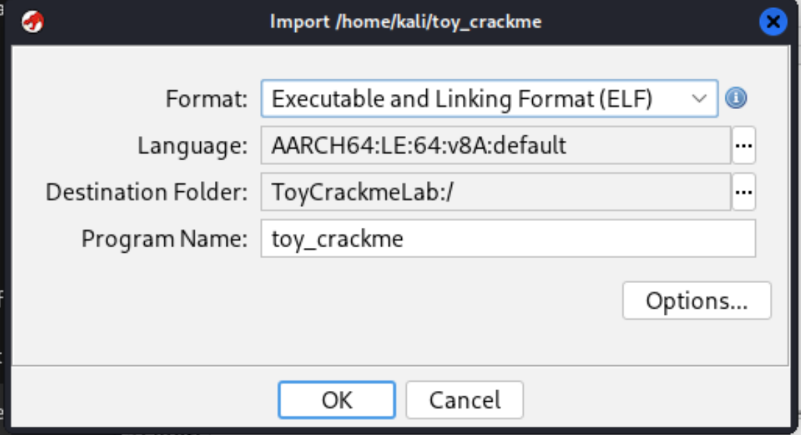

---

# 5. Automatic Program Analysis

Upon opening the binary, Ghidra performs static analysis:

### ✔ Analysis summary  
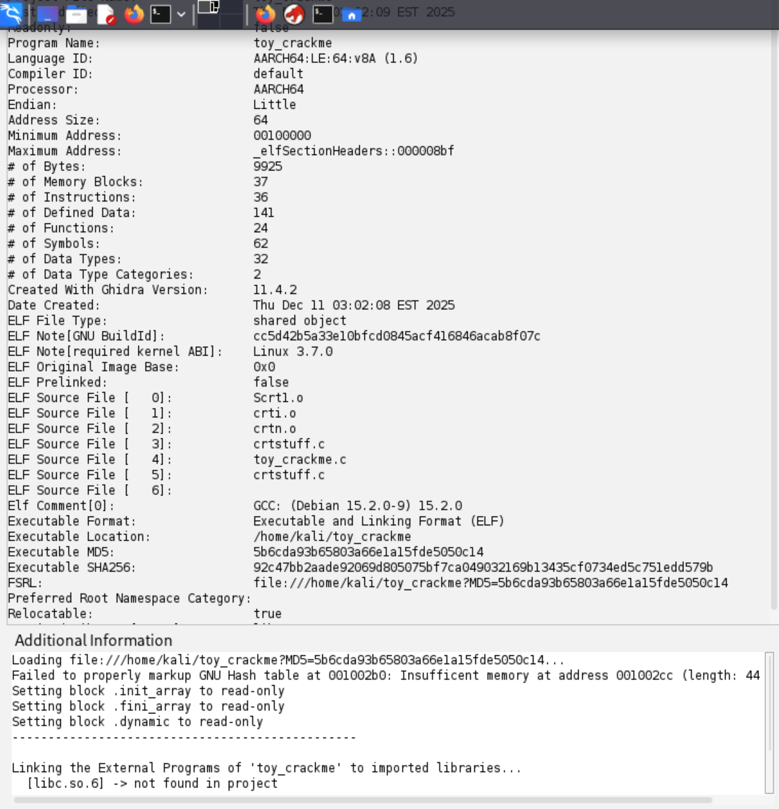

---

# 6. Locate and Analyze `main()`

Use the Symbol Tree:

```
Functions → main
```

### ✔ Decompiled `main()` logic  
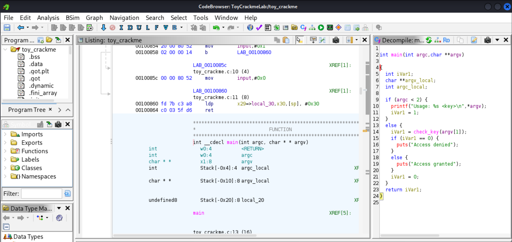

This shows:

- Argument validation  
- A call to `check_key()`  
- Clear success / failure printing

---

# 7. Reverse Engineering the `check_key()` Function

Double-clicking the function name in `main()` opens:

### ✔ Decompiled `check_key()`  
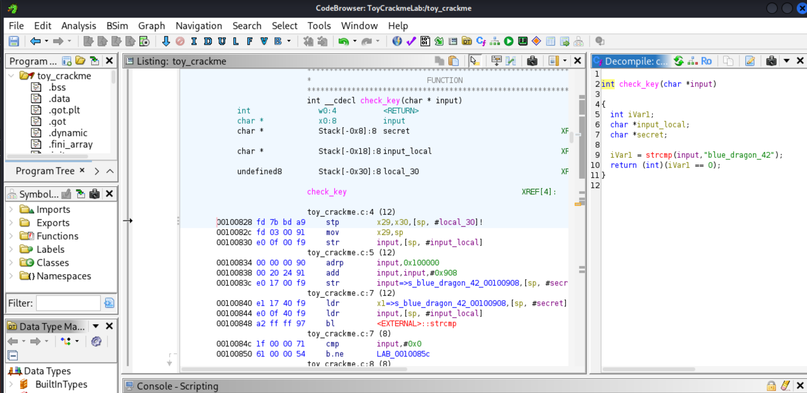

Key finding:

```c
strcmp(input, "blue_dragon_42")
```

**Recovered Secret Key:** `blue_dragon_42`

---

# 8. Locating Strings in Memory

Use:

```
Window → Defined Strings
```

### ✔ Secret string found inside ELF memory  
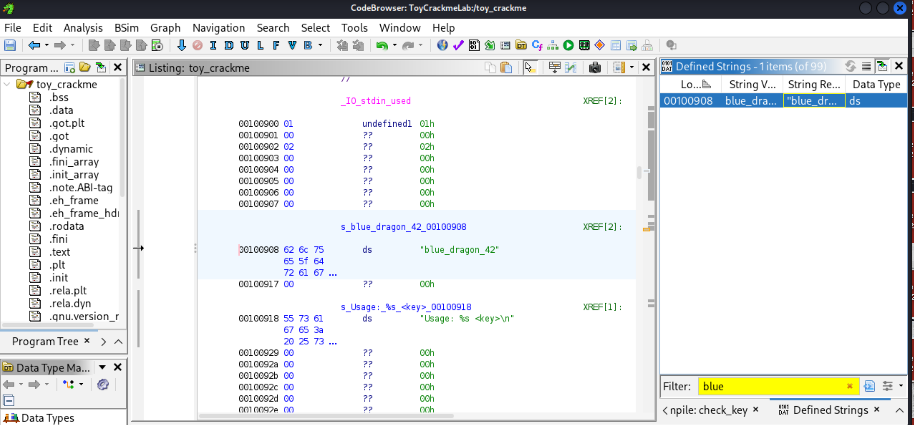

---

# 9. Understanding Control Flow (CFG)

Ghidra's Function Graph visualizes branches of the password verification.

### ✔ Function Graph for check_key  
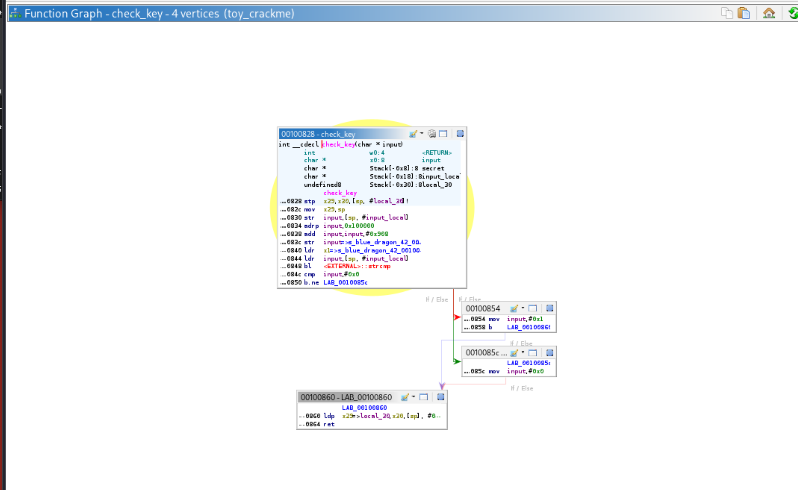

This confirms:

- One branch for successful match  
- One branch for failure  
- Return values: `1` (success), `0` (failure)

---

# 10. Runtime Validation of Reverse Engineering Result

Testing the binary:

### ✔ Correct key  
```bash
./toy_crackme blue_dragon_42
# Access granted
```

### ✔ Wrong key  
```bash
./toy_crackme wrong_key
# Access denied
```

### ✔ Screenshot  
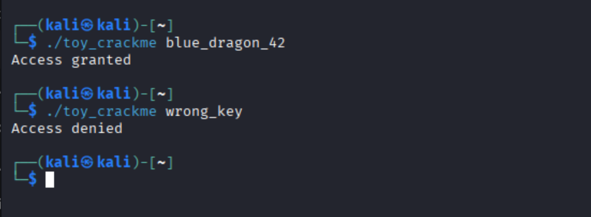

---

# 11. Theory & Learning Outcomes

## What is Reverse Engineering?

Reverse engineering deconstructs a compiled binary to understand how it works without source code.  
Analysts use this to study malware, software behavior, vulnerabilities, and protocols.

## Why Ghidra?

Ghidra provides:

- Disassembly  
- Decompilation  
- String inspection  
- Control-flow graphs  
- Symbol reconstruction  
- Cross-reference navigation  

It is free, open source, and powerful enough for professional malware analysis.

## Crackmes vs. Real Malware

Crackmes are:

- Safe  
- Small  
- Focused on logic analysis  

Real malware often includes:

- Anti-debugging  
- Obfuscation  
- Encrypted strings  
- Packagers  

This lab builds foundational skills used for analyzing real threats.
