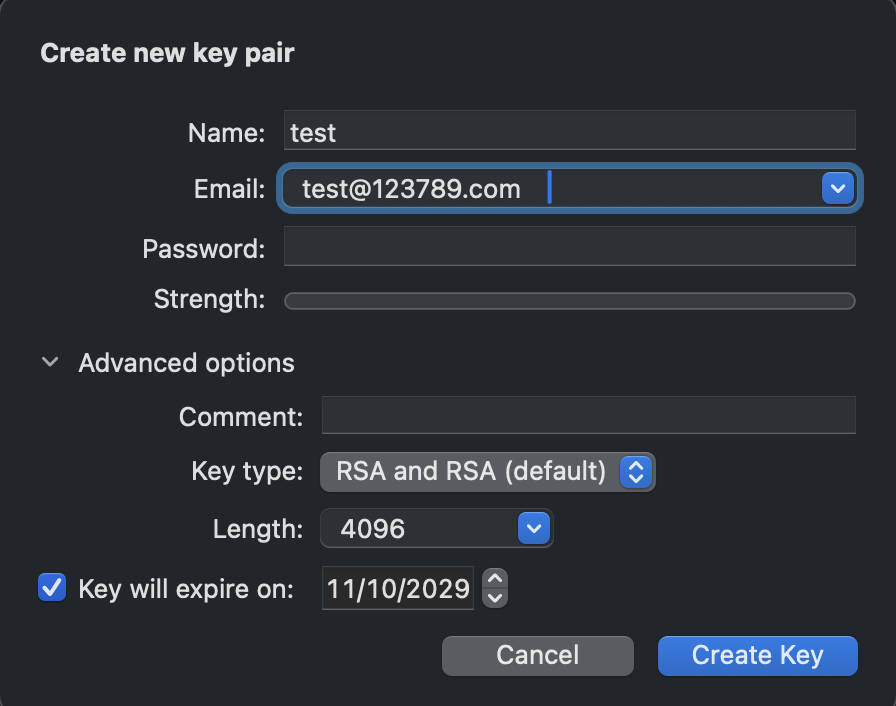

# GPG Suite on macOS — Step-by-Step Guide

This guide walks you through creating encryption keys, encrypting and decrypting files, and sharing keys using **GPG Suite** on macOS — **no terminal required**.

---

## Prerequisites
- macOS (latest version)
- [GPG Suite](https://gpgtools.org/) installed

---

## Download and Install GPG Suite
1. Visit [https://gpgtools.org/](https://gpgtools.org/)
2. Click **Download GPG Suite**
3. Open the `.dmg` file and follow installation steps
4. Launch **GPG Keychain** via **Launchpad**

---

## Create a New Key Pair
1. Open **GPG Keychain**
2. Click **New** (top left)
3. Fill in your details:
   - **Name** → e.g., `test`
   - **Email** → e.g., `test@123789.com`
4. Expand **Advanced Options**:
   - **Key Type:** `RSA and RSA (default)`
   - **Length:** `4096`
   - **Expiration Date:** optional (default 5 years)
5. Click **Create Key**

---

## Share Your Public Key
After your key is created:
- You can **upload it to a public key server**, or
- Export it manually and share it (`.asc` file).

To export manually:
1. In **GPG Keychain**, right-click your key.
2. Select **Export → Public Key Only**.

---

## Import Someone Else’s Public Key
If you’ve received someone’s `.asc` public key file:
1. Right-click the file.
2. Choose **Services → OpenPGP: Import Key from File**

---

## Encrypt a File
To securely send a file:
1. Right-click the file → **Services → OpenPGP: Encrypt File**
2. Select the recipient(s) from the **Select Recipients** window
3. (Optional) Check your own key to decrypt it later
4. Click **Encrypt**

The encrypted file will appear as: filename.ext.gpg

Send this file to the intended recipient.

---

## Decrypt a File
To decrypt a received `.gpg` file:
1. Right-click the file → **Services → OpenPGP: Decrypt File**
2. Wait for the success dialog

3. Click **Show in Finder** to open the decrypted file.

---

## Services Menu Overview

| Service Option | Description |
|----------------|-------------|
| **OpenPGP: Encrypt File** | Encrypts a file with selected public keys |
| **OpenPGP: Decrypt File** | Decrypts `.gpg` files using your private key |
| **OpenPGP: Import Key from File** | Adds a new public key to your keychain |
| **OpenPGP: Sign File** | Digitally signs a file using your key |
| **OpenPGP: Verify Signature of File** | Verifies a signed file’s authenticity |

---

### 🗝️ Notes
- RSA 4096-bit keys are recommended for security.
- Always keep your **private key** safe — never share it.
- Regularly back up your keys.

---

