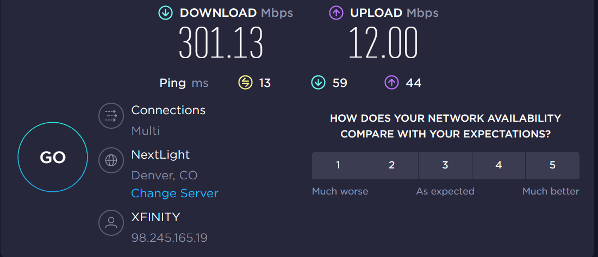
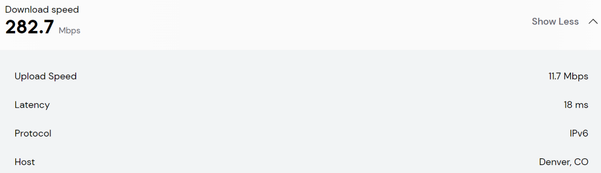
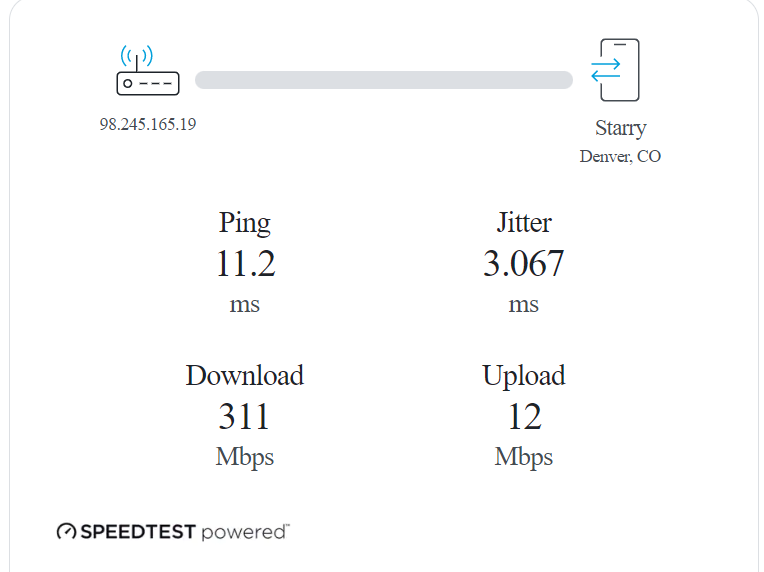
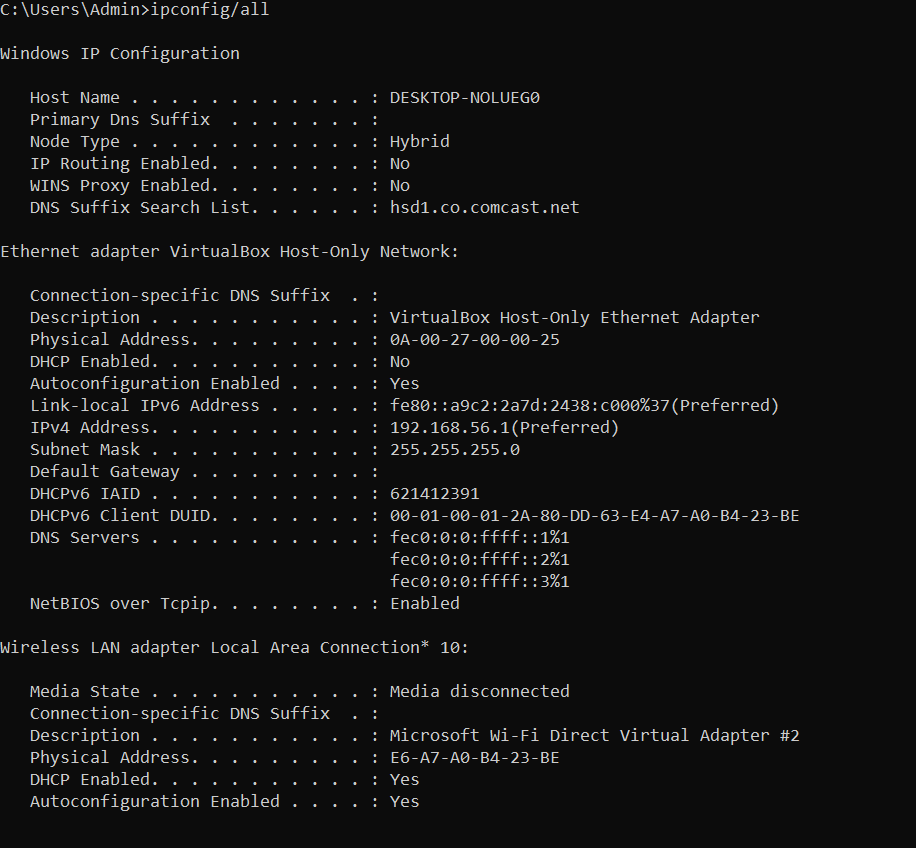
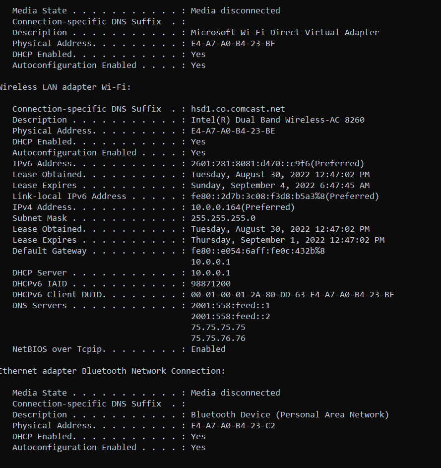
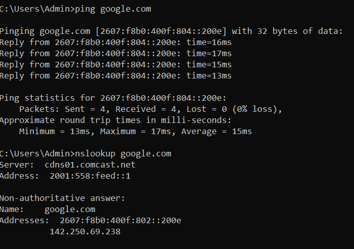
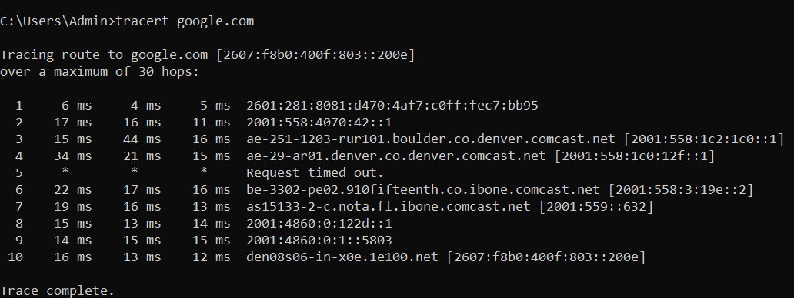

# Internet Speed Test & Command Prompt

## Summary

This lab provides an introduction to:

- Internet speed-testing technologies  
- Factors influencing speed test accuracy  
- Differences between wired and wireless connectivity  
- Basic OS command-line networking tools (Windows & macOS)

---

# Objective 1 — Internet Speed Testing

## 1. Online Speed Tests

Your selected sites:

1. Ookla Speedtest  
2. Comcast Speed Test  
3. AT&T Speed Test  

### Screenshots

  
  

---

## 2. Comparison of Results

Speed test results differed due to real‑time bandwidth availability, congestion, routing paths, and server distance.

---

## 3. Wired vs. Wireless Testing

### Wireless Test

Wired test not performed (no Ethernet port).

**Analysis:** Wi‑Fi experiences interference and obstacles; Ethernet is more stable.

---

## 4. Different Location Tests

- **Campus:** Fastest — enterprise‑grade network  
- **Home:** Moderate  
- **Coffee shop:** Slowest — many users and limited bandwidth  

---

## 5. Benefits of Accurate Speed Testing

1. Confirms actual upload/download speeds  
2. Helps diagnose latency or packet loss  
3. Prevents data corruption or poor‑quality transfers  

---

## 6. Best Practices

1. Clear browser cache  
2. Close bandwidth‑using applications  
3. Restart modem/router/device  

---

## 7. Speed Test Concepts

| Concept | Explanation |
|--------|-------------|
| **Ping** | Time for packet round trip |
| **Download Speed** | Data received per second |
| **Upload Speed** | Data sent per second |

**Protocol:** TCP (accuracy + reliability)

---

## 8. Troubleshooting Slow Speeds

Before contacting ISP:

1. Restart equipment  
2. Remove unknown devices  

To improve speed:

- Use 5 GHz Wi‑Fi  
- Update router firmware  
- Adjust antenna placement  

---

# Objective 2 — Command Prompt Networking

### Opening Command Prompt (Windows)

1. Open File Explorer  
2. Go to `C:\Windows\System32`  
3. Run `cmd.exe` as Administrator  

---

## IP Configuration Output

| Item | Value |
|------|-------|
| **IP Address** | 192.168.56.1 |
| **DHCP** | Enabled |
| **NIC** | Wireless |
| **Default Gateway** | None |
| **DNS Servers** | 2001:558:feed::1, 2001:558:feed::2, 75.75.75.75, 75.75.76.76 |
| **MAC Address** | E6-A7-A0-B4-23-BE |

---

# 📌 Objective 3 — IP Connectivity

## Ping Test

- Google IP: 142.250.69.238  
- Avg RTT: 15 ms  
- Continuous ping: `ping -t`  
- Stop: `CTRL + C`

Entering Google's IP in a browser loads Google because Google responds with correct HTTP routing.

---

## Traceroute

---

