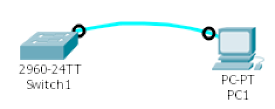
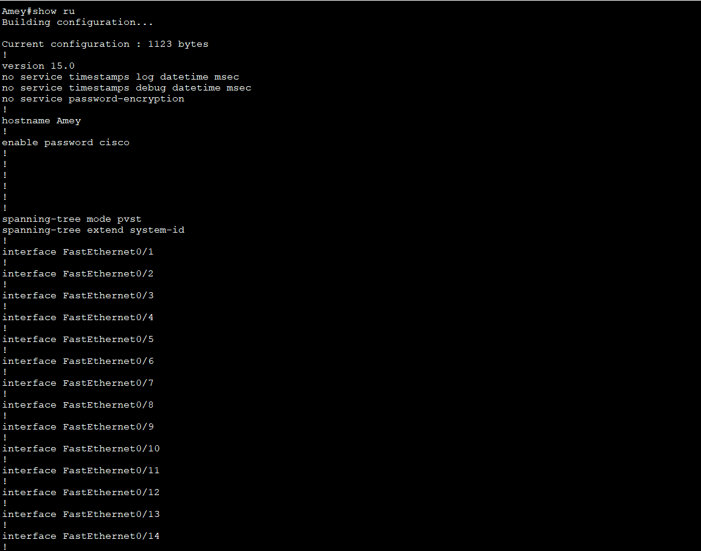
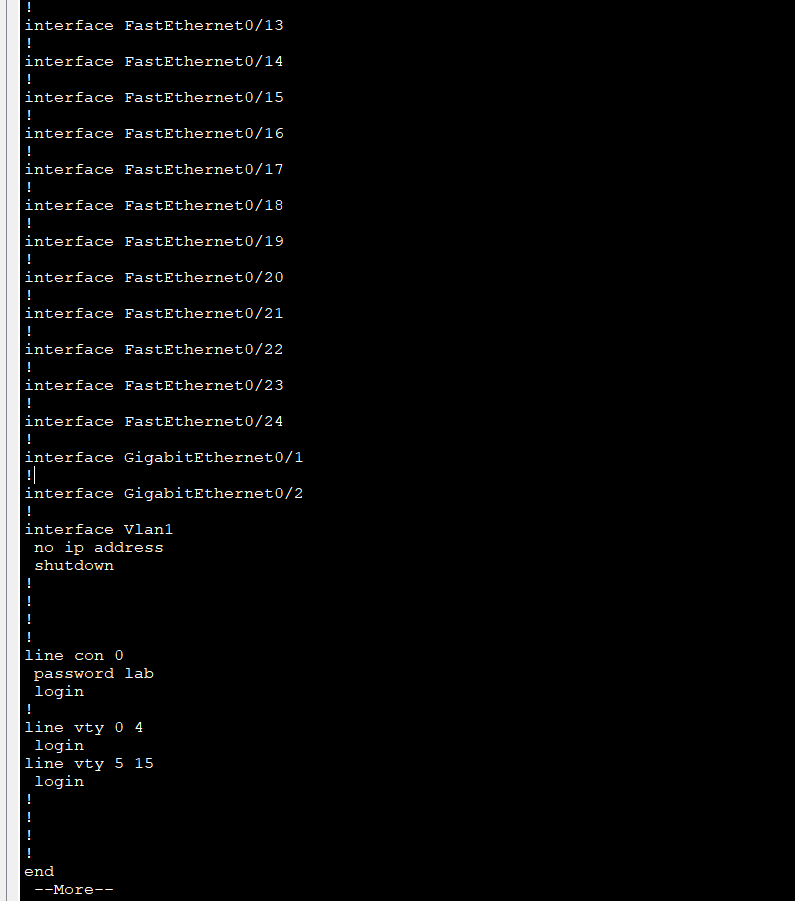
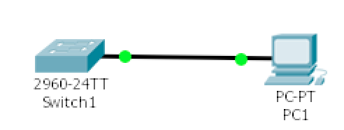
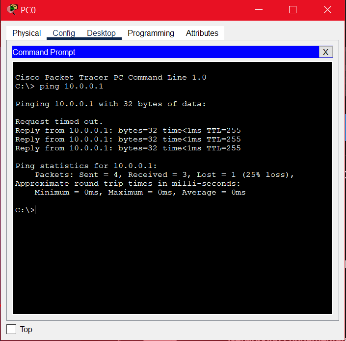
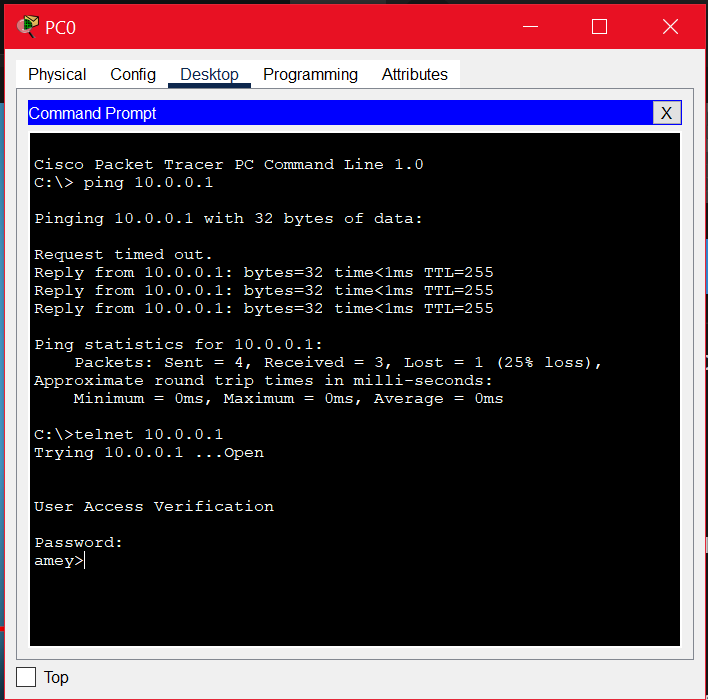

# Introduction to Cisco IOS & Spanning Tree Protocol (STP)

## Summary

This lab introduces:

- Cisco IOS & CLI navigation  
- Switch configuration (passwords, interfaces, VLANs)  
- Telnet remote access  
- MAC tables & switching behavior  
- Spanning Tree Protocol (STP) loop prevention  

---

# Part 1 — Cisco IOS Essentials

## **Objective 1: Connect PC to Cisco Switch**

Use a Cisco **console cable** to connect PC1 to Switch1.



---

## **Objective 2: IOS User Levels & CLI**

Tasks performed:

- Configure hostname = *your name*  
- Set enable password = `cisco`  
- Set console password = `lab`  
- Logout and log back in

### **Successful Login Screenshot**


### **Running Configuration**



**Configured settings present?**  
- Hostname — YES  
- Enable password — YES  
- Console password — YES  

---

## **Objective 3: Telnet Remote Access**

Configure PC & Switch based on diagram.

### **Cable Used:**  
**Copper Straight-Through**

### **Ping Test Screenshot**



### **Telnet Connection Screenshot**



---

# Part 2 — Switch Port Configuration & MAC Tables

## **Objective 1: Basic Switch Port Configuration**

### **Steps to enable PC-to-PC communication**

1. Connect PCs to switch  
2. Assign IPs:  
   - PC1 → 10.0.0.1  
   - PC2 → 10.0.0.2  
3. Configure switch VLAN1:  
   ```
   conf t
   int vlan 1
   ip address 10.0.0.3 255.255.255.0
   ```
4. Ping between PCs

### **Port Status Screenshot**



- Ports UP  
- Speed: 100 Mbps  
- Duplex: Full  
- Proper descriptions applied

### **Hard Set Port to 10Mbps / Half Duplex**

**Can PC1 still reach PC2? — YES**  
Half‑duplex allows one direction at a time, but connectivity remains.

---

## **MAC Table Analysis & Topology Work**

### **Created Topology Screenshot**



### **MAC Table Command Used**

```
show mac-address-table
```

### **Interpretation of Switch-3 Table**

- Shows learned source/destination MACs  
- Broadcast sent first; then unicast reply recorded  

### **After moving PC-6 to Switch1**

MAC table on Switch2 changes due to new forwarding port.

### **After pinging PC‑6 from PC‑4**

A new entry appears because PC‑4 communicates for the first time.

---

# Objective 2 — Spanning Tree Protocol (STP)

### **Two Switches Connected + PCs**

- MAC addresses mapped correctly to Fa0/1 and Fa0/2  
- STP blocks redundant links to prevent loops

### **Adding a Second Link**

**Expected behavior:** STP blocks one port to prevent loops.

### **Verification**

Use:

```
show spanning-tree
```

The blocked port is indicated under STP output.

### **Failure Simulation**

Unplugging one inter-switch cable:

- Pings **did NOT fail**  
- STP activates backup path seamlessly

---

# Report Questions

### **1. MAC Address Length & Structure**

48 bits → divided into:  
- **OUI** (first 24 bits)  
- **Device Identifier** (last 24 bits)

### **2. Why Switches Are Faster Than Routers**

Switches use **hardware-based forwarding (ASICs)**; routers rely on **software decisions**, making them slower.

### **3. How ARP Works**

- Broadcast sent to discover MAC address  
- Devices compare IP network  
- Matching device responds with unicast  
- MAC stored in ARP table for future communication  

---
