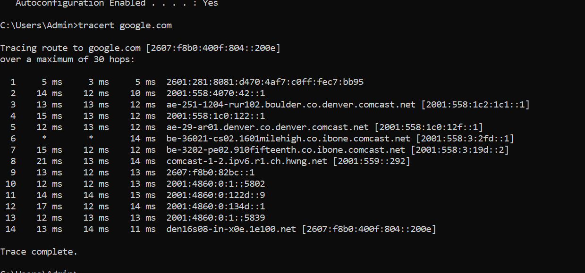
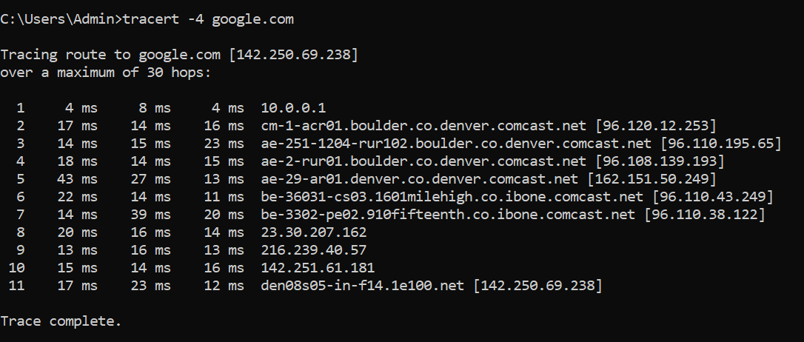
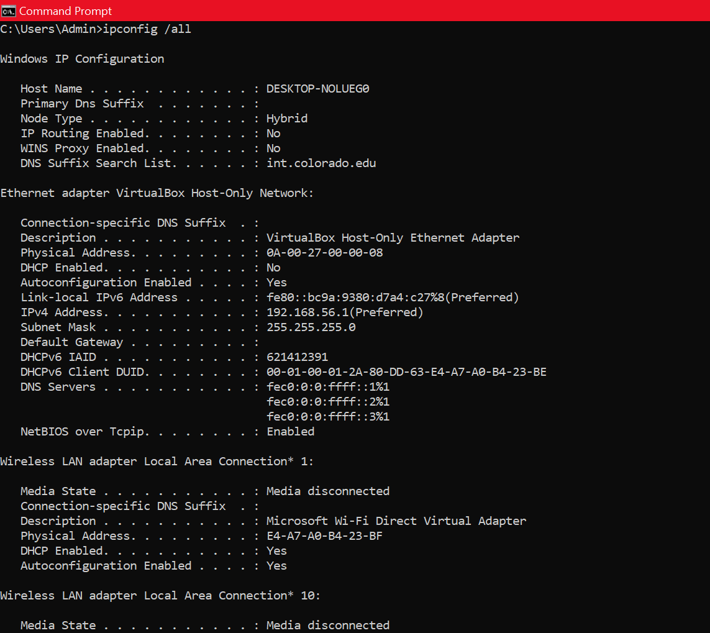
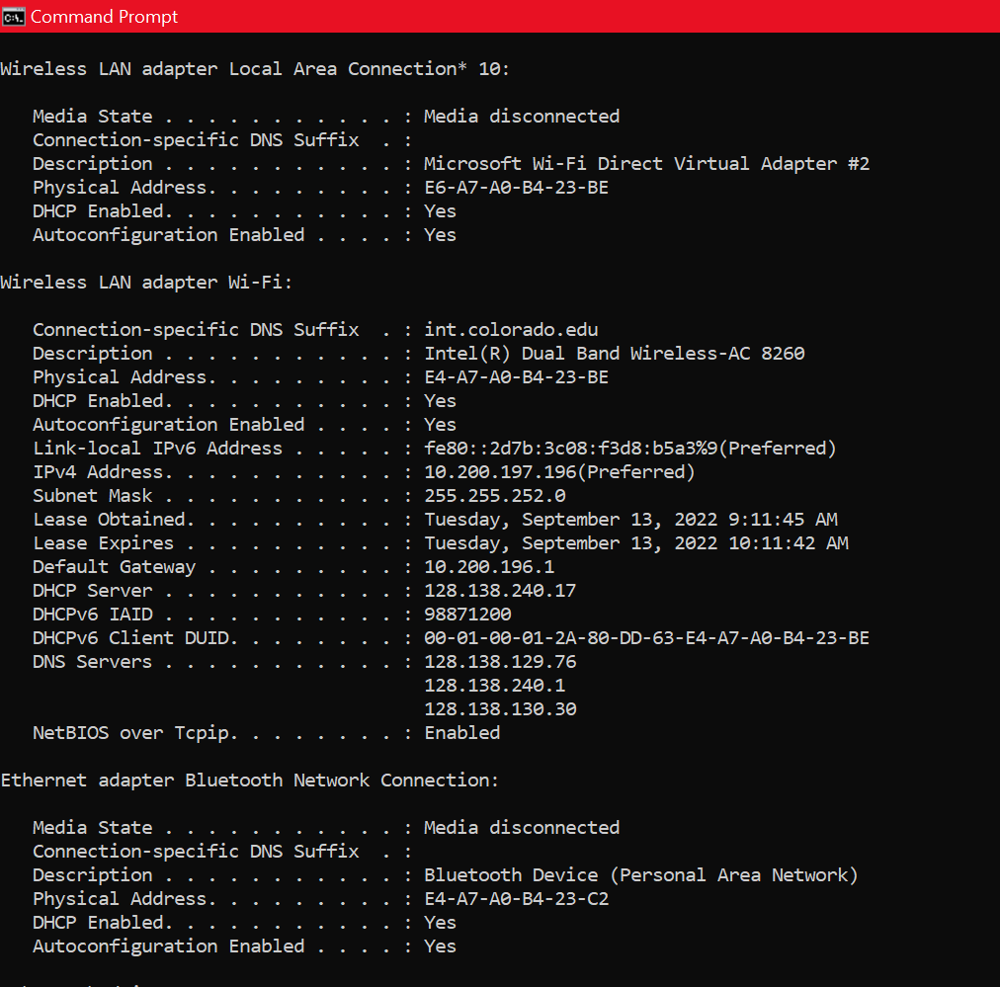

# IP Addressing

## Summary

This lab introduces:

- Public vs. private IP addressing  
- IPv4 and IPv6 formats  
- Traceroute analysis  
- Static vs. dynamic addressing  
- Subnetting and classful/classless addressing  
- Packet flow interpretation  

---

# Objective 1 — Public & Private IP Addresses

### **Laptop IP Address (Local IP)**  
**192.168.56.1 — Dynamic (DHCP Enabled)**

### **Public IP (ipchicken.com)**  
**37.19.211.78**  
Different because:  
- Local IP = private address  
- ipchicken.com shows the **public IP** assigned by ISP/NAT router  

---

### **Traceroute Screenshot**

### **Analysis**

- IPs are from **different networks**  
- Each hop represents a router along the path  
- Traceroute also reveals latency per hop and packet response behavior  

### **Private vs. Public IPs**

Private IP ranges:  
- 10.x.x.x  
- 172.16.x.x – 172.31.x.x  
- 192.168.x.x  

In the trace, **only the first hop** is private.

### **IPv6 Address Obtained**

**2601:281:8081:d470::162b**

### **Public IPv6 Test Result**

Same as above → IPv6 often uses globally routable addresses.

---

# Objective 2 — IP Address Format

### **On CU Campus Network**

You observed:

- **1 IPv4 address**  
- **1 IPv6 address**

---

### **Static IP Configuration (Windows)**

Steps summarized:

1. Run → `ncpa.cpl`  
2. Right‑click network adapter → Properties  
3. Select **IPv4**  
4. Choose **Use the following IP address**  
5. Manually enter IP, subnet mask, gateway  

---

### **Formatting of IPv4 & IPv6**

| Protocol | Format | Size |
|---------|--------|------|
| **IPv4** | `x.x.x.x` (4 octets, dotted decimal) | 32 bits |
| **IPv6** | `y:y:y:y:y:y:y:y` (8 segments, hex) | 128 bits |

---

# Objective 3 — Public vs. Private & Need for IPv6

### **Differences**

| Public IP | Private IP |
|-----------|------------|
| Used for communication **outside** LAN | Used **within** LAN |
| Globally unique | Unique only within local network |
| Assigned by ISP | Assigned by router/admin |
| Searchable publicly | Visible only on device CMD |

### **Need for IPv6**

- Larger address space  
- Improved security (IPsec mandatory)  
- Efficient routing  
- End‑to‑end connectivity  

---

# Objective 4 — IPv4 Subnetting

### **Classful vs Classless**

| Classful | Classless (CIDR) |
|----------|------------------|
| Fixed boundaries (A/B/C) | No fixed boundaries |
| Inefficient | Efficient IP allocation |
| Wastes addresses | Prevents exhaustion |

### **Subnetting needs**

- Reduces congestion  
- Improves security & segmentation  
- Better performance  

---

### **Subnetting CPT Topology**

### **Efficient Subnetting — Key Points**

1. Reduce address waste  
2. Subnets should match host requirements  

---

# Report Questions

### **H1 → Destination Packet Flow**

Same subnet → H1 performs ARP → sends directly.

### **H3 → H1 Packet Flow**

- H3 → R2 (gateway)  
- R2 → R1  
- R1 → H1  

---

### **New Subnet Addition**

Split original /25 into **two /26 networks**:

- 128.96.34.1 – 128.96.34.63  
- 128.96.34.65 – 128.96.34.126  

Add R3 for second subnet.

---

### **Problem 2 — Packet Path Table**

| Hop | Src MAC | Dst MAC | Src IP | Dst IP |
|-----|---------|---------|--------|--------|
| A → R1 | 79:AA:EF:AC:11:21 | 0C:AF:10:00:1E:1C | 123.123.123.111 | 22.1.23.45 |
| R1 → R2 | 74:29:9C:EF:AC:55 | 89:00:CC:1F:2C:1F | 123.123.123.111 | 22.1.23.45 |
| R2 → R3 | AF:CC:1F:11:EE:10 | AA:BB:CC:AF:2F:11 | 123.123.123.111 | 22.1.23.45 |
| R3 → B | AF:0C:FF:11:22:11 | 00:23:42:AC:EE:FC | 123.123.123.111 | 22.1.23.45 |

---

### **ARP Reply for Host C**

The gateway router responds with a **unicast** containing its **MAC address**.

---
