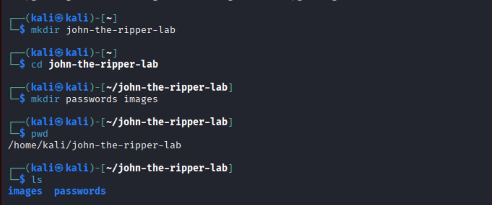
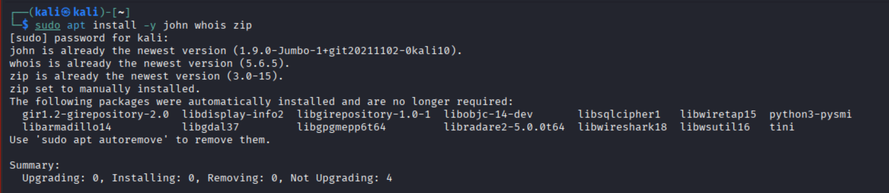
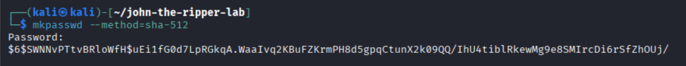
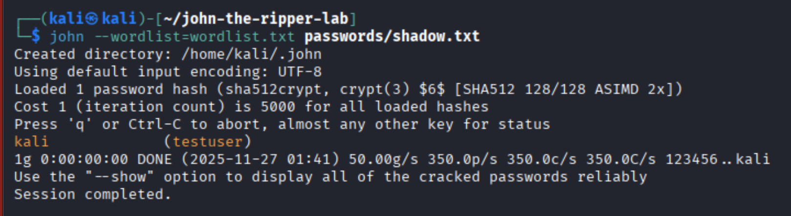
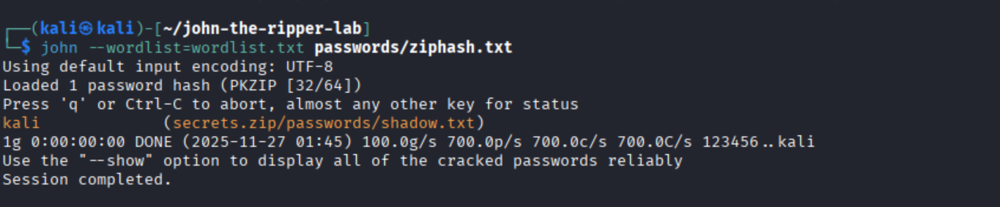
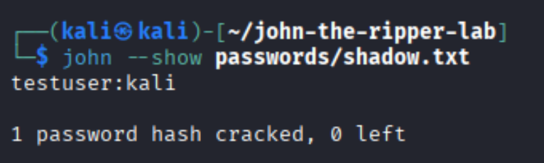
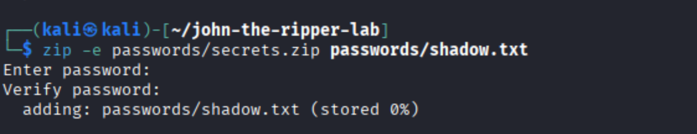
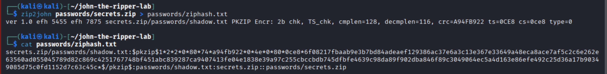

# John the Ripper (JtR) Password Cracking Lab

A complete, hands-on lab for learning **offline password cracking** using **John the Ripper** on Kali Linux.  
This README includes **your practical steps**, **explanations**, and **your screenshots** placed at the correct points.

> **Ethical Notice**  
> Only crack passwords and hashes that you own or have explicit permission to test.  
> This lab is strictly for learning and demonstration.

---

# Lab Overview

This lab covers two core John the Ripper techniques:

#  Part 1 — Setting Up the Environment

## ** Create the project directory**

```bash
mkdir john-the-ripper-lab
cd john-the-ripper-lab
mkdir passwords images
```

📸  


---

## **Install John, mkpasswd, and zip utilities**

```bash
sudo apt install -y john whois zip
```

📸  


---

#  Part 2 — Scenario 1: Cracking a Linux SHA-512 Hash

## **Theory: How Linux SHA-512 Hashing Works**
Linux systems store user password hashes inside `/etc/shadow`.  
When the hashing method is `$6$`, it means:

- **$6$ = SHA-512 crypt**
- It uses **salt** + **password**, run through many iterations

These hashes cannot be reversed mathematically —  
**you must guess the password and hash each guess** until one matches.  
This is exactly what John the Ripper does.

---

## **Generate a SHA-512 hash with mkpasswd**

```bash
mkpasswd --method=sha-512
```

This produces a hash like:

```
$6$SWNNvPTtvBRloWfH$uEi1fG0d7LpRGkqA.WaaIvq2KBuFZKrmPH8d5gpqCtunX2k09QQ/IhU4tiblRkewMg9e8SMIrcDi6rSfZhOUj/
```

📸  


---

## **Create a shadow-format file**

```bash
nano passwords/shadow.txt
```

Add:

```
testuser:$6$SWNNvPTtvBRloWfH$uEi1fG0d7LpRGkqA.WaaIvq2KBuFZKrmPH8d5gpqCtunX2k09QQ/IhU4tiblRkewMg9e8SMIrcDi6rSfZhOUj/
```

📸  


---

## **Create a wordlist**

```bash
nano wordlist.txt
```

Be sure the real password you used (e.g., **kali**) is included:

```
123456
password
letmein
kali
qwerty
```

---

## **Crack the hash with John**

```bash
john --wordlist=wordlist.txt passwords/shadow.txt
```

📸  


---

## **Show cracked password**

```bash
john --show passwords/shadow.txt
```

📸  


---

# Part 3 — Scenario 2: Cracking a Password-Protected ZIP

## **Theory: How ZIP Password Cracking Works**
ZIP archives can be protected with **legacy PKZIP encryption** or **AES encryption**.  
`zip -e` on Kali uses traditional ZIPCrypto (older, weaker).  

John cannot crack ZIP files directly; instead:

1. Convert ZIP → hash with `zip2john`
2. Crack the resulting hash file

---

## **Create a ZIP file with a password**

```bash
zip -e passwords/secrets.zip passwords/shadow.txt
```

Enter a ZIP password (e.g., **kali**).

📸  


---

## **Convert the ZIP to a crackable hash**

```bash
zip2john passwords/secrets.zip > passwords/ziphash.txt
```

📸  


---

## **Crack the ZIP password**

```bash
john --wordlist=wordlist.txt passwords/ziphash.txt
```

📸  


---


