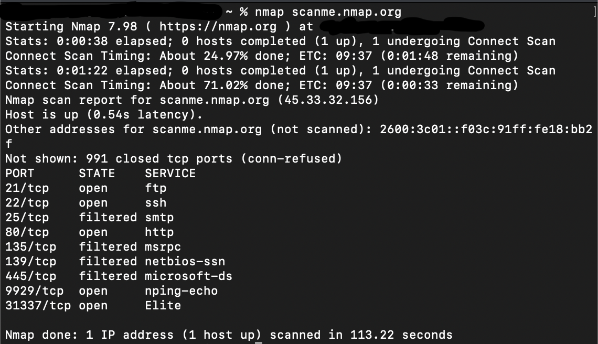
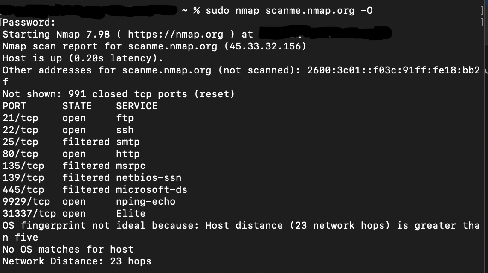
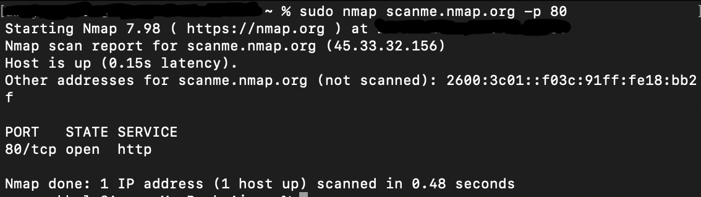
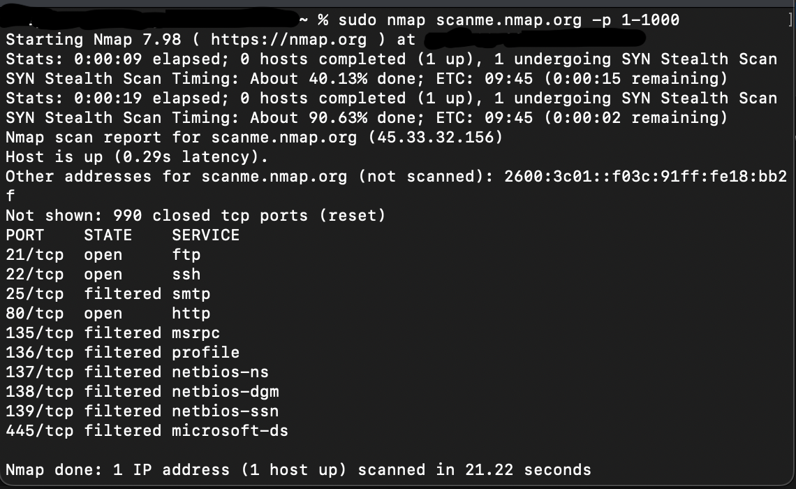
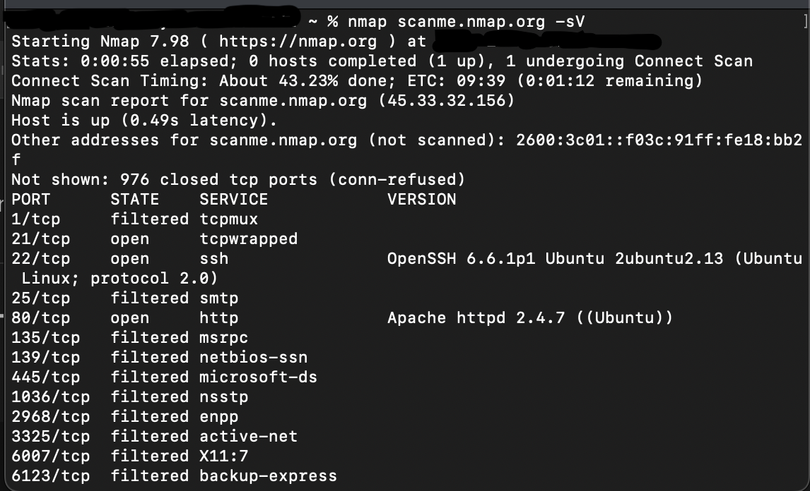
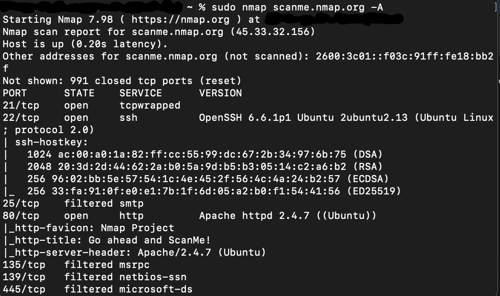
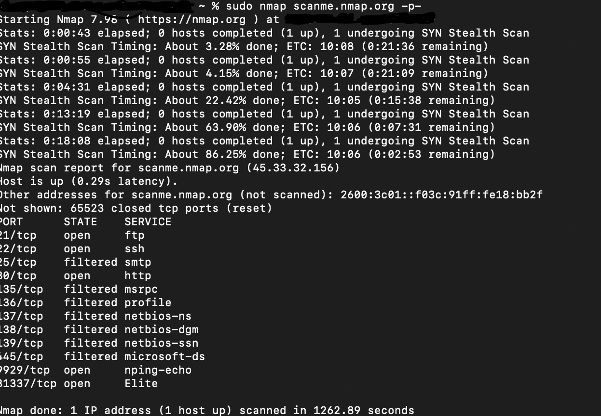

# Nmap Scanning Guide (macOS)

This README provides a clear and structured explanation of how to install **Nmap** on a Mac, along with demonstrations of essential Nmap commands. The results shown here come from practical scans run against **scanme.nmap.org**, the official public Nmap test target.

>  **Important:** Only scan hosts you own or have explicit permission to test. `scanme.nmap.org` is safe to use for learning.

---

## Installing Nmap on macOS (Apple M3)

### **1. Install Homebrew (if not installed)**

Homebrew is the easiest way to install Nmap.

```bash
/bin/bash -c "$(curl -fsSL https://raw.githubusercontent.com/Homebrew/install/HEAD/install.sh)"
```

After installation, add Homebrew to your PATH if prompted.

### **2. Install Nmap**

```bash
brew install nmap
```

### **3. Verify Installation**

```bash
nmap --version
```

You should see output confirming the installed version.

---

## Commands Used in This Project

Below are all the commands demonstrated, along with screenshots and explanations.

---

## ### 1. `nmap scanme.nmap.org`

A **default scan**. Nmap scans the most common 1,000 ports.

**Purpose:** Quick overview of open ports.

**Screenshot:**  


---

## ### 2. `nmap -O scanme.nmap.org`

Enables **OS detection**.

**Purpose:** Attempts to identify the remote operating system.  
*May fail if network distance is too large (as seen in the scan).*

**Screenshot:**  


---

## ### 3. `nmap -p 80 scanme.nmap.org`

Scans a **specific port**.

**Purpose:** Faster, more targeted scanning.

**Screenshot:**  


---

## ### 4. `nmap -p 1-1000 scanme.nmap.org`

Scans ports **1 through 1000**.

**Purpose:** Discover more services while keeping scan time reasonable.

**Screenshot:**  


---

## ### 5. `nmap -sV scanme.nmap.org`

Runs **service/version detection**.

**Purpose:** Identifies software running on open ports (e.g., Apache, OpenSSH).

**Screenshot:**  


---

## ### 6. `nmap -A scanme.nmap.org`

The **aggressive scan**.

Includes:
- `-O` OS detection  
- `-sV` service/version detection  
- Default scripts  
- Traceroute  

**Purpose:** Most detailed single-command scan.

**Screenshot:**  


---

## ### 7. `nmap -p- scanme.nmap.org`

Scans **all 65,535 ports**.

**Purpose:** Full coverage of every TCP port.  
Useful for catching services not shown in the default top 1000-port scan.

**Screenshot:**  


---

##  Summary Table

| Command         | Description                                        |
| --------------- | -------------------------------------------------- |
| `nmap <target>` | Default top 1000 port scan                         |
| `-O`            | OS detection                                       |
| `-p <port>`     | Scan specific port                                 |
| `-p 1-1000`     | Scan a port range                                  |
| `-p-`           | Scan all ports (1–65535)                           |
| `-sV`           | Service & version detection                        |
| `-A`            | Aggressive scan (OS, version, scripts, traceroute) |

---
