# Static & Dynamic Routing

-
## Summary

This lab introduces core routing concepts including:

- Static routing & default routes  
- Administrative distance & failover  
- Dynamic routing protocols (RIP / OSPF)  
- Routing tables, convergence, and packet flow  
- Distance-vector & link-state algorithms  

---

# Part 1 — Network Design & Setup

### **Topology Screenshot**

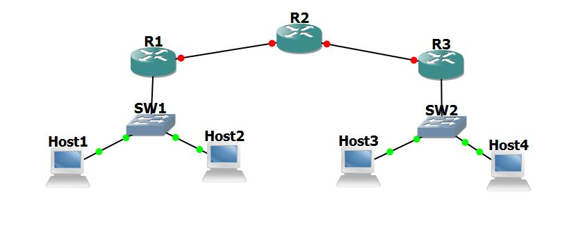

### Requirements

- Use **/24 subnets** for LANs  
- Use **/30 subnets** for router-to-router WAN links  
- Each host placed in its own subnet  

### **Can PC1 ping WAN interface of R1?**

**No.** The WAN interface belongs to a different subnet.

### **Can PC1 ping R3?**

**No.** Same reason—R3 belongs to a different network.

### **Why can PC1 ping R1 LAN interface but not WAN?**

LAN interface is in the **same subnet**.  
WAN interface is not reachable without a default gateway.

---

# Objective 2 — Static Routing

### Show Static Routes

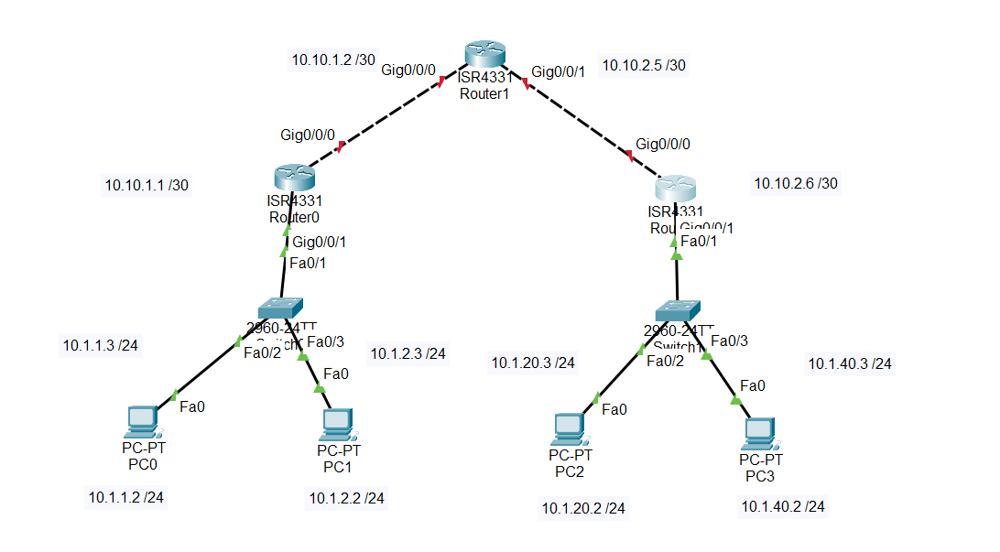

### R1 Routing Table

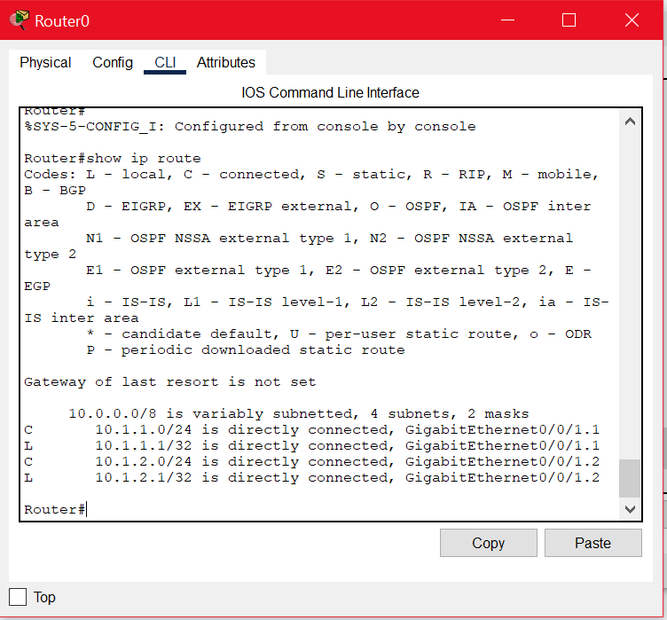

### R2 Routing Table

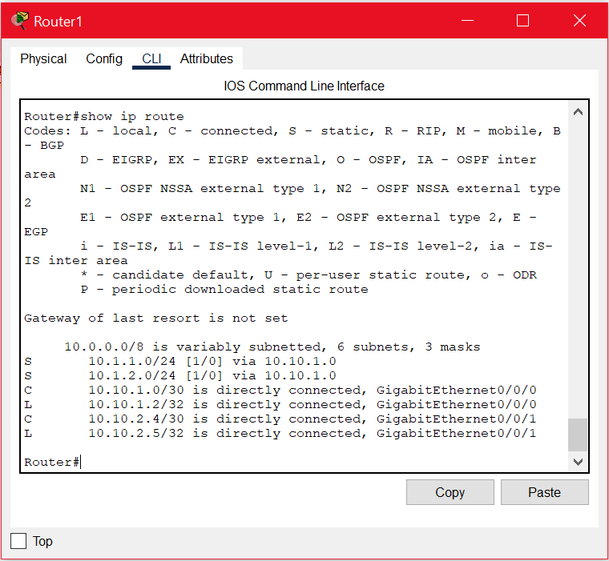

### R3 Running Configuration

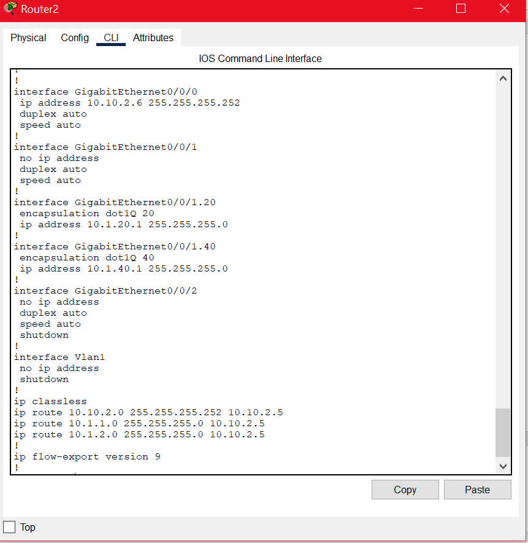

### Traceroutes (PC1 → PC2, PC3, PC4)

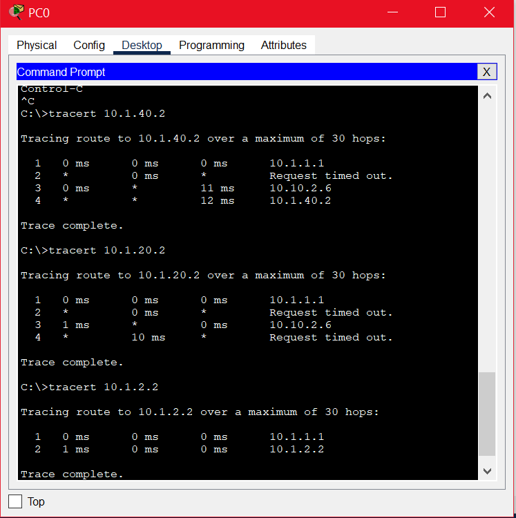

---

# Objective 3 — Understanding Routing Protocols

## 3.1 Distance Vector Tables

Initial, one-hop, and two-hop distance-vector tables were calculated for all nodes.

### Example Image


---

## 3.2 Link-State Algorithm (Node D)

Steps:

1. Discover neighbors  
2. Build link-state database  
3. Apply Dijkstra’s algorithm  
4. Compute shortest paths  
5. Populate routing table  

### Final Routing Table for Node D


---

## 3.3 Dijkstra’s Algorithm (Graph in Figure 4)

Shortest-path analysis from **v3 → v5**.

### Result Screenshot

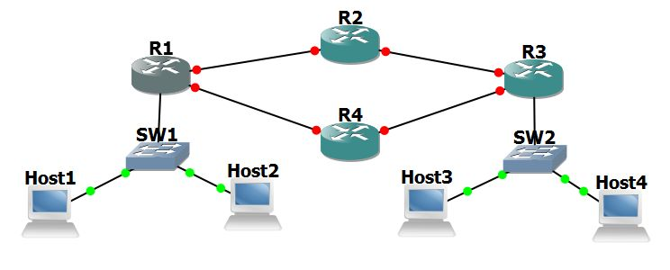

---

# Objective 4 — Dynamic Routing (RIP or OSPF)

### Network Topology

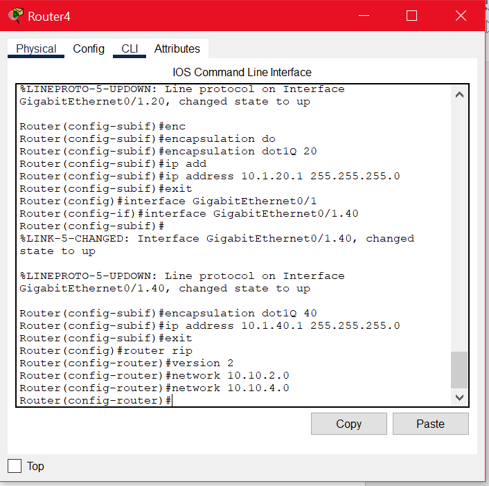

### RIP Configuration Example

```
router rip
 version 2
 network X.X.X.X
```

### OSPF Configuration Example

```
router ospf 1
 network X.X.X.X 0.0.0.255 area 0
```

### Routing Table on R2

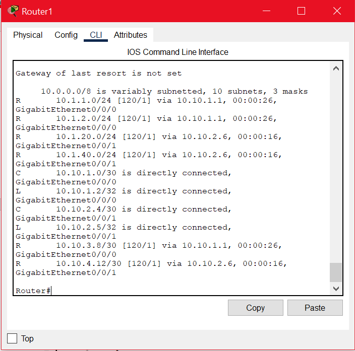

### Routing Table on R4

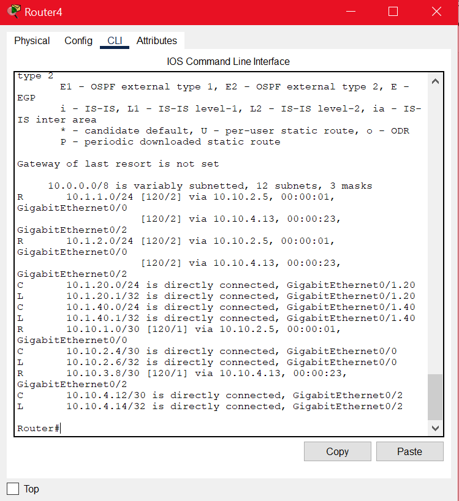

### What is Convergence?

All routers have consistent routing information and agree on topology.

---

# Objective 5 — Routing Protocol Failover

### Traceroute Path Used


- OSPF path is used because **AD = 110**, which is preferred over RIP (AD = 120).

### Link Failure Test

- When the primary link is removed, **packets drop briefly**.  
- Routing protocol reconverges, using alternate path.

### Can Failover Be Achieved Using Static Routes?

**No.** Static routes require manual updates. Failover only works with dynamic routing.

---

# Extra Credit

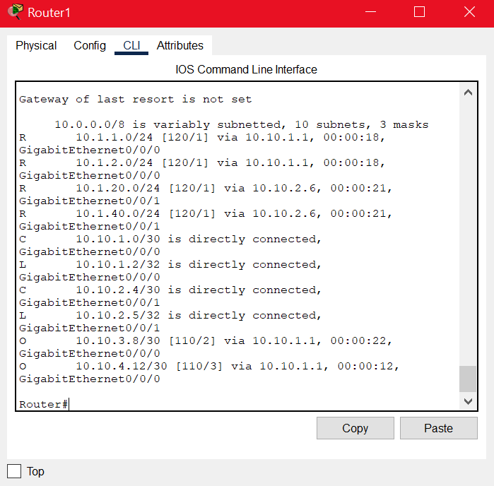

**Which path is chosen?**  
The **OSPF path** due to lower administrative distance.

---

# Report Questions

### Advantages of Routing Protocols

- Scalable  
- Automatic failover  
- No manual updates needed  

### Distance Vector vs Link State

| Distance Vector | Link State |
|-----------------|------------|
| Slow convergence | Fast convergence |
| Possible loops | Loop prevention |
| Simple | More complex |

### When Use Static Routing?

- Small networks  
- High security  
- Predictable paths  

### Protocol Classification

| Protocol | Type |
|---------|------|
| OSPF | Link State |
| BGP | Distance Vector |
| RIP | Distance Vector |
| IS-IS | Link State |

### Administrative Distances

- **OSPF = 110**  
- **RIP = 120**

---
