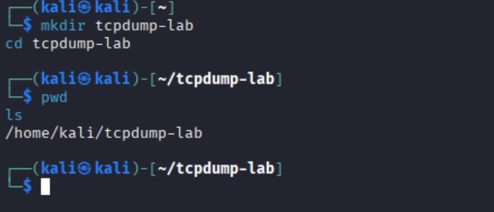
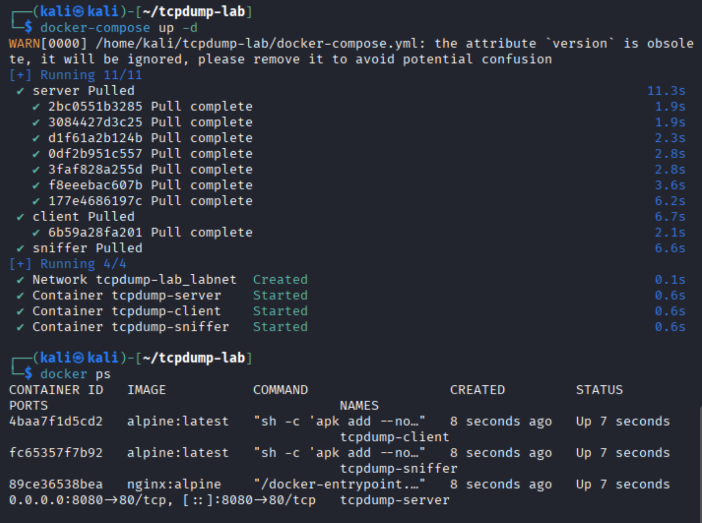
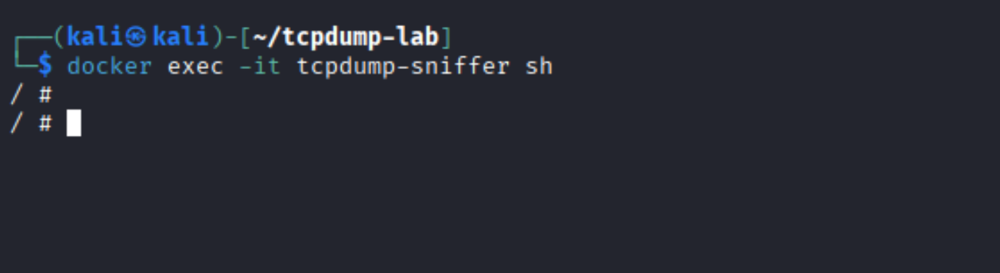
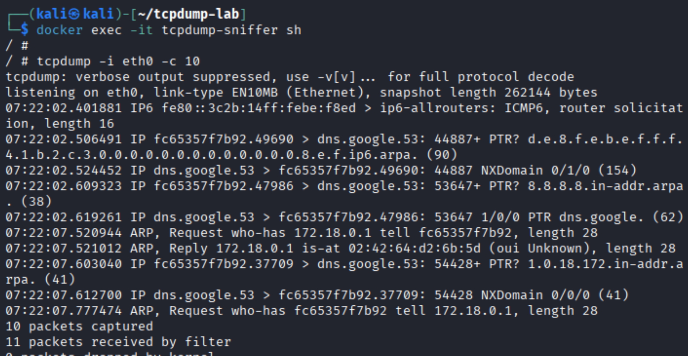
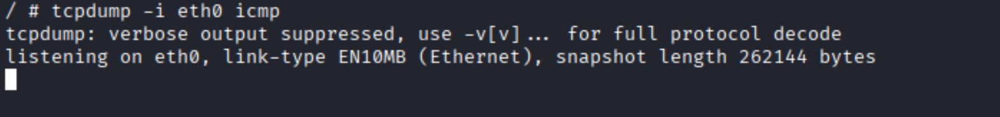
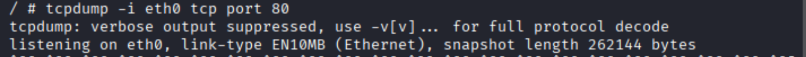
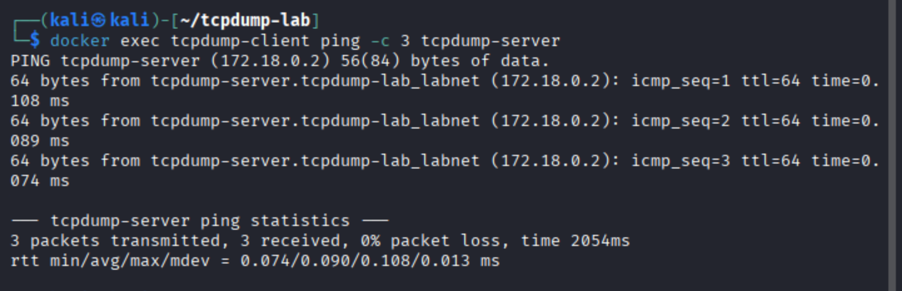
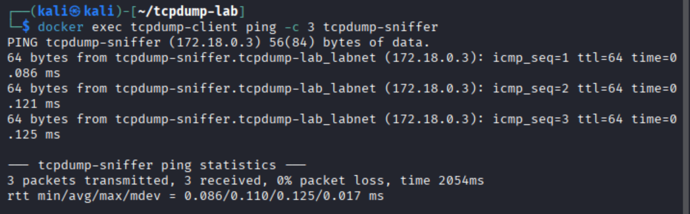

# TCPDUMP LAB 

##  Introduction & Theory
This lab demonstrates the fundamentals of **network packet capture** using the tool **tcpdump**. Packet capture is an essential skill for:
- Network troubleshooting
- Traffic analysis
- Performance monitoring
- Security investigations

### What is tcpdump?
`tcpdump` is a command-line packet analyzer used to capture and inspect network traffic. It allows you to:
- Listen on specific interfaces
- Filter packets using expressions
- Save packet captures into `.pcap` files for later analysis

### How tcpdump Works
`tcpdump` uses **libpcap**, a packet capture library providing access to raw packets. The workflow includes:
1. Selecting a network interface
2. Listening for packets
3. Applying **Berkeley Packet Filter (BPF)** rules
4. Displaying packet metadata and payload

### Common Use-Cases
- `tcpdump -i eth0` – Capture all packets  
- `tcpdump -c 10` – Capture first 10 packets  
- `tcpdump icmp` – Filter by ICMP  
- `tcpdump tcp port 80` – Capture HTTP  
- `tcpdump -w file.pcap` – Save to file  

---

## Step 1: Create the Lab Directory
```bash
mkdir tcpdump-lab
cd tcpdump-lab
pwd
ls
```
### Screenshot


---

## Step 2: Start Docker Containers
```bash
docker-compose up -d
docker ps
```
### Screenshot


---

## Step 3: Enter the Sniffer Container
```bash
docker exec -it tcpdump-sniffer sh
```
### Screenshot


---

## Step 4: Capture First 10 Packets
```bash
tcpdump -i eth0 -c 10
```
### 📸 Screenshot


---

## Step 5: Capture ICMP Packets
```bash
tcpdump -i eth0 icmp
```
### Screenshot


---

## Step 6: Capture HTTP Traffic
```bash
tcpdump -i eth0 tcp port 80
```
### Screenshot


---

## Step 7: Ping Test – Client → Server
```bash
docker exec tcpdump-client ping -c 3 tcpdump-server
```
### Screenshot


---

## Step 8: Ping Test – Client → Sniffer
```bash
docker exec tcpdump-client ping -c 3 tcpdump-sniffer
```
### Screenshot


---

