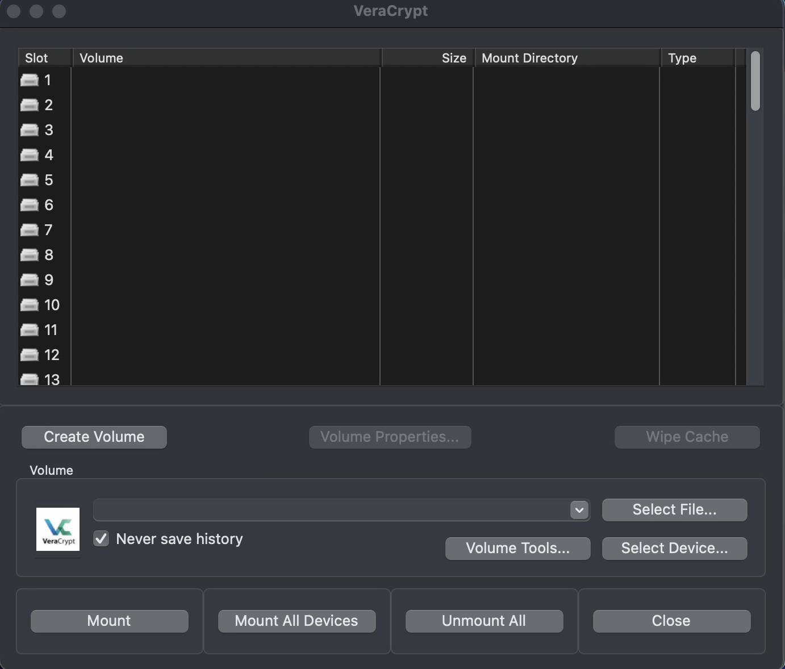
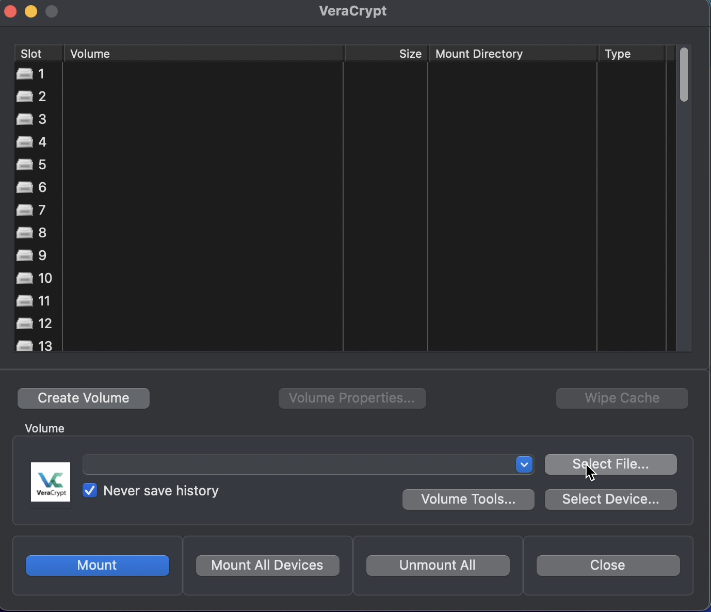
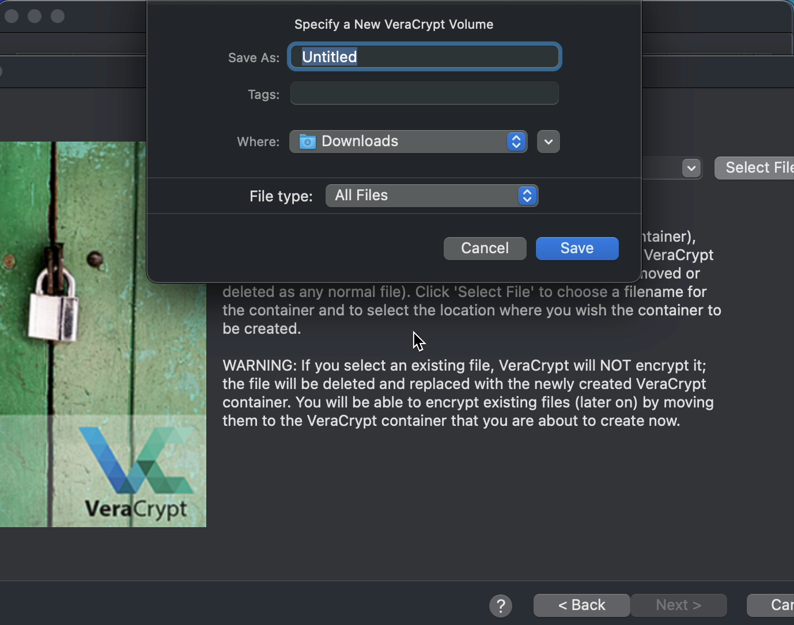
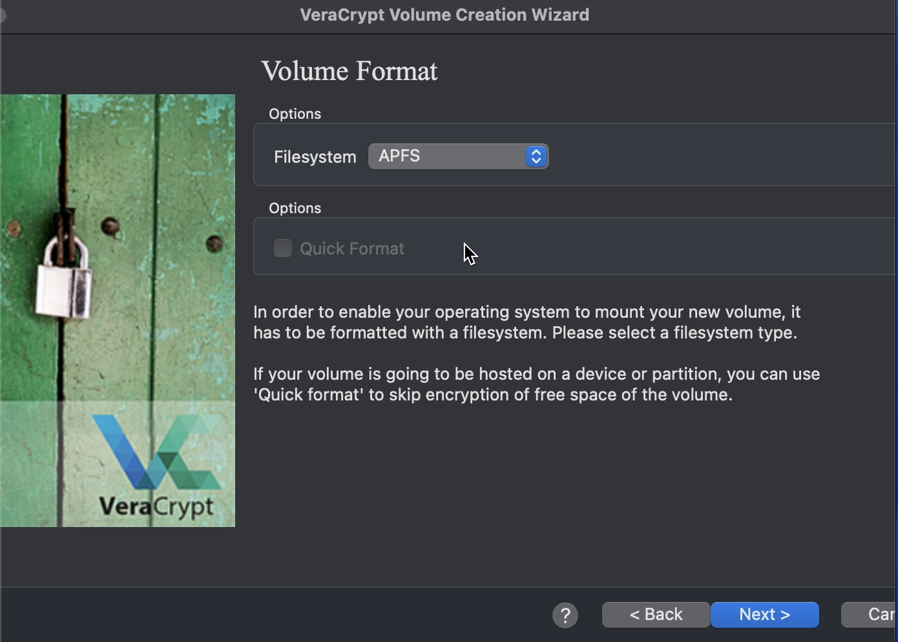
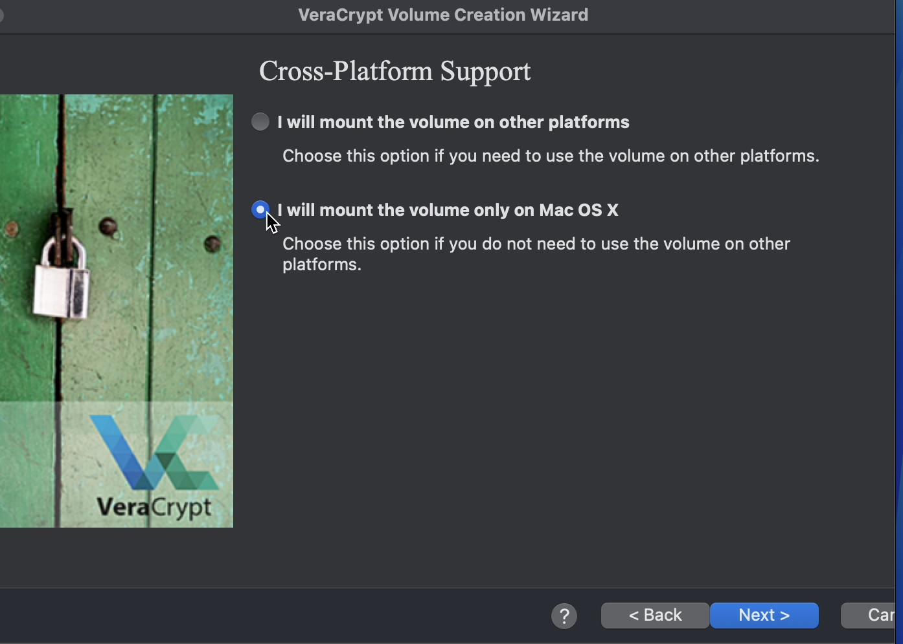
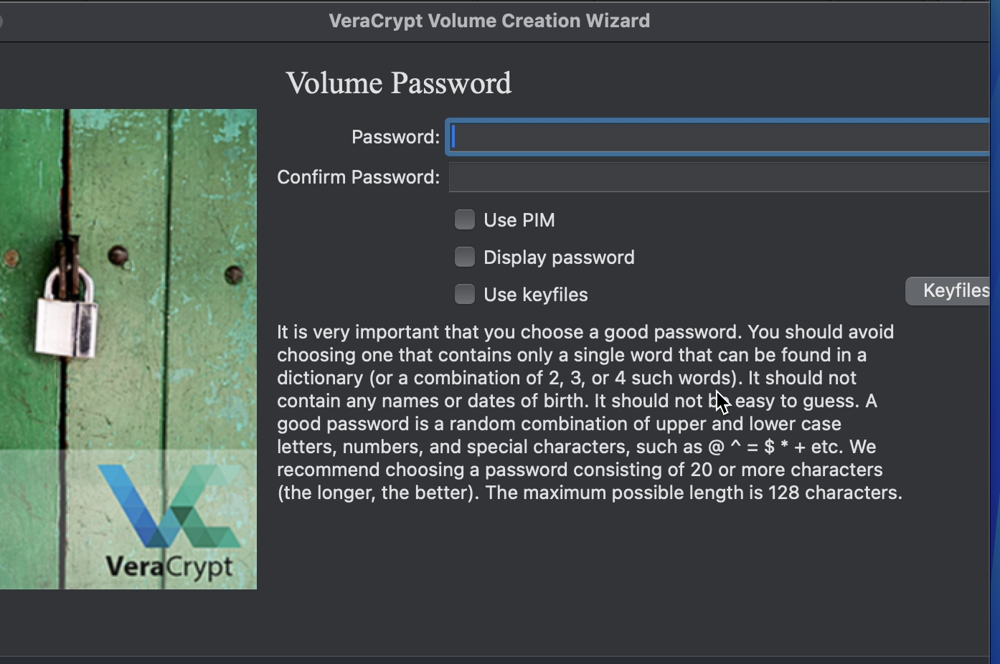
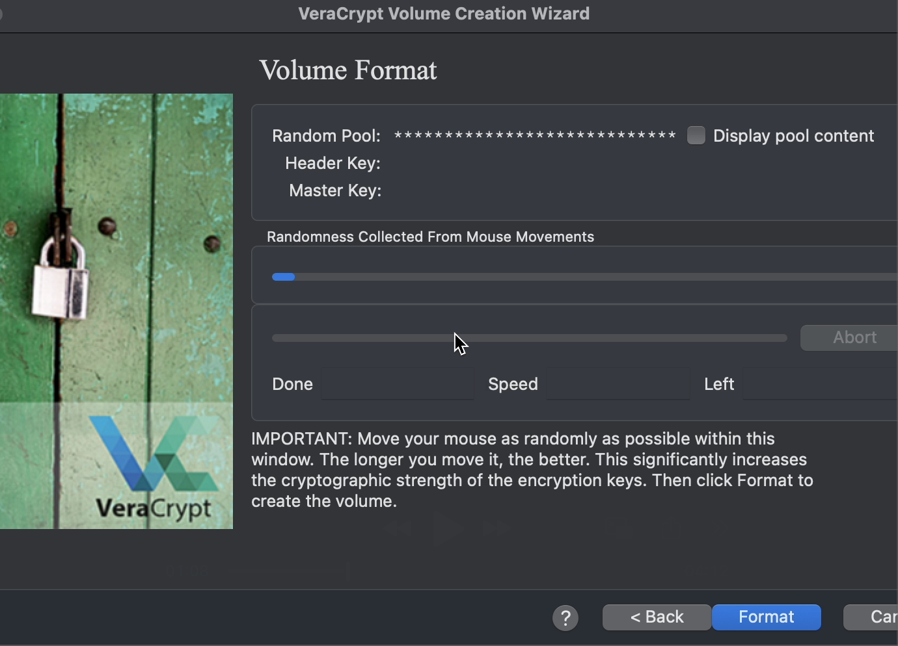
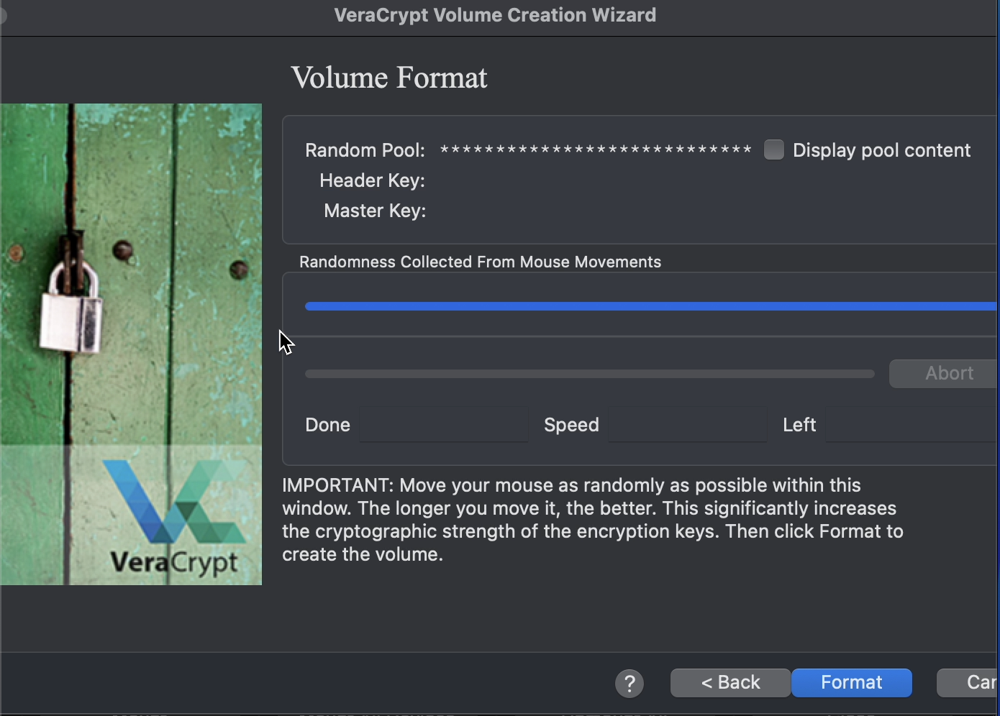
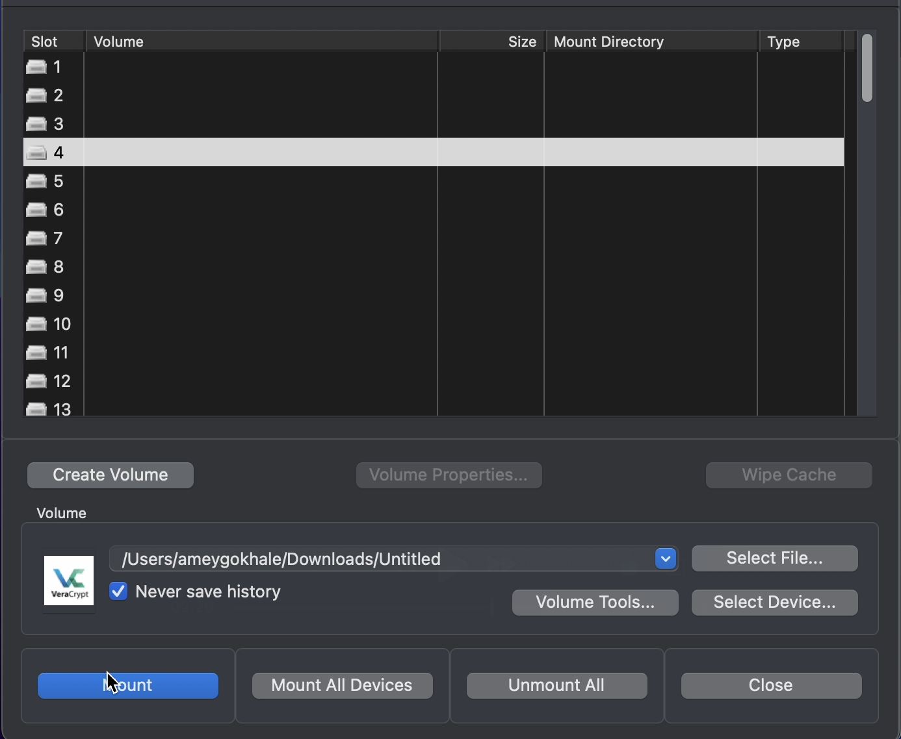
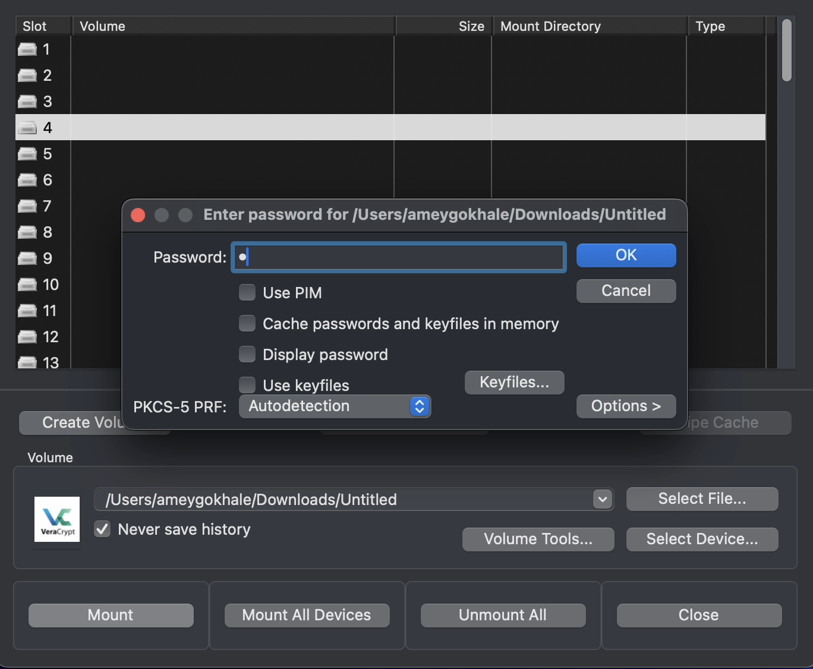

# VeraCrypt — Create and Mount an Encrypted Volume (macOS)

A step-by-step visual guide to creating, formatting, and mounting a VeraCrypt encrypted volume on macOS.

---

## Launch VeraCrypt
Open **VeraCrypt** from Launchpad or Applications.

---

## Create a New Volume
1. Click **Create Volume** in the main window.
2. Select **Create an encrypted file container**.
3. Click **Next**.

---

## Specify a Volume Location
Choose where to save your new encrypted container, give it a name, and click **Save**.

---

## Choose Filesystem Type
Select a filesystem for your encrypted volume.
- **APFS** — best for macOS only
- **exFAT/FAT** — for cross-platform compatibility

---

## Cross-Platform Support
Choose whether the volume will be used on other platforms or only macOS.

---

## Create a Strong Password
Enter and confirm a secure password.  
Avoid short or common words; aim for 20+ characters with mixed symbols.

---

## Generate Randomness
Move your mouse randomly inside the window to strengthen the cryptographic key.

---

## Format the Volume
Click **Format** to encrypt and initialize your new volume.

---

## Mount the Encrypted Volume
1. Click **Select File** and choose your `.hc` or container file.
2. Choose a slot.
3. Click **Mount**.

---

## Enter Password to Unlock
Type the password you set earlier, then click **OK** to mount the volume.

---

## Access and Use the Mounted Volume
The mounted VeraCrypt volume will appear in Finder as a virtual disk.  
Add or remove files as needed — all content remains encrypted on disk.

---

