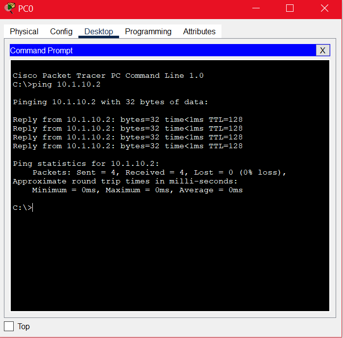
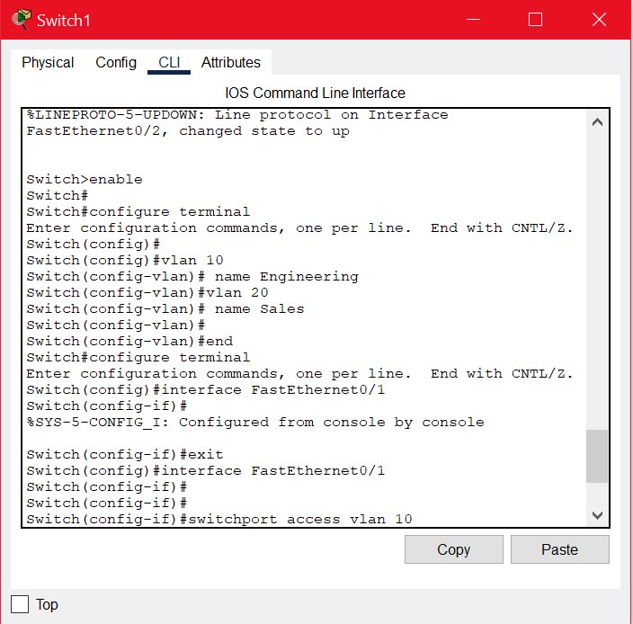
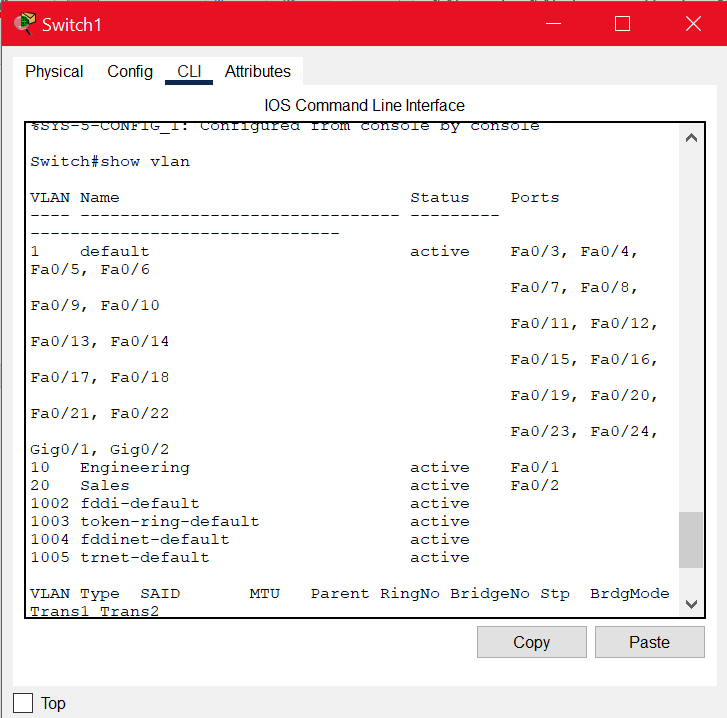
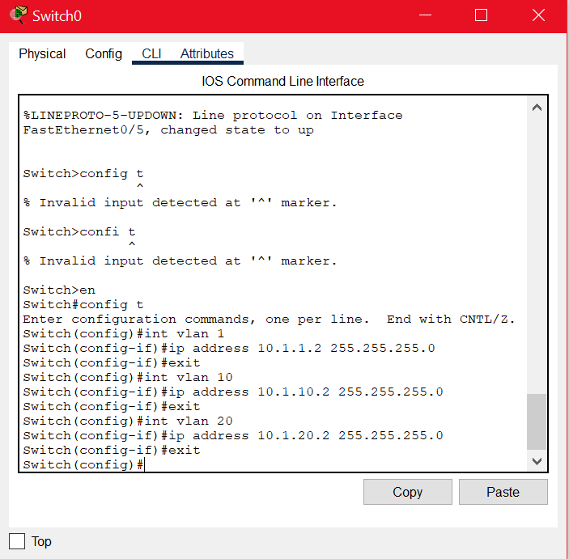

# VLANs, Trunking & Inter-VLAN Routing

## Summary

This lab introduces:

- VLAN creation and configuration  
- Trunk ports and VLAN propagation  
- Inter-VLAN routing (“Router on a Stick”)  
- Multi-switch VLAN environments  
- Packet flow analysis across VLANs  

---

# bjective 1 — Switch VLAN Configuration

## Same-VLAN Communication (Diagram 1)

Assigned IPs:  
- **PC1:** 10.1.10.1  
- **PC2:** 10.1.10.2  

Both must be in the **same subnet** for Layer‑3 communication.

### **Ping Screenshot**

---

## Creating VLANs (Diagram 2)

- **VLAN 10 → Engineering**  
- **VLAN 20 → Sales**

### **Show VLAN Output**

### Assigning PCs to VLANs

- PC1 → VLAN 10 (Engineering)  
- PC2 → VLAN 20 (Sales)

### Can PC1 Ping PC2?

**No.** They are in different VLANs → different broadcast domains → ARP request cannot be answered.

### Telnet Requirements

To allow PC1 to Telnet to the switch:

1. Assign IP to VLAN interface  
2. Configure VTY lines for Telnet  
3. Set password  
4. From PC: `telnet <switch IP>`

---

# Objective 2 — VLANs Across Two Switches (Trunking)

### In what subnet is PC5?

PC5 belongs to **10.1.10.0/24** (VLAN 10 subnet).

### Ping Tests

| PCs | Same VLAN? | Expected Ping |
|-----|-------------|----------------|
| PC1 ↔ PC2 | No | ❌ Cannot ping |
| PC2 ↔ PC3 | No | ❌ Cannot ping |

### Configure Switches for Same-VLAN Communication

### Allow All PCs to Ping (Inter-VLAN Routing)

Requires **Router-on-a-Stick**:

- One router interface  
- Multiple **sub‑interfaces**  
- Each sub-interface corresponds to a VLAN  
- Trunk link between router & switch  

---

# Objective 3 — Inter-VLAN Routing (Router on a Stick)

VLAN Networks:

- **VLAN 1 → 10.1.1.0/24**  
- **VLAN 10 → 10.1.10.0/24**  
- **VLAN 20 → 10.1.20.0/24**

### What Are Sub-Interfaces?

Virtual interfaces under a single physical router port.

### Advantages

- Saves router ports  
- Supports multiple VLANs on one link  
- Enables logical segmentation  

### Example Configuration

### Traceroute Through Router

---

# Objective 4 — Inter-VLAN Routing with Multiple Switches

### What port type connects Switch1 ↔ Switch2?

**Trunk port**  
Justification: Allows VLAN tags to pass between switches.

### Additional Configurations Needed

- Add VLANs on Switch2  
- Assign PC4 and PC5 to VLANs  
- Configure trunk link between switches  
- Ensure router trunk matches VLANs  

### Successful Ping / Trace Output

---

# Report Questions

### **1. Advantages of VLANs**

- Reduces broadcast traffic  
- Improves security and segmentation  

### **2. Can Any VLAN Telnet into a Switch?**

Yes, **if**:

- Switch has IP assigned on an SVI  
- VTY lines configured  
- Device can reach the switch via routing  

### **3. Access Port vs Trunk Port**

| Access Port | Trunk Port |
|-------------|------------|
| One VLAN | Multiple VLANs |
| End devices | Switch-to-switch / Switch-to-router |
| Frames untagged | Frames tagged (802.1Q) |

### **4. Benefit of Trunk Ports**

- Carries multiple VLANs  
- Preserves segmentation across switches  

### **5. How to Route Between VLANs**

Use router-on-a-stick or Layer‑3 switch.

### **6. Packet Flow PC2 → PC5**

Summary:

- PC2 sends ARP to find gateway  
- Switch forwards request  
- Router resolves VLAN 10 → VLAN 40  
- Router ARPs for PC5  
- PC5 responds → communication established  

---

# Extra Credit

### Broadcast Domain

Broadcast domain = network segment receiving all broadcast frames.

Topology contains **2 broadcast domains**.

### Native VLAN Mismatch Warning

When Switch1 uses VLAN 10 native and Switch2 uses VLAN 20 native:

- **802.1Q Native VLAN mismatch** error appears  
- Traffic may be mis-tagged or dropped  

---
