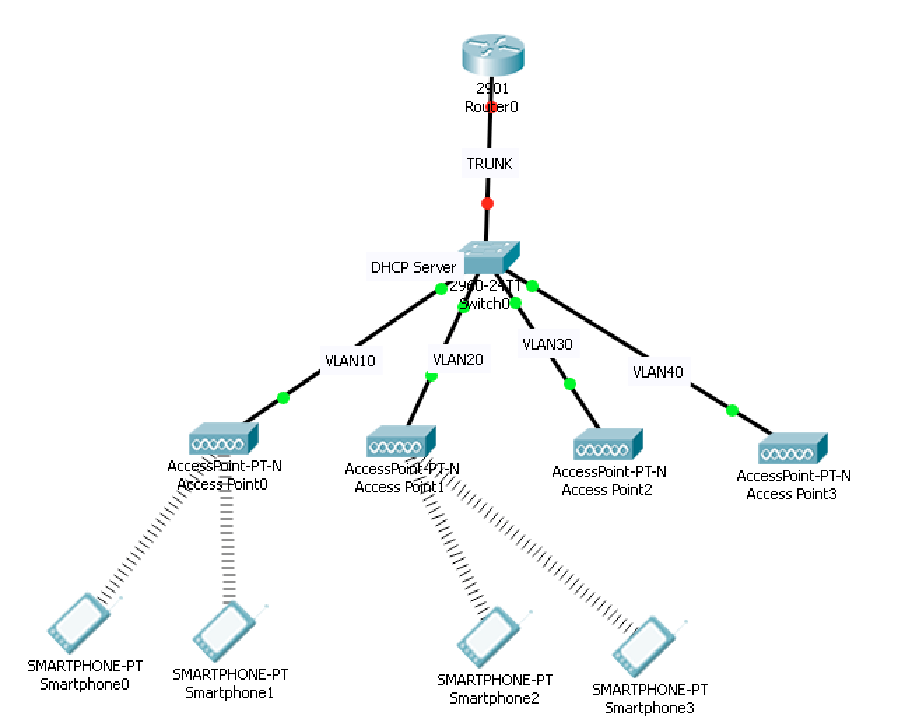
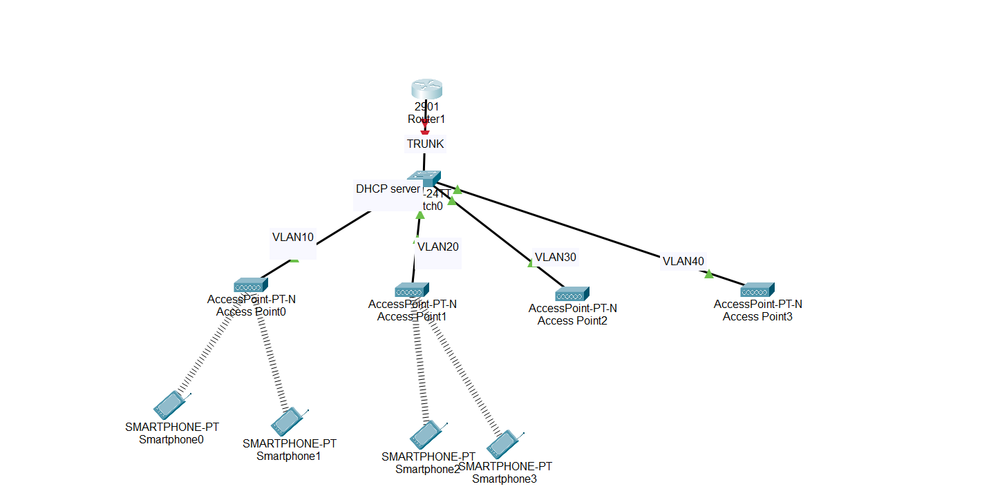
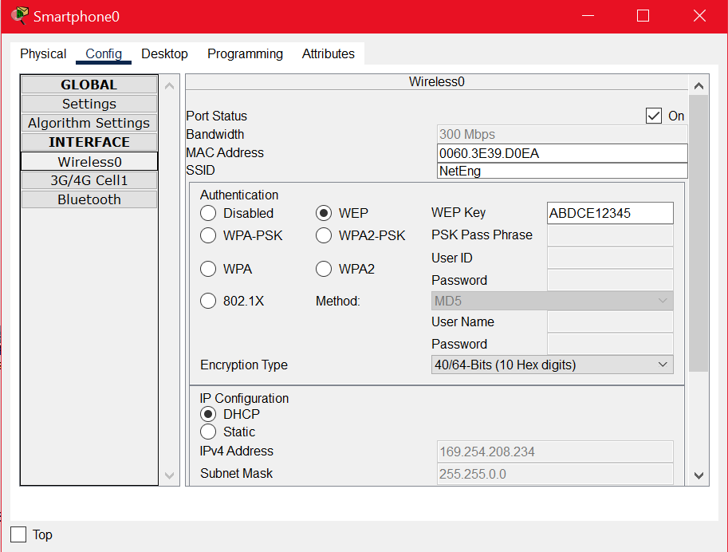
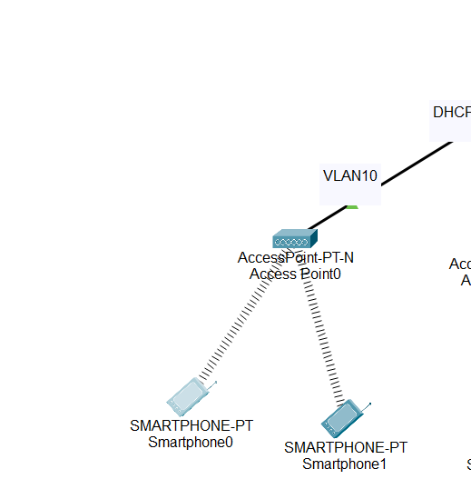
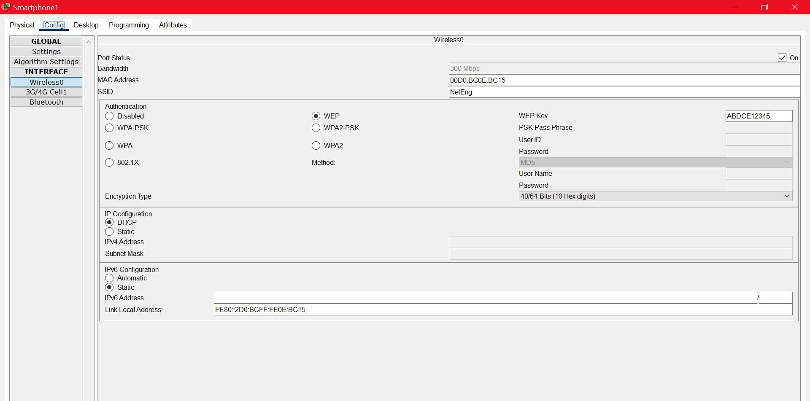
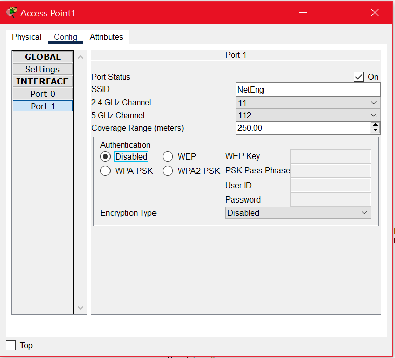
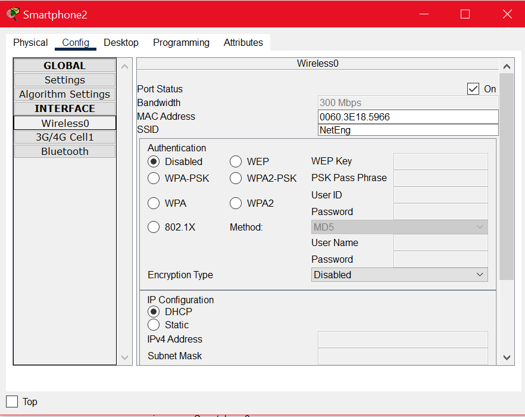
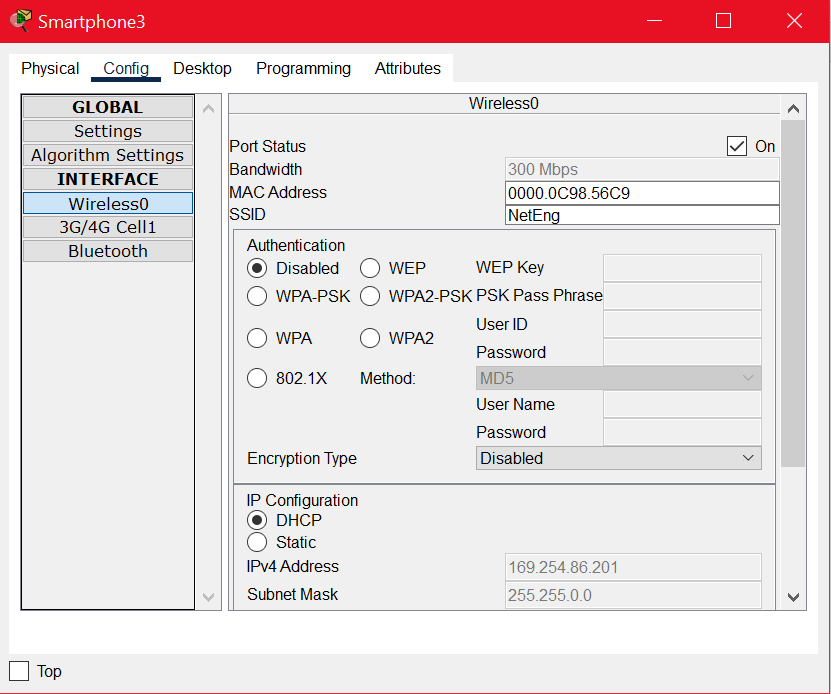

# Wireless Networking (Wi‑Fi, APs, Roaming, Security)

## Summary  
This lab introduces wireless LAN fundamentals including:

- Wi‑Fi access point configuration  
- Wireless security protocols (WEP, WPA, WPA2, WPA3)  
- DHCP scopes for wireless devices  
- VLAN segmentation with wireless networks  
- Router‑on‑a‑stick for wireless inter‑VLAN communication  
- Roaming behavior between multiple access points  

---

# Objective 1 — Build the Wireless Topology (CPT)

### Required Topology (Figure 1)



You must place:

- 4 Access Points (AP0–AP3)  
- 4 Smartphones  
- 1 Switch  
- 1 Router  

Each smartphone may auto-connect to any AP initially — ignore this for now.

---

# Objective 2 — Wireless Network Configuration

## Configure AP0  
**Settings:**  
- SSID: `NetEng`  
- Channel: 6  
- Coverage: 250m  
- Authentication: **WEP**  
- Key: `ABCDE12345`

Smartphones 0 & 1 must use:  
- SSID: `NetEng`  
- WEP Key: `ABCDE12345`

### Screenshot  


---

## Configure AP1  
**Settings:**  
- SSID: `NetEng`  
- Channel: 11  
- Coverage: 250m  
- Authentication: **Disabled**

Smartphones 2 & 3:  
- SSID: `NetEng`  
- No Authentication

### Screenshot  


---

## Configure AP2  
**Settings:**  
- SSID: `Default`  
- Channel: 6  
- Coverage: 250m  
- Authentication: Disabled  

### Screenshot  


---

## Configure AP3  
**Settings:**  
- SSID: `NetEng`  
- Channel: 1  
- Coverage: 250m  
- Authentication: Disabled  

### Screenshot  


---

## Configure Switch 0  
- Each switchport connected to APs placed in **separate VLANs**  
- Router uplink port configured as **TRUNK**  
- Switch acting as **DHCP Server** with 4 pools  

Smartphones receive DHCP-assigned IP addresses.

### Screenshot (DHCP Assignments)  


---

## Router Configuration — Router‑on‑a‑Stick  
To allow inter‑VLAN communication, create sub-interfaces:

```
int g0/0.10
 encapsulation dot1q 10
 ip address 10.1.10.1 255.255.255.0

int g0/0.20
 encapsulation dot1q 20
 ip address 10.1.20.1 255.255.255.0

int g0/0.30
 encapsulation dot1q 30
 ip address 10.1.30.1 255.255.255.0
```

---

## **Ping Smartphone 0 → Smartphone 2**

### Result: **Ping SUCCESSFUL**



**Explanation:**  
- Each VLAN has a DHCP pool and correct default gateway  
- Switch tags frames on trunk link  
- Router sub-interfaces route packets between VLANs  
- Packet travels: **Smartphone0 → AP → Switch → Router → Switch → AP → Smartphone2**

---

# bjective 3 — Wireless Roaming

## Modify AP1 Coverage → 10 meters  


**Observation:**  
Smartphones 2 & 3 switch from **AP1 → AP3**

### Why?  
Wi‑Fi clients roam when:

1. Signal strength drops  
2. Another AP with same SSID provides stronger signal  
3. Authentication settings match  
4. Channels do not conflict severely  

**Real World Example:**  
Walking around a campus or mall, your phone jumps between multiple APs broadcasting the same SSID (e.g., `CU-Wireless`).

---

## Why Did They Choose AP3 Specifically?

Configuration summary:

| AP | SSID | Auth | Channel |
|----|------|--------|---------|
| AP0 | NetEng | WEP | 6 |
| AP1 | NetEng | None | 11 |
| AP2 | Default | None | 6 |
| **AP3** | **NetEng** | **None** | **1** |

Smartphones 2 & 3:  
- Prefer APs matching **SSID = NetEng**  
- Ignore AP2 (`Default`)  
- AP0 uses WEP, which they are not configured for  
- AP3 matches SSID + Auth + signal strength

Thus, AP3 is the only compatible AP after AP1’s coverage reduces.

---

## WLAN Modes

### **Ad‑Hoc Mode**  
Devices communicate peer‑to‑peer without APs.

### **Infrastructure Mode**  
Devices connect **to APs**, which connect to a wired network.

**This lab uses Infrastructure Mode.**

---

## Preventing Interference Between APs  
Solutions:

- Use **non-overlapping channels** (1, 6, 11 in 2.4GHz)  
- Adjust transmit power  
- Use different authentication methods  
- Proper AP spacing  

---

## WLAN Security Standards (Summary)

| Standard | Description |
|----------|-------------|
| **WEP** | Outdated, weak encryption |
| **WPA** | Improved over WEP |
| **WPA2** | Uses AES, industry standard |
| **WPA3** | Strongest, modern standard |

**Lab used:** **WEP** on AP0.

---

## Unlicensed Spectrum Bands  
- **900 MHz**  
- **5.8 GHz**

---