# 🧠 Wireshark Network Protocol Analysis Labs

This repository contains a collection of **Wireshark protocol analysis labs** demonstrating how various network protocols operate and transmit data.  
Each lab includes setup instructions, capture steps, applied filters, and screenshots showing packet analysis.

---

## 📋 Table of Contents
- [Setup and Launching Wireshark](#-setup-and-launching-wireshark)
- [HTTP Analysis](#-http-analysis)
- [DNS Analysis](#-dns-analysis)
- [DHCP Analysis](#-dhcp-analysis)
- [FTP Analysis](#-ftp-analysis)
- [SMTP Analysis](#-smtp-analysis)
- [Protocol Summary](#-protocol-summary)
- [Security Recommendations](#-security-recommendations)
- [Credits](#-credits)

---

## ⚙️ Setup and Launching Wireshark

1. **Download Wireshark for macOS**  
   👉 [https://www.wireshark.org/download.html](https://www.wireshark.org/download.html)

2. **Launch Wireshark**  
   From **Launchpad**, open **Wireshark**.

3. **Select Capture Interface**  
   Choose `en0` (Wi-Fi interface) from the Wireshark dashboard.

---

## 🌐 HTTP Analysis

### Steps
1. Start packet capture on `en0`.
2. Visit:
   ```
   http://testphp.vulnweb.com/login.php
   ```
3. Log in with:
   ```
   Username: test
   Password: test
   ```
4. Stop capture.
5. Apply the display filter:
   ```
   http
   ```
6. Locate a **POST** message.
7. Right-click → **Follow → HTTP Stream** to view plaintext username and password.
8. Observe transmitted webpage data.

### Screenshots

**HTTP Packet Capture**  
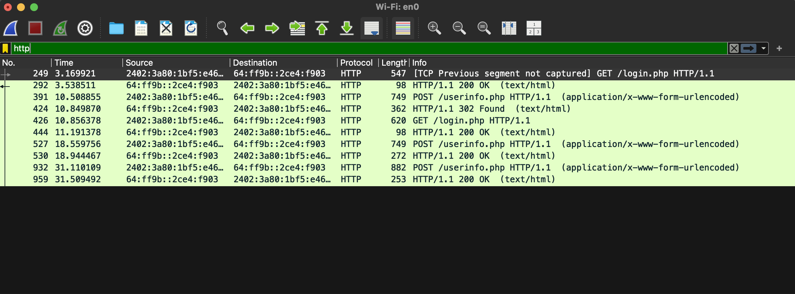

**Captured Credentials (POST Request)**  
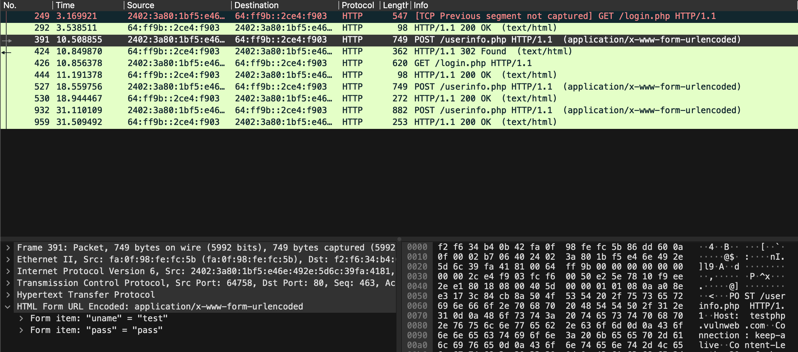

**Following the HTTP Stream**  
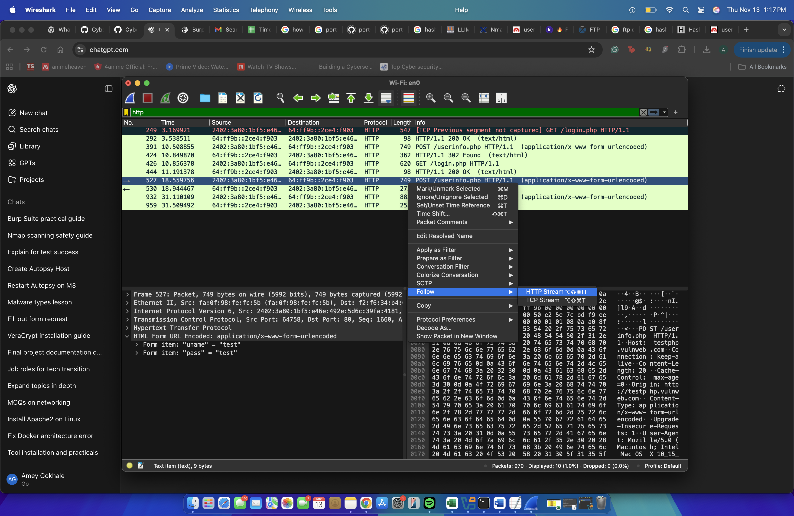

**Captured Webpage Source**  
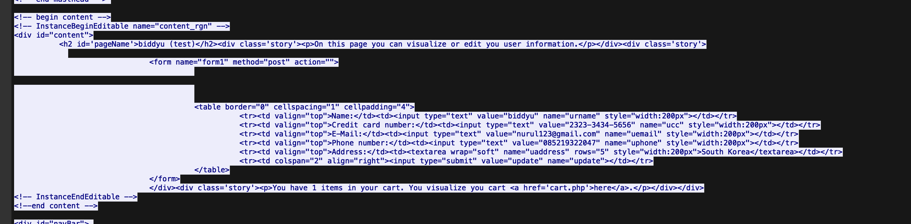

---

## 🌍 DNS Analysis

### Steps
1. Start capturing in Wireshark.
2. Open a browser and search for a **new website**.
3. Wait a few seconds, then stop the capture.
4. Apply filter:
   ```
   dns
   ```
5. Locate the DNS query for your domain.
6. Expand the packet details to view query/response information.

### Screenshots

**DNS Query Packets**  
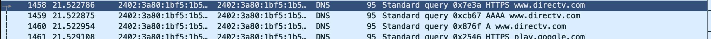

**DNS Query Details**  
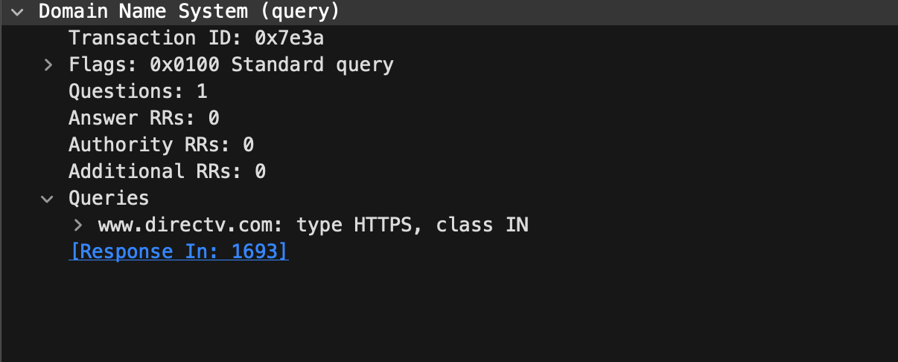

---

## 💻 DHCP Analysis

### Steps
1. Start Wireshark capture.
2. Open Terminal and type:
   ```bash
   sudo ipconfig set en0 DHCP
   ```
3. Wait for DHCP negotiation to complete.
4. Stop capturing and filter for:
   ```
   dhcp
   ```
5. Observe DHCP message flow:
   - **Release**
   - **Discover**
   - **Offer**
   - **Request**
   - **Acknowledge**

### Screenshot

**DHCP Packet Flow**  
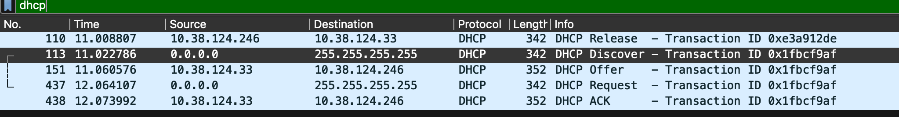

---

## 📁 FTP Analysis

### Steps
1. Start capturing packets in Wireshark.
2. In Terminal, connect to the test FTP server:
   ```bash
   ftp ftp.dlptest.com
   ```
3. Use the provided credentials:
   ```
   Username: dlpuser
   Password: [from site]
   ```
4. Run basic FTP commands:
   ```bash
   pwd
   ls
   get test.zip
   ```
5. Stop capturing.
6. Apply the display filter:
   ```
   ftp
   ```
7. Observe FTP authentication and file transfers in plaintext.

### Screenshots

**FTP Connection in Terminal**  
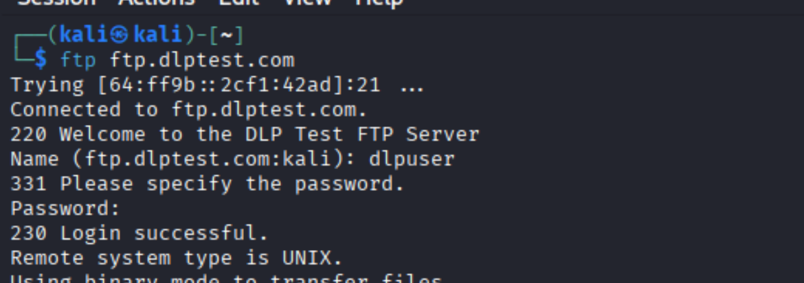

**FTP Packets in Wireshark**  
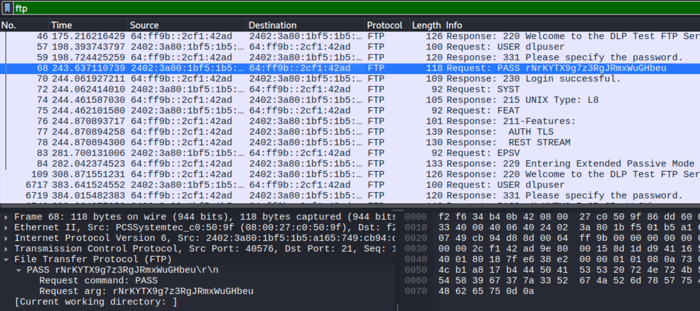

**FTP Directory Listing**  
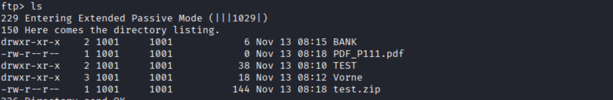

---

## ✉️ SMTP Analysis

### Steps
1. Start capturing packets in Wireshark.
2. Open Terminal and connect to an SMTP server:
   ```bash
   telnet smtp.yourmailserver.com 25
   ```
3. Execute:
   ```
   HELO yourdomain.com
   MAIL FROM:<you@yourdomain.com>
   RCPT TO:<friend@example.com>
   DATA
   Subject: Test Email
   Hello, this is a test message!
   .
   QUIT
   ```
4. Stop capturing.
5. Apply the filter:
   ```
   smtp
   ```
6. Follow TCP stream to view message content and headers.

### Screenshots

**SMTP Session in Terminal**  
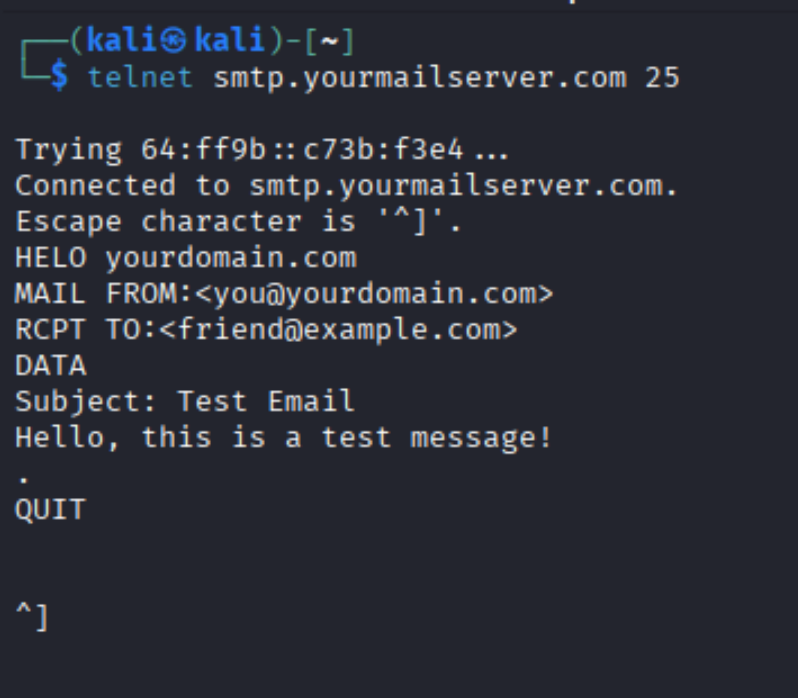

**SMTP Packets Captured in Wireshark**  
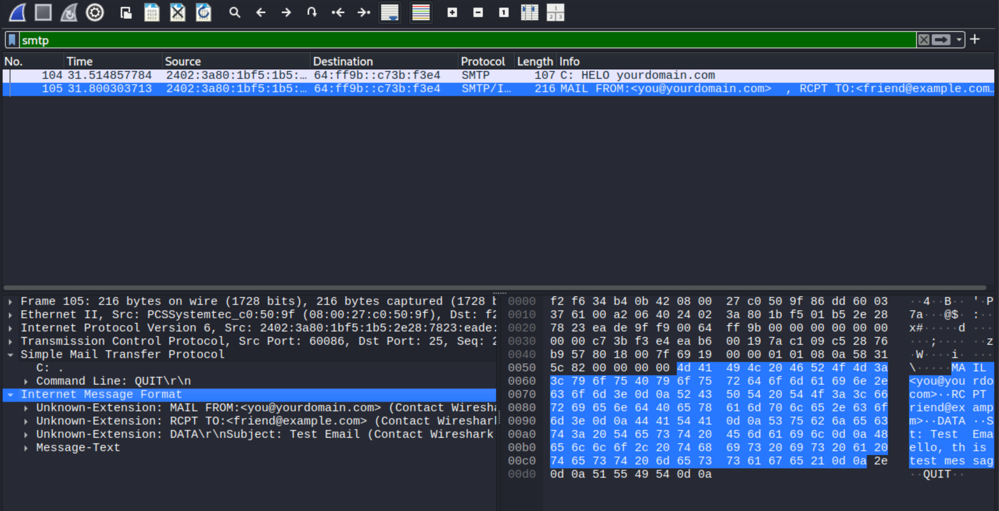

---

## 🧩 Protocol Summary

| Protocol | Port(s) | Encryption | Sensitive Data Visible | Key Insight |
|-----------|----------|-------------|------------------------|-------------|
| **HTTP** | 80 | ❌ No | ✅ Username, Password | Login credentials sent in clear text |
| **DNS** | 53 | ❌ No | ✅ Domain Names | Reveals browsing activity |
| **DHCP** | 67/68 | ❌ No | ✅ IP Assignment | Shows device-network negotiation |
| **FTP** | 21 | ❌ No | ✅ Credentials | Username & password exposed |
| **SMTP** | 25 | ❌ No | ✅ Message Content | Email and metadata visible |

---

## Security Recommendations

- Use **HTTPS** instead of HTTP  
- Use **FTPS/SFTP** instead of FTP  
- Use **SMTPS (TLS)** instead of SMTP  
- Use **DNS over HTTPS (DoH)** for private name resolution  
- Capture traffic **only with authorization** and for educational purposes  

---

⭐ *This project demonstrates how unencrypted network protocols expose sensitive data. Always use secure versions in real deployments.*

---

*End of README*
